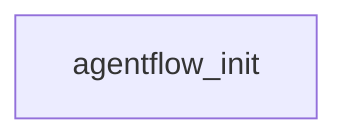

# Onboarding tour: multi-agent-workflow

## TL;DR
agentflow is a Python backend for an AIOps Bug Fix agent platform. Bug-fix scenarios are modeled as YAML workflow DAGs (agents, tools, sandbox actions, approval gates), version-frozen per run, then executed by a config-driven engine with DAG semantics (join/skip), idempotent side effects, retry/resume, approval with CAS, and audit logging. All infrastructure (StateStore/Queue/Lock) is pluggable: InMemory/SQLite for local, Kafka/PostgreSQL/Redis for production. Milestones M0-M7 (72 tests) cover the full loop: diagnosis from real data sources (ES/Prometheus/kubectl) → sandboxed repair → approval → PR.

## Architecture map

View / edit on [mermaid.live](https://mermaid.live/view#pako:eNoVyzsKhDAUBdCthFtnBaktrZx2YLgkLxrIZ4gviIh7F9sD54JvQeAQczv8xq5mXr7VGK5S9cVfqklhUaQXpgB3QTcp7wkSObLituDQ9jmrh9M-xGL8A1WmxLWzwEXmXe4HMn0mqg)

Legend:
- `agentflow_init` = `agentflow/__init__.py`

Every edge above is verified by static analysis. Edges the tool couldn't verify are omitted, not guessed.

## Mental model
Think of it as a deterministic workflow orchestrator wrapped around AI agents. A workflow (workflows/*.yaml) is a DAG: nodes are typed steps (agent/invoke/tool/approval), edges carry optional `when` conditions, joins are `any|all`. When a Run is created, the workflow is snapshotted via `workflow_hash` (version freeze) and executed by the DAG executor. State lives in a pluggable StateStore (InMemory/SQLite/Postgres), concurrency in a pluggable Queue/Lock (memory/Kafka/Redis), all selected by config. Side effects are idempotency-guarded by `execution_id` + `external_operation_id`. Approval transitions use CAS and terminal states are immutable. Agents run on AgentScope (locked to 2.0.3, DeepSeek deepseek-v4-flash) with a tool registry and permission context; code-execution side effects are pushed into a sandbox pod with a whitelist of actions. Real testbed integration swaps the same tool signatures to ES/Prometheus/kubectl adapters, so mock↔real is only an adapter swap. The control plane is a FastAPI app exposing run create/approve/resume plus audit reads.

## Reading order
- `README.md` - Milestone overview (M0-M7), quick start (make install/test/demo/api), directory map, and the sandbox + testbed integration recipes. Read first for the big picture.
- `workflows/bug-fix-pipeline.yaml` - The canonical workflow definition (design §8.1). Shows the DAG shape, node types, when-conditions, joins, and approval gate that everything else executes.
- `agentflow/core/dag.py` - DAG semantics: edges with `when`, join any|all, all-INACTIVE to SKIPPED cascade, and approval nodes participating in skip. The single most important semantic file.
- `agentflow/statestore/base.py` - State model + approval CAS + terminal-state immutability. Read before touching any state transitions — bypassing CAS is forbidden.
- `agentflow/executor/dag_executor.py` - The execution engine: concurrent node running, param resolution, idempotency, retry, and how approval suspension releases only when the ready set is empty.
- `agentflow/service.py` - RunService orchestration: create_run (version freeze) → approve → resume. The glue that wires workflow, state, executor, and queue.
- `agentflow/config.py` - Config-driven backend switching (LLM + StateStore/Queue/Lock). Explains how local InMemory/SQLite swaps to production Kafka/Postgres/Redis.
- `agentflow/sandbox/action_executor.py` - The finite whitelist of sandbox actions (scale/restart/patch_resources/delete_temp) and their bounds — what the platform is allowed to do on a cluster.
- `scripts/run_fix_loop.py` - M7 end-to-end scenario-2 fix loop: diagnosis → repair in a real git workspace → approval → PR. The most complete vertical slice of the whole platform.
- `tests/test_executor.py` - The semantic contract tests (join/skip/approval CAS/skip cascade/failure abort, including S-010b). Change DAG semantics only with this suite green.

## Entry points found
- agentflow/__init__.py - Python package root inferred from pyproject and __init__.py.

## Subsystems
### Agentflow (main package)
What it does: The platform: agents (AgentScope 2.0.3 15-agent fleet, tool registry, permission context, real datasource adapters), API control plane (FastAPI), approval (CAS + timeout sweeper + notifier), audit logger, idempotent executor (DAG + retry + resume), pluggable queue/lock adapters (memory + Kafka/Redis), sandbox client/orchestrator/policy, and config-driven wiring.
Where it lives: `agentflow/**`
Entry point: `agentflow/service.py`
Skip unless: Skip unless your task touches agent execution, tooling, approval, or backend wiring directly.

### Core
What it does: Workflow model + DAG semantics (join any|all, conditional edges, SKIPPED cascade), expression/path helpers, and version freeze (Run uses workflow_hash snapshots; Resume reads the original snapshot).
Where it lives: `agentflow/core/**`
Entry point: `agentflow/core/dag.py`
Skip unless: Skip unless you are changing workflow/DAG semantics or version-freeze behavior.

### Tests
What it does: Behavioral contract suites: workflow load/freeze/validation, executor semantics (S-010b), idempotency, resume, workspace freeze, sandbox, M5 approval, M6 adapters + fault recovery, agents, datasources.
Where it lives: `tests/**`
Entry point: `tests/conftest.py`
Skip unless: Skip unless you need to understand the expected behavior contract or extend coverage.

### Scripts
What it does: Real-model / real-datasource integration: scenario 1 & 2 diagnosis chains (DeepSeek + ES/Prometheus/kubectl), the M7 fix-loop E2E, and sandbox K8s verification.
Where it lives: `scripts/**`
Entry point: `scripts/run_fix_loop.py`
Skip unless: Skip unless you are running testbed integration or the end-to-end fix loop.

### Workflows
What it does: Declared YAML workflows: the canonical bug-fix pipeline (§8.1) and the scenario-2 full repair loop (diagnosis → fix → approval → PR).
Where it lives: `workflows/**`
Entry point: `workflows/bug-fix-pipeline.yaml`
Skip unless: Skip unless you are authoring or extending workflow definitions.

### Docker
What it does: Sandbox image: pure-stdlib http.server exec service (zero pip deps, offline-buildable), with an optional WITH_JDK build arg for Java compilation.
Where it lives: `docker/sandbox/**`
Entry point: `docker/sandbox/Dockerfile`
Skip unless: Skip unless you are modifying the sandbox image or adding a runtime (e.g. Java).

## Gotchas
- AgentScope is pinned to 2.0.3 — upgrading requires re-running S-001/S-011, and the model is DeepSeek deepseek-v4-flash via agent config, not configurable per-agent casually.
- Approval transitions MUST go through the CAS update in statestore/base.py; terminal states are immutable. Never bypass CAS to change a terminal state.
- Side effects must be idempotent: execution_id unique + external_operation_id reuse. Any new side-effect node must define its idempotency key.
- DAG semantics are load-bearing: edges carry `when`, join is any|all, all-INACTIVE nodes cascade to SKIPPED, and approval nodes participate in skip. Change semantics only with tests/test_executor.py S-010b green.
- README claims a workspace/ (M3) module with git base_sha freeze and branch isolation, but that directory is not present on this branch — docs run ahead of the checked-in tree. Don't grep for files that README promises.
- Sandbox exec_service is pure stdlib on purpose (offline-buildable image); SandboxClient local dev must use kubectl port-forward (pod IPs aren't routable from macOS), and sandbox actions are a finite whitelist — new actions need review.
- Real datasources: ES index is `app-logs` with camelCase field `app.traceId` (not `trace_id`); Prometheus uses cAdvisor `container_*`; kubectl namespace is `order`. Scenarios must run in a clean log window — DELETE :19200/app-logs between scenarios or they contaminate each other.
- trace-analyst agent needs max_iters >= 12 (2 tools + chain synthesis); the default of 6 exhausts iterations and returns {}.
- Param resolution: `$.nodes.X.output` (no field) vs `.output.field` — `output` is a standard accessor and must NOT be traversed as a field (the M7 latent bug that silently killed all workflow params).
- Redis lock token comparison must decode the bytes returned by redis get before comparing.
- Multi-tenancy: all tables carry tenant_id, and tenant identity derives from JWT — never trust a client-submitted tenant as the authorization basis.

## Estimated read time
35 minutes for the spine, 4 hours for fuller coverage.
