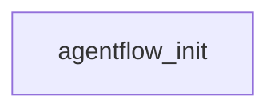

# 新手上手指南：multi-agent-workflow

## 一句话总结
agentflow 是 AIOps Bug Fix 智能体平台的后端。Bug 修复场景被建模为 YAML 工作流 DAG（包含 agent、工具、沙箱动作、审批门禁），每次 Run 创建时版本冻结，再由配置驱动的执行引擎按 DAG 语义（join/skip）执行，支持幂等副作用、重试/断点续跑、CAS 审批与审计日志。所有基础设施（StateStore/Queue/Lock）均可插拔：本地用 InMemory/SQLite，生产切换 Kafka/PostgreSQL/Redis。里程碑 M0-M7（72 个测试）覆盖完整闭环：从真实数据源（ES/Prometheus/kubectl）诊断 → 沙箱修复 → 审批 → PR。

## 架构地图

在 [mermaid.live](https://mermaid.live/view#pako:eNoVyzsKhDAUBdCthFtnBaktrZx2YLgkLxrIZ4gviIh7F9sD54JvQeAQczv8xq5mXr7VGK5S9cVfqklhUaQXpgB3QTcp7wkSObLituDQ9jmrh9M-xGL8A1WmxLWzwEXmXe4HMn0mqg) 查看 / 编辑

图例：
- `agentflow_init` = `agentflow/__init__.py`

图中每一条边都由静态分析验证过；工具无法验证的边会被省略，绝不猜测。

## 心智模型
把它理解为一个包裹 AI 智能体的确定性工作流编排器。

一个工作流（`workflows/*.yaml`）就是一个 DAG：节点是带类型的步骤（agent/invoke/tool/approval），边可携带 `when` 条件，join 为 `any|all`。创建 Run 时，工作流通过 `workflow_hash` 快照（版本冻结）并由 DAG 执行器运行。

状态存放在可插拔的 StateStore（InMemory/SQLite/Postgres），并发由可插拔的 Queue/Lock（memory/Kafka/Redis）承担，全部由配置驱动。

副作用通过 `execution_id` + `external_operation_id` 保证幂等。

审批转移使用 CAS，终态不可逆。

Agent 运行在 AgentScope（锁定 2.0.3，模型 DeepSeek deepseek-v4-flash）之上，配工具注册表与权限上下文；代码执行类副作用被推进沙箱 Pod，且动作是白名单有限集合。

真实 testbed 联调时，同一套工具签名直接切换为 ES/Prometheus/kubectl 适配器，因此 mock↔真实 只换 adapter。控制面是一个 FastAPI 应用，提供 Run 的 create/approve/resume 以及审计查询。

## 建议阅读顺序
- `README.md` — 里程碑总览（M0-M7）、快速开始（make install/test/demo/api）、目录结构，以及沙箱与 testbed 联调脚本。先读它建立全局认识。
- `workflows/bug-fix-pipeline.yaml` — 标准工作流定义（design §8.1）。展示其余代码所要执行的 DAG 形态：节点类型、when 条件、join、审批门禁。
- `agentflow/core/dag.py` — DAG 语义：带 `when` 的边、join any|all、全 INACTIVE → SKIPPED 级联、审批节点参与 skip。这是语义上最重要的文件。
- `agentflow/statestore/base.py` — 状态模型 + 审批 CAS + 终态不可变。动任何状态转移前必读——绕过 CAS 是被禁止的。
- `agentflow/executor/dag_executor.py` — 执行引擎：并发跑节点、param 解析、幂等、重试，以及审批挂起时仅当 ready 集为空才释放 worker。
- `agentflow/service.py` — RunService 编排：create_run（版本冻结）→ approve → resume。把工作流、状态、执行器、队列串起来的胶水层。
- `agentflow/config.py` — 配置驱动的后端切换（LLM + StateStore/Queue/Lock）。解释本地 InMemory/SQLite 如何切到生产 Kafka/Postgres/Redis。
- `agentflow/sandbox/action_executor.py` — 沙箱动作的有限白名单（scale/restart/patch_resources/delete_temp）及其边界——平台在集群上被允许做什么。
- `scripts/run_fix_loop.py` — M7 场景2 端到端修复闭环：诊断 → 在真实 git 工作区修复 → 审批 → PR。整个平台最完整的纵向切片。
- `tests/test_executor.py` — 语义契约测试（join/skip/审批 CAS/skip 级联/失败 abort，含 S-010b）。改动 DAG 语义必须保持此套件全绿。

## 发现的入口点
- agentflow/__init__.py — 由 pyproject 与 __init__.py 推断出的 Python 包根。

## 子系统
### Agentflow（主包）
- 职责：平台本体：agents（AgentScope 2.0.3 的 15-agent 编队、工具注册表、权限上下文、真实数据源适配器）、API 控制面（FastAPI）、审批（CAS + 超时 Sweeper + 通知）、审计日志、幂等执行器（DAG + 重试 + 续跑）、可插拔 queue/lock 适配器（memory + Kafka/Redis）、沙箱 client/orchestrator/policy，以及配置驱动的装配。
- 位置：`agentflow/**`
- 入口：`agentflow/service.py`
- 何时可跳过：除非你的任务直接涉及 agent 执行、工具、审批或后端装配。

### Core
- 职责：工作流模型 + DAG 语义（join any|all、条件边、SKIPPED 级联）、表达式/路径辅助函数、版本冻结（Run 使用 workflow_hash 快照；Resume 读原快照）。
- 位置：`agentflow/core/**`
- 入口：`agentflow/core/dag.py`
- 何时可跳过：除非你要改工作流/DAG 语义或版本冻结行为。

### Tests
- 职责：行为契约套件：工作流加载/冻结/校验、执行器语义（S-010b）、幂等、续跑、工作区冻结、沙箱、M5 审批、M6 适配器 + 故障恢复、agents、数据源。
- 位置：`tests/**`
- 入口：`tests/conftest.py`
- 何时可跳过：除非你需要理解预期行为契约或扩展覆盖率。

### Scripts
- 职责：真实模型 / 真实数据源联调：场景1 与场景2 诊断链（DeepSeek + ES/Prometheus/kubectl）、M7 修复闭环 E2E、沙箱 K8s 验证。
- 位置：`scripts/**`
- 入口：`scripts/run_fix_loop.py`
- 何时可跳过：除非你在跑 testbed 联调或端到端修复闭环。

### Workflows
- 职责：声明的 YAML 工作流：标准 bug-fix 流水线（§8.1）与场景2 完整修复闭环（诊断 → 修复 → 审批 → PR）。
- 位置：`workflows/**`
- 入口：`workflows/bug-fix-pipeline.yaml`
- 何时可跳过：除非你在编写或扩展工作流定义。

### Docker
- 职责：沙箱镜像：纯 stdlib http.server 的 exec 服务（零 pip 依赖、离线可建），带可选 `WITH_JDK` 构建参数以支持 Java 编译。
- 位置：`docker/sandbox/**`
- 入口：`docker/sandbox/Dockerfile`
- 何时可跳过：除非你在改沙箱镜像或新增运行时（例如 Java）。

## 踩坑清单
- AgentScope 锁定 **2.0.3**——升级前必须重跑 S-001/S-011；模型是 DeepSeek deepseek-v4-flash（走 agent 配置），不能随意逐 agent 改。
- 审批转移**必须**走 `statestore/base.py` 里的 CAS 更新；终态不可变。严禁绕过 CAS 修改终态。
- 副作用必须幂等：`execution_id` 唯一 + `external_operation_id` 复用。任何新增副作用节点都必须定义幂等键。
- DAG 语义是承重的：边带 `when`，join 是 any|all，全 INACTIVE 节点级联为 SKIPPED，审批节点参与 skip。改语义必须保持 `tests/test_executor.py` S-010b 全绿。
- README 声称存在 `workspace/`（M3）模块（git base_sha 冻结 + 分支隔离），但该目录在**当前分支并不存在**——文档跑在代码树前面。不要照 README 承诺去 grep 不存在的文件。
- 沙箱 `exec_service` 刻意用纯 stdlib（镜像离线可建）；SandboxClient 本地联调必须用 `kubectl port-forward`（macOS 宿主无法路由 pod IP）；沙箱动作是有限白名单——新增动作需评审。
- 真实数据源：ES index 是 `app-logs`，字段是驼峰 `app.traceId`（不是 `trace_id`）；Prometheus 用 cAdvisor `container_*`；kubectl namespace 是 `order`。场景必须跑在干净日志窗口——切换前 `DELETE :19200/app-logs` 清窗，否则互相污染。
- trace-analyst agent 需要 `max_iters >= 12`（2 个工具 + 链合成）；默认 6 会迭代耗尽返回 {}。
- param 解析：`$.nodes.X.output`（无字段）与 `.output.field` 都要正确解析——`output` 是标准访问器，**不能当字段遍历**（M7 修复的潜伏 bug，曾导致所有 workflow params 静默失效）。
- Redis 锁 token 比较前必须 decode（redis get 返回 bytes）。
- 多租户：所有表带 `tenant_id`，租户身份由 JWT 派生——**禁止**以客户端提交的 tenant 作为授权依据。

## 预估阅读时间
主线 35 分钟，全面覆盖约 4 小时。
