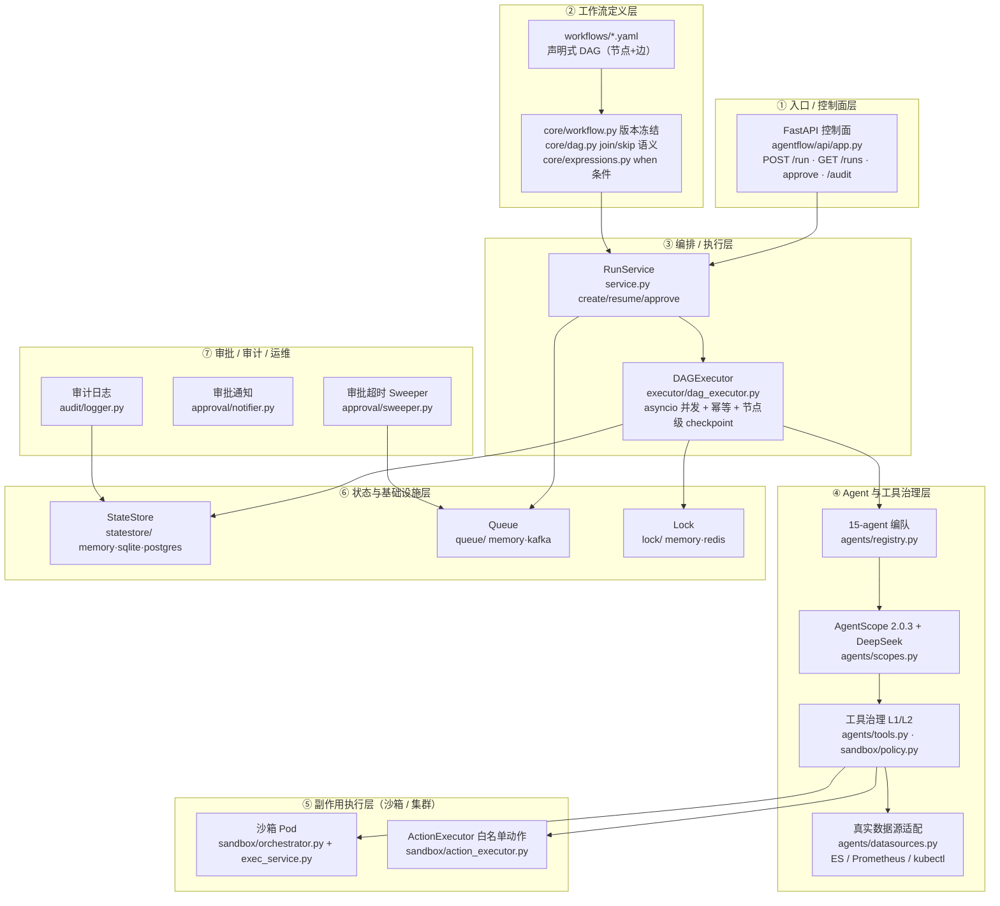
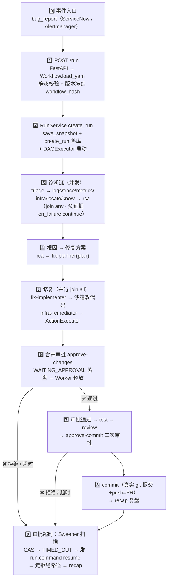

# agentflow 项目架构与数据流转图

> 目的：从「事件进来」到「修复上线」的一整条链路，看清**流转了哪些组件、它们是什么层级、用了什么技术、为什么这么用**。
> 建议配合 `ONBOARDING.zh-CN.md`（心智模型 + 子系统）一起看。

---

## 一、分层架构总览（7 层）

**层级说明（每层的职责 / 技术 / 为什么）**

| 层 | 职责 | 技术 | 为什么这么用 |
|---|---|---|---|
| ① 控制面 | 对外 REST 入口：创建 Run、查询、审批、审计、健康检查 | FastAPI + Uvicorn + Pydantic | 控制面与 Worker 解耦（生产）；HTTP 便于接 API Gateway / JWT；Pydantic 做请求校验 |
| ② 工作流定义 | 把 YAML 变成可校验、可冻结的 DAG | PyYAML + hashlib | 声明式编排可读可审计；`workflow_hash`(sha256) 版本冻结，保证 Run 与 Resume 永远用同一版本 |
| ③ 编排执行 | 并发执行 DAG：join/skip、审批挂起、重试、断点续跑 | asyncio | 并行分支用 `asyncio.gather` 并发跑；节点级 checkpoint 落库，任意 crash 可 Resume |
| ④ Agent 与工具 | 15 个职能 agent 分工 + 工具权限治理 + 真实数据源 | AgentScope 2.0.3、DeepSeek、httpx | AgentScope 提供统一 agent 运行时（推理/工具/权限）；工具分 L1 只读 / L2 执行并带超时限流审计 |
| ⑤ 副作用执行 | 代码写入 / Shell / 集群动作，与推理隔离 | K8s python client、stdlib http.server、httpx | 推理与执行分离：沙箱独立 Pod、非特权、资源受限；动作是**有限白名单**防失控 |
| ⑥ 状态与基础设施 | 状态、队列、锁全部可插拔 | SQLite/PostgreSQL、Kafka、Redis | 本地 MVP 与生产统一架构：核心逻辑 100% 共享，只换适配器（`config.py` 驱动） |
| ⑦ 审批 / 审计 | 审批超时自动拒绝、通知、全量审计 | asyncio 后台任务 + CAS | 终态不可逆（CAS）；审批无人处理时由 Sweeper 超时踢走，不卡死整条链路 |

---

## 二、端到端数据流转（带步骤编号）

**步骤详解：组件 × 技术 × 为什么**

| # | 组件 | 这一步做了什么 | 技术 | 为什么 |
|---|---|---|---|---|
| 0 | 外部系统 | 推送故障事件（bug_report：工单号、影响面、CMDB CI、trace 提示） | ServiceNow / Alertmanager 概念 | 平台是被动响应事件，事件即 Run 的 `inputs` |
| 1 | `api/app.py` + `core/workflow.py` | 解析 workflow_yaml → `DAG.build` 静态校验（环 / join 一致性 / params 只引用上游）→ 计算 `workflow_hash` | FastAPI + PyYAML + hashlib | 声明式 + 启动即校验，非法 DAG 直接 422；hash 用于去重与版本冻结 |
| 2 | `service.py` `RunService.create_run` | 保存 snapshot（同 hash 复用）→ `create_run` 落库 → 构建 `DAGExecutor` 并 `run()` | asyncio | 状态先落库再执行，为崩溃恢复留基础 |
| 3 | `executor/dag_executor.py` + 诊断 8 agent | 并发执行 ready 节点：triage 先出初步判断，6 个只读 agent 并行取证，最后 rca 汇合。每节点完成即持久化 checkpoint | `asyncio.gather` + AgentScope | 并行取证快；`on_failure:continue` 的 agent（logs/metrics/infra/know）失败产出负证据不中断；checkpoint 支持 Resume |
| 4 | `fix-planner` | 根据根因生成结构化修复方案（steps） | AgentScope + DeepSeek | 修复动作前先规划，便于审批展示 |
| 5 | `fix-implementer` + `infra-remediator` | 前者在沙箱写代码（L2 工具），后者经 `ActionExecutor` 做基建动作（scale/restart/patch），两者 `join:all` 汇入审批 | 沙箱 client + K8s client | 修复与基建并行；all-join 保证审批时方案完整可见 |
| 6 | `approve-changes`（approval 节点） | 满足条件 → 置 `WAITING_APPROVAL` 落盘 → `run()` 返回，Worker 释放 | CAS 状态机 | 人工把关在自动化中间插入；审批挂起时不再推进，等外部 approve |
| 7 | `tester` + `reviewer` + `approve-commit` | 结构化测试 → 代码审查 → 二次审批 | AgentScope + `when` 条件边 | 测试/审查通过才走到提交审批；`when` 边按输出真假分流（通过→继续，失败→直接 recap） |
| 8 | `committer` | 真实 git commit + push（=PR），结果带 `external_operation_id`(PR 号) | git + 幂等键 | **副作用只发生一次**：重跑时命中同 run 同节点同 external_operation_id 的成功记录则直接复用 |
| 9 | `approval/sweeper.py` | 后台每 60s 扫 `WAITING_APPROVAL`；超时用 CAS 置 `TIMED_OUT` → 发布 `run.command` resume → Worker 继续走拒绝路径 | asyncio 常驻 + Queue | 无人审批不无限卡死；CAS 保证与手动审批并发不冲突（终态不可逆） |
| ⏭ | `audit/logger.py` | 每次工具调用写一条审计（tenant/tool/decision/run/node/输入脱敏） | AuditLogger → StateStore.audit_logs | 全链路可追溯、合规；输入脱敏避免密钥泄露 |

---

## 三、贯穿全程的关键机制

- **版本冻结（§8.5）**：`create_run` 时把规范化 YAML + sha256 存 `workflow_snapshots`；Resume 永远读原 snapshot，后续改 YAML 不影响旧 Run。
- **幂等（§8.4）**：每个节点执行生成唯一 `execution_id`；副作用节点带 `external_operation_id`，重跑复用成功结果。
- **审批 CAS + 终态不可逆（§8.3）**：`cas_update_approval` 只有当前状态=期望状态才更新；APPROVED/REJECTED/TIMED_OUT 之后不可再变。
- **join/skip 语义（§8.2）**：边带 `when` 条件；`any` ≥1 条 ACTIVE 入边即执行，`all` 需全部 required 边 ACTIVE；所有入边 INACTIVE → 节点 SKIPPED 并级联下游。审批节点也参与 skip（S-010b）。
- **推理/执行分离（§4.1）**：Agent（推理，只读）不直接执行代码/集群动作，全部经沙箱 Pod 或 ActionExecutor（有限动作 + 参数白名单）。

> ⚠️ 注意：`scripts/run_fix_loop.py` 引用了 `agentflow.workspace`（WorkspaceManager，M3）和 CMDB，
> 但**该目录在当前分支并未包含在代码树中**（README 声称 M3 已实现，实际目录缺失），脚本目前无法直接运行。
> 读代码时以磁盘上的 `agentflow/**` 为准。

---

## 四、技术选型一览（为什么用这些）

| 技术 | 版本/形态 | 用在哪 | 为什么 |
|---|---|---|---|
| Python + asyncio | ≥3.12 | 全后端 | 全异步；DAG 并行分支、审批挂起、Sweeper 常驻都依赖事件循环 |
| FastAPI + Pydantic | ≥0.111 | 控制面 API / 配置 | 类型校验、OpenAPI 文档、异步原生 |
| AgentScope | **锁定 2.0.3** | agent 运行时 | 内建 Agent/工具/权限/状态；升级前必须重跑 S-001/S-011 |
| DeepSeek | deepseek-v4-flash | LLM 推理 | OpenAI 兼容低成本；无 Key 时回退 ScriptedJsonModel 供 CI |
| PyYAML | ≥6.0 | 工作流定义 | 声明式 DAG，human-readable + 可哈希冻结 |
| httpx | ≥0.27 | 数据源 / 沙箱调用 | 异步 HTTP；mock↔真实 adapter 同签名 |
| K8s python client | kubernetes≥30 | 沙箱 Pod / ActionExecutor | 动态拉起隔离 Pod、受限动作改集群 |
| stdlib http.server | 纯标准库 | 沙箱 exec 服务 | 零 pip 依赖 → 镜像离线可建 |
| SQLite / PostgreSQL | aiosqlite / psycopg | StateStore | 本地零配置 / 生产完整 schema（§8.8） |
| Kafka | kafka-python | Queue | 生产双队列 `run.trigger` + `run.command`；故障可重放 |
| Redis | redis-py | Lock | `SET NX PX` 原子分布式锁 + token 校验防误删 |

---

## 五、用一句话记住它

> **事件进来 → FastAPI 控制面解析 YAML 并版本冻结 → RunService 启动 DAGExecutor → 15 个 Agent 分工诊断（查 ES/Prometheus/k8s）→ 定位根因 → 规划 → 沙箱+集群并行修复 → 审批门禁（CAS，超时自动拒绝）→ 测试/审查 → 真实 git 提交出 PR → 复盘。全程幂等、可续跑、全审计。**
