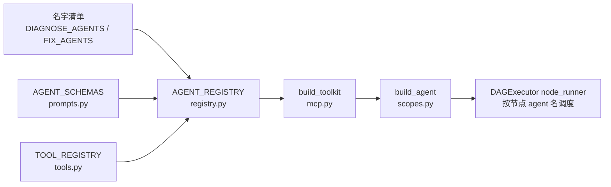
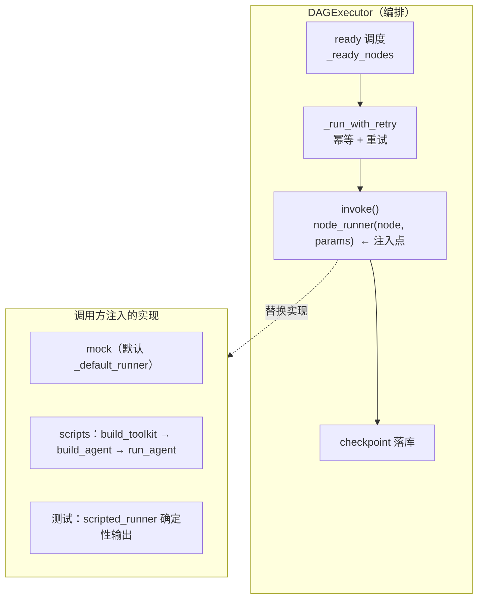

# agentflow 的 agent 是如何注册的

> 目标：说清 15 个 agent（8 诊断 + 7 修复）从「定义」到「可被工作流调度执行」的完整注册链路。
> 一句话：注册分两层——**import 时的静态元数据注册**（`AGENT_REGISTRY`）和**运行时的实例化**（每个节点执行时才真正造出 Agent）。没有任何动态注册 API。

---

## 1. 概览：注册分两层

| 层 | 时机 | 产物 | 代码 |
|---|---|---|---|
| 静态注册 | 模块 import 时 | `AGENT_REGISTRY`（元数据：名字/角色/输出契约/可见工具） | `agents/registry.py` |
| 运行时实例化 | 每个节点执行时 | 真正的 AgentScope `Agent` 实例 | `agents/mcp.py` + `agents/scopes.py` |



---

## 2. 静态注册（import 时）

### 2.1 名字清单：先定义"有哪些 agent"

`agents/registry.py` 硬编码两个清单（共 15 个）：

```python
DIAGNOSE_AGENTS = ["triage", "log-analyst", "trace-analyst", "metrics-analyst",
                   "infra-locator", "code-locator", "knowledge-lookup", "root-cause"]  # 8 个，只读
FIX_AGENTS = ["fix-planner", "fix-implementer", "infra-remediator",
              "tester", "reviewer", "committer", "postmortem"]                        # 7 个，含 L2 执行
```

### 2.2 字典推导式：拼出 `AGENT_REGISTRY`

`registry.py:45` 用一句字典推导式，把四个来源合成每个 `AgentSpec`：

```python
AGENT_REGISTRY = {
    name: AgentSpec(
        name=name,
        role="diagnose" if name in DIAGNOSE_AGENTS else "fix",
        schema=AGENT_SCHEMAS.get(name, {}),     # 输出契约 ← prompts.py
        tools=tools_for_agent(name),            # 可见工具 ← tools.py
    )
    for name in DIAGNOSE_AGENTS + FIX_AGENTS
}
```

`AgentSpec` 字段来源：

| 字段 | 来源 | 说明 |
|---|---|---|
| `name` | 两个清单里的字符串 | 唯一标识，也是 workflow 节点 `agent:` 的值 |
| `role` | 在哪个清单 | `diagnose`（只读）/ `fix`（修复） |
| `schema` | `prompts.py` 的 `AGENT_SCHEMAS` | 输出 JSON 契约（如 `BugReportSchema`），用于校验 LLM 输出 |
| `tools` | `tools.py` 的 `tools_for_agent(name)` | 该 agent 可见的工具列表（ToolSpec 列表） |

> `AGENT_REGISTRY` 是 **dict**（name → AgentSpec），所以 `get_agent_spec(name)` / `all_agents()` 都是 O(1) 查找，执行器按节点 agent 名取 spec。

---

## 3. 工具注册是"反向"的（`tools.py`）

**关键点：不是"给 agent 挂工具"，而是"工具声明对谁可见"。**

每张工具定义 `ToolSpec` 自带一个 `agents` 列表（`tools.py:27` `TOOL_REGISTRY`）：

```python
"get_trace": ToolSpec(
    "get_trace",
    ["trace-analyst", "root-cause", "triage"],   # ← 谁能看到我
    timeout=30, rate_limit=60, level="L1",
    description="查询链路追踪",
),
```

`tools_for_agent` 是**反向过滤**整张 `TOOL_REGISTRY`（`tools.py:111`）：

```python
def tools_for_agent(agent_name):
    return [spec for spec in TOOL_REGISTRY.values() if agent_name in spec.agents]
```

含义：

- triage 只可见 `get_trace`（它的名字只出现在这一个 ToolSpec 的 `agents` 里）；
- `search_knowledge` 只在 `knowledge-lookup` / `root-cause` 的可见范围；
- 工具治理以 `TOOL_REGISTRY` 为唯一真源——工具没写你的名字，你对它不可见。

工具分两级：

- **L1 只读**（`query_logs / get_trace / query_metrics / check_infra / describe_pod / locate_code / search_knowledge`）——数据源 MCP，本地执行；
- **L2 执行**（`sandbox_run_shell/python/write_file / scale_deployment / restart_pod / patch_resources`）——经沙箱 Pod / ActionExecutor，`needs_approval=True` 的需审批。

---

## 4. 运行时实例化（每个节点执行时）

注册表只是元数据，真正的 Agent 在节点执行时才构建，链路是 `mcp.py → scopes.py`：

```python
# mcp.py:20  —— 按 agent 可见工具造 FunctionTool（Toolkit）
toolkit = build_toolkit(agent_name, use_mock=True, cmdb=..., datasource=..., sandbox_client=..., action_executor=...)

# scopes.py:71 —— 组装 AgentScope Agent（system_prompt + model + toolkit + 权限上下文）
agent = build_agent(agent_name, toolkit, model, max_iters=..., tenant_id="local")

# scopes.py:93 —— 喂入输入，解析出严格 JSON（§7 输出契约）
out = await run_agent(agent, input)
```

`build_agent` 补齐注册表里没有的两样：

- **system_prompt**：`prompts.py` 的 `SYSTEM_PROMPTS.get(name, ...)`（每个 agent 的角色提示词，如 triage 的"症状分类"规则）；
- **权限上下文**：`build_permission_context(name)`（`scopes.py:23`）——`DONT_ASK` 模式 + 把该 agent 注册的工具全部设为 allow（白名单免确认执行）；**没在 allow 里的工具默认 DENY**。这是 §9.5 工具权限的关键：agent 只能调自己注册过的工具。

调度：DAGExecutor 的 `node_runner` 读工作流节点里的 `agent:` 名字 → 查 `AGENT_REGISTRY` 取 spec → 走上面的实例化 → 执行。`node_runner` 本身是 executor 与「怎么跑节点」之间的解耦点，见下节。

> 注：数据源适配可切换——`build_toolkit` 传 `cmdb`/`datasource`（真实 ES/Prometheus/kubectl）或 `use_mock=True`（本地确定性 mock），**工具签名不变，只换 adapter**。

---

## 5. node_runner：executor 与「怎么跑节点」的解耦点

### 5.1 它是什么

`node_runner` **既不是运行阶段，也不是独立模块**，而是一个**注入点 / 策略回调**。类型别名定义在 `executor/dag_executor.py:46`：

```python
NodeRunner = Callable[[Node, dict], Awaitable[Any]]
#            入参: (节点对象, 解析后的 params)   返回: 该节点的输出
```

### 5.2 职责划分：编排 vs 执行

| | executor（`dag_executor.py`） | node_runner（调用方注入） |
|---|---|---|
| 管什么 | **编排**：ready/skip 调度、join any\|all、when 条件、幂等 + 重试、checkpoint 落库、审批挂起 | **执行**：一个节点"具体怎么跑"——agent 实例化、喂 LLM、拿输出 |
| 确定性 | 完全确定 | 可替换 |
| 代码 | executor 内部 | 谁注入就是谁的 |



### 5.3 在 executor 里的调用位置

`dag_executor.py:265 _run_with_retry` 内的 `invoke()` —— **每个节点执行一次，含每次重试**：

```python
async def invoke() -> Any:
    result = self.node_runner(node, params)   # 单节点执行钩子
    if asyncio.iscoroutine(result):           # 兼容同步/异步 runner
        return await result
    return result
```

调用链：`run()` → `_ready_nodes()` 选一批 ready → `asyncio.gather` 并发 `_run_with_retry` → `invoke()` → `node_runner` → 结果落 checkpoint。

### 5.4 谁注入什么

| 调用方 | 注入 | 效果 |
|---|---|---|
| `DAGExecutor.__init__`（`dag_executor.py:129`） | 不传 → `_default_runner` | mock：`sleep(0.01) + {"node": ..., "ok": True}`，**无 LLM** |
| `RunService`（`service.py:22`） | 透传外部 `node_runner` → executor / `resume_executor` | API 层不传 → 全 mock |
| `scripts/diagnose_scenario{1,2}.py` / `run_fix_loop.py` | 闭包：每次 `build_toolkit(name)` → `build_agent(...)` → `run_agent(...)` | 真实 DeepSeek |
| 测试（`tests/test_diagnose_chain.py` 骨架） | `scripted_runner(node, params)` 字典映射 | 确定性，锁死编排语义 |

### 5.5 与 agent 生命周期的关系

正因为脚本的 node_runner 每次被调都**新建**一个 agent（`build_toolkit` + `build_agent`），所以：

- N 个流程 × 各跑一次 triage → **约 N 次** triage 实例化，粒度是"节点执行"而非"流程"；
- 单节点重试 → 每次 `invoke()` 重新走 node_runner → 再建一个；
- 用完无显式 destroy，靠引用计数归零 → GC 回收；
- 每次重建的只有**轻量 Agent 壳**；`model` 和数据源 adapter 是**重资产**，在 runner 外构建一次、全程共享。

#### 为什么 model / 数据源 adapter 是"重资产"，Agent 壳是"轻的"

分界线：**谁持有连接/传输层，谁就是重资产；谁只是引用拼装，谁就是轻壳**。

- **数据源 adapter（重）**：`RealDataSourceAdapter.__init__`（`datasources.py:42`）构造时就建了一个**常驻 `httpx.AsyncClient`（连接池）**，所有工具（query_logs / query_metrics / check_infra / describe_pod / get_trace）复用它发 HTTP 到 ES/Prometheus——这也是脚本结尾要 `await ds.aclose()` 显式释放的原因。若每节点都新建 adapter：新 TCP 连接 + 重新握手、用完要逐个 aclose 否则连接泄漏、keep-alive 预热全浪费。
- **model（重）**：`build_model()` 返回的 `OpenAIChatModel` 持有 DeepSeek 凭据 + LLM 传输层/连接 + AgentScope 用量统计/重试状态。重建 = 重新建连。
- **Agent 壳（轻）**：`build_agent` 返回的 `Agent` 只是纯 Python 组合对象——`name` / `system_prompt` 字符串 + 对共享 `model` / `toolkit` 的**引用** + `ReActConfig` + 权限上下文。不持有任何 socket / 连接。
- **Toolkit（轻）**：N 个 `FunctionTool`，内部是 `partial(getattr(datasource, ...))` 的轻闭包，真正干活时指向共享的 datasource。

| 对象 | 持有什么 | 重建成本 |
|---|---|---|
| `RealDataSourceAdapter` | 常驻 `httpx.AsyncClient`（ES/Prometheus 连接池） | 高：重新建连 + 泄漏风险 |
| `model` | DeepSeek 凭据 + LLM 传输层/连接 | 高：重新建连 |
| `Agent` 壳 | 字符串 + 对 model/toolkit 的引用 + 配置 | 低：纯对象拼装，无 I/O |
| `Toolkit` | N 个 FunctionTool（partial 闭包） | 低：轻闭包，func 指向共享 datasource |

> 时序细节：`model` 和 `ds` **不是"服务进程启动时"建的**，而是**一次脚本运行 / 一次 Run 开始时建一次**（脚本里是 `main()` 开头 `model = build_model()`、`ds = RealDataSourceAdapter()`，之后 for 循环里所有节点共用）。当前 API 模式（`make api`）走 mock runner，这两个甚至不会被构建。

### 5.6 关键收益

**换 runner 不碰编排代码，改编排逻辑也不碰 runner。** API 走 mock、脚本走真实 LLM、测试走脚本化输出，三者的执行语义由 executor 统一保证（幂等/重试/负证据/checkpoint），只是"最后一公里"的实现不同。

---

## 6. 新增一个 agent 要动哪几处

全声明式，无运行时注册：

| 步骤 | 文件 | 改什么 |
|---|---|---|
| 1 | `agents/registry.py` | 名字加进 `DIAGNOSE_AGENTS` / `FIX_AGENTS` |
| 2 | `agents/prompts.py` | 加 `SYSTEM_PROMPTS[name]`（角色提示词）+ `AGENT_SCHEMAS[name]`（输出契约） |
| 3 | `agents/tools.py`（可选） | 在某个 `ToolSpec.agents` 里加上它，或新增 `ToolSpec` |
| 4 | `workflows/*.yaml`（使用方） | 节点 `agent:` 指向新名字 |

---

## 7. 相关文件索引

| 文件 | 角色 |
|---|---|
| `agentflow/agents/registry.py` | 名字清单 + `AGENT_REGISTRY` 构建 + `get_agent_spec` / `all_agents` |
| `agentflow/agents/tools.py` | `TOOL_REGISTRY`（工具→可见 agent）+ `tools_for_agent` + L1/L2 实现 |
| `agentflow/agents/prompts.py` | `SYSTEM_PROMPTS`（角色提示词）+ `AGENT_SCHEMAS`（输出契约） |
| `agentflow/agents/mcp.py` | `build_toolkit`：把可见工具打包成 AgentScope Toolkit |
| `agentflow/agents/scopes.py` | `build_agent` / `build_model` / `run_agent` / `build_permission_context` |
| `agentflow/executor/dag_executor.py` | DAG 编排 + `NodeRunner` 类型别名（:46）+ 默认 mock `_default_runner`（:208）+ `_run_with_retry` 调注入点（:265） |
| `agentflow/service.py` | `RunService` 透传 `node_runner` 给 executor / `resume_executor` |
| `scripts/diagnose_scenario{1,2}.py` / `scripts/run_fix_loop.py` | 注入真实 LLM 的 node_runner（每次 `build_toolkit` → `build_agent` → `run_agent`） |
