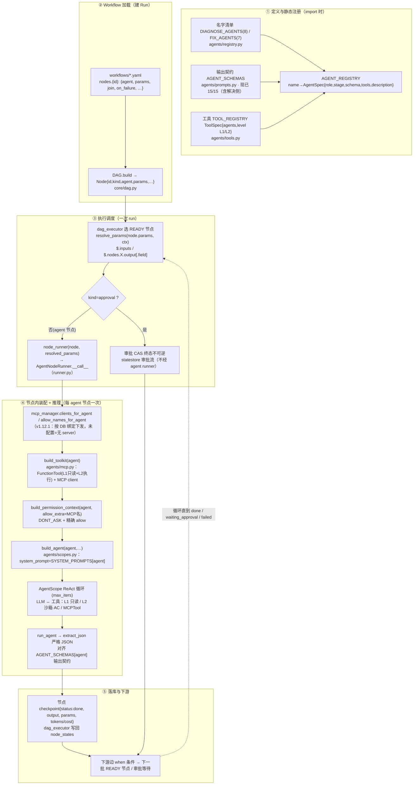

# agentflow 调用流程图 + 调用步骤

> 说明「一条 bug ticket 进来 → workflow 各 agent 节点逐个执行 → 出结果」的完整调用链。
> 配套：agent 注册/定义见 `AGENTS_REGISTRATION_zh-CN.md`；worker/queue/审批语义见 `design-v5.2.md`。
> 图中每个文件/函数都给出可跳转位置，与当前仓库代码一一对应。

---

## 1. 流程图

图例：五段 = ① 定义与静态注册 → ② Workflow 加载 → ③ 执行调度 → ④ 节点内 agent 装配与推理 → ⑤ 落库与下游推进。
菱形 = 分支点：`approval` 节点不走 agent runner。

---

## 2. 调用步骤（一条请求从进来到出结果）

### ① Run 创建（service / api）
1. `POST /run {workflow_id, ticket}`（`agentflow/service.py` `start_run`）→ 从库 / workflow snapshot 加载 DAG
   （`core/workflow.py` 版本冻结 `workflow_hash`，Run 用 snapshot）。
2. `RunService` 拉起后台 run，把 `node_runner` 注入 `DAGExecutor`：
   - 检测到 `DEEPSEEK_API_KEY` → 真实 `AgentNodeRunner(build_model(settings))`（`api/app.py` `init()`）；
   - 无 Key → mock `_default_runner`（全绿、token/cost 诚实为 0）。

### ② 调度（`agentflow/executor/dag_executor.py`）
3. 每波扫 DAG：挑 `READY` 节点（上游 done、边 `when` 条件满足）。
4. `resolve_params(node.params, ctx)`（dag_executor.py:301）把 `$.nodes.X.output[.field]` / `$.inputs.*`
   解析成实参 dict；注意 `output` 是标准访问器，**不能当字段遍历**（历史潜伏 bug，CLAUDE.md §9.5）。
5. `approval` 节点（`kind: approval`）→ 走审批 CAS 终态流程（approve/reject/skip），**不进 runner**；
   `agent` 节点 → 调 `node_runner(node, resolved_params)`。

### ③ agent 节点执行（`AgentNodeRunner.__call__`，`agents/runner.py:114`）
6. `agent = node.agent`；为空返回结构化占位（审批/兜底节点）。
7. 有 `mcp_manager` → 预取 `clients_for_agent(agent)` + `allow_names_for_agent(agent)`
   （v1.12.1 两态：DB `mcp_server_ids` 无绑定 → 返回**空**（该 agent 无 MCP 工具）；绑定子集 → 只下发
   所选 server。未注入 resolver 的独立用法才回退全量；allow 名单必须早于 build_agent）。
8. `build_toolkit(agent, use_mock, mcp_clients)`（`agents/mcp.py`）＝ FunctionTool
   （L1 只读 mock/真实数据源；L2 沙箱 / Action Executor 视执行器注入）＋ MCP client（hybrid）。
9. `build_permission_context(agent, allow_extra=mcp__…名)`（`agents/scopes.py:23`）→ `DONT_ASK` + 精确 allow。
10. `build_agent(agent, toolkit, model, permission_context, max_iters)`（`agents/scopes.py:71`）
    → `system_prompt = SYSTEM_PROMPTS[agent]`；模型包一层 `UsageTrackingModel` 计量。
11. `run_agent`：喂入 params JSON → AgentScope ReAct 循环，LLM 按需调工具
    （只读工具自动 ALLOW；非只读无 allow 规则 → DENY）→ `extract_json` 提取严格 JSON 返回。
12. `last_usage = {tokens, cost}`；执行器把它并入节点 checkpoint（dag_executor.py:307）。

### ④ 落库 / 推进
13. 节点 `{status: done, output, params, tokens/cost}` 写 `node_states` → `_persist`（断点续跑基础）；
    下游边 `when`（如 `$.nodes.approve-changes.output.approved == true`）决定下一批 READY。
14. 循环直到 `done` / `waiting_approval`（审批等待，Worker 释放）/ `failed`（抛 `WorkflowNodeFailed`）。

---

## 3. agent 定义的来源（配合本图 ①，DB 覆盖层 v1.12）

> 现状（v1.12 起）：运行时以 `agentflow/agents/agent_config.py::AgentConfigResolver` 为**合并事实来源**。
> resolver 构造自控制面 `agent_configs` 表（`agentflow/api/agent_store.py`），把 DB 覆盖行与内置静态默认**合并**解析。

| AgentSpec 字段 | 静态默认来源 | DB 覆盖来源 | 位置 |
|---|---|---|---|
| `name` | `DIAGNOSE_AGENTS` / `FIX_AGENTS`（15 个） | `agent_configs.name`（seed 15 行 + 自定义） | `agents/registry.py` |
| `role` | 在哪个清单（diagnose/fix） | `role` | `agents/registry.py` |
| `stage` | `AGENT_STAGES`（detect…learn，供 /agents 分组） | `stage` | `agents/registry.py` |
| `schema` | `AGENT_SCHEMAS`（**15/15 已接线**） | `schema_json` | `agents/prompts.py` → `agents/schemas.py` |
| `tools` | `tools_for_agent(name)`（ToolSpec 反向可见） | —（L1 函数工具不可经 API 配置） | `agents/tools.py` |
| `description` | `AGENT_DESCRIPTIONS` | `description` | `agents/registry.py` |
| `system_prompt` | `SYSTEM_PROMPTS` | `system_prompt` | `agents/prompts.py` |
| `enabled` | 恒 True（静态无此概念） | `enabled` | 停用 → 节点击短路，不调 LLM |
| `mcp_server_ids` | —（静态无绑定 = 无 server） | `mcp_server_ids`（两态，见 §4） | agent→MCP server 绑定 |

**覆盖语义（NULL=回退内置）**：DB 行 `description/system_prompt/schema_json` 存 `NULL` 表示**未覆盖**，
resolver 合并时回退到静态默认；写入非空即覆盖。schema 覆盖仅为元数据/详情展示层生效
（`extract_json` 不做强校验，对齐现状）。`origin='builtin'`（seed，禁删，可编辑/清空覆盖回退）vs
`origin='custom'`（POST 新建，可删）。
**内置默认物化**：seed 会把内置行的 description/system_prompt/schema_json 落静态默认（DB 是可见快照，
非 NULL）；因此「未覆盖」的 NULL 主要出现在 custom 行或用户清空覆盖后——清空保存（→NULL）即回退内置。

**装配链（改动即热生效）**：控制面每次写 `/agent-configs` 后重建 resolver 并重接
`mcp_manager.server_ids_for = resolver.server_ids_for`（server 粒度下发）；API 启动 `init()` 把 resolver
注入 `AgentNodeRunner(agent_config=…)`——节点执行（③）开头先 `resolve(agent)`：`enabled=0` → 短路返回
`{"node":…,"ok":True,"disabled":True}`（不调 LLM）；否则把合并后的 `system_prompt` 传 `build_agent`
（DB 覆盖优先，未覆盖 → 回退 `SYSTEM_PROMPTS[name]`）。

运行时（③-10）真正生效的是 `name → resolver.resolve(name).system_prompt` 与 `name → tools_for_agent(agent)`；
`AGENT_REGISTRY` 仍服务 `GET /agents` 元数据，v1.12 改为 resolver 合并视图（内置 15 + 自定义）。

---

## 4. 与 MCP server 的关系（v1.12：agent 主表绑定，server 粒度）

- agent 节点执行时（③-7/8）按 **server 粒度**决定挂哪些 MCP client：`AgentConfigResolver.server_ids_for(name)`
  返回空 `set()`（未配置/明确不绑，v1.12.1）→ **无 server**（该 agent 没有 MCP 工具）；非空 set → 只挂
  绑定子集的 enabled client。`MCPClientManager` 注入 `server_ids_for` 回调后，`clients_for_agent` /
  `allow_names_for_agent` 自动收窄到所选 server（非只读工具 allow 名单只对真正下发的 client 生成）；
  未注入 resolver 的独立用法（测试）才回退「全部 enabled」。
- MCP server 记录本身无 `agents` 绑定字段（已移除，v1.11.x）；绑定以 **agent 为主表**建模：
  `agent_configs.mcp_server_ids` JSON 列（`[mid,…]`），**两态（v1.12.1）**：
  `NULL`/`[]`（写入归一 NULL）= 无 MCP server / `[mid,…]` = 精确子集。
  「没配置就没有 server」——不再有「未配置=全量 enabled」的默认。
