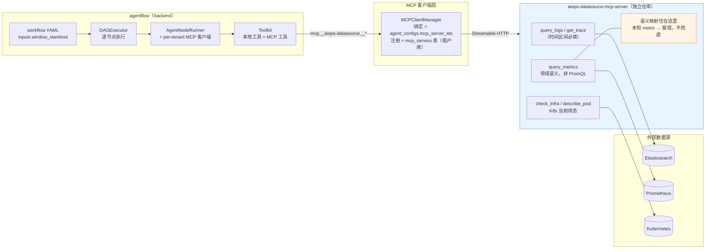

# AI 运维 Bug Fix 智能体平台设计文档（v5.5 — 数据面 MCP 化）

**版本**：v5.5
**最后更新**：2026-09-10
**基线**：design-v5.4.md（动态编排版）、design-v5.3.md（多租户版）、design-v5.2.md（第三轮评审签字版）
**状态**：🟢 **批 1 / 批 2 / 批 3 全部实施并实测通过**（MCP-only 已达成）

---

## 1. 文档定位

1. v5.5 是 v5.3 §P1（**数据面 = 租户自有 MCP**）的**落地专项**。v5.3 确立了原则
   "诊断数据工具一律来自租户 MCP 绑定"，但当时**没有任何一个真实 server**——平台
   默认姿态（`AGENTFLOW_SHARED_DATASOURCES=False`）下 agent 根本无数据工具可用，
   联调只能开 `=True` 走"进程内直连 HTTP"这条**本该废止的旁路**。
2. v5.5 交付 `aiops-datasource-mcp-server`：把 ES / Prometheus / K8s 三类查询
   实现为**领域型只读 MCP 工具**，并提供**时间区间 + 查询目标**的强制契约。
3. 与 **v5.4（动态编排）** 的关系：v5.4 解决"编排层怎么选/怎么编 workflow"，
   v5.5 解决"**取数层怎么安全、准确、可诊断**"。二者正交——v5.4 的动态产物跑的
   仍是同一套数据工具；v5.5 的工具是 v5.4 planner 可装配的 capability 底座。
4. 与 **v5.2/v5.3 冲突处**以本文档为准；执行引擎、多租户隔离、审批语义**均不变**。

## 2. 现状与缺口（有实测证据）

直连实现（`agentflow/agents/datasources.py:RealDataSourceAdapter`）在真实测试床
联调中暴露三宗罪：

### 2.1 查询语义错位（最严重）

`_promql` 的白名单键是 `cpu`/`memory`/`disk`/`disk_limit`/`restarts`，
而 LLM 按 `MetricsEvidenceSchema` 传的是
`cpu_percent`/`memory_percent`/`disk_percent`/`error_rate`/`p95_latency_ms`
——**五个名字无一命中**，全部落到函数末尾的兜底分支：

```python
# 默认：CPU 使用率（cores）
return f"sum(rate(container_cpu_usage_seconds_total{{{sel}}}[1m]))"
```

后果：五个指标返回**同一个数字**。实测 `metrics-analyst` 据此得出
"CPU 几乎空闲（约 0.7%），排除资源饱和类根因"——**结论方向完全错误，且看不出异常**。

> **这是本设计最重要的一条教训**：真实数据 + 错误查询，比假数据更危险。
> mock 至少会让人怀疑；错配的真实数字看起来完全可信。

### 2.2 无时间维度

- `query_metrics` 用 `/api/v1/query`（**瞬时查询**），不表达任何时间区间；
- `query_logs` 只按 `@timestamp` 倒序取 N 条，**无窗口**。

后果：诊断无法聚焦"故障发生的那几分钟"，只能看最近 N 条——故障已过去时
窗口里全是噪声。

### 2.3 未知输入静默兜底

未知 metric 不报错而是回退 CPU（见 2.1 代码）。同类还有：容器未设 memory limit
时 `用量/0` 得 `+Inf`，agent 会把无穷大当成"内存爆了"。

## 3. 目标架构



**要点**：
- **取数只有这一条路**——进程内直连实现（原 `agents/datasources.py`）已在批 3 删除；
- **语义映射住在 server 侧**（图中橙色）：调用方传 `metric=cpu_percent` 而非 PromQL，
  避免"不同指标映射到同一条查询"这类语义错位（§2.1）；
- **注册与绑定都在租户库**：server 注册行随租户库走（v5.3 P4），跨租户物理不可见。

- **接入方式**：复用 v5.3 既有的 `mcp_servers` 表 + `agent_configs.mcp_server_ids`
  绑定（控制面 API 已完备，无需改代码）；
- **隔离**：server 注册行在**租户库**内，租户间物理不可见（P4）；
- **工具命名**：agent 侧经 AgentScope 前缀化为
  `mcp__aiops-datasource__query_logs`，`readOnlyHint=True` 使只读工具自动 ALLOW。

## 4. 工具规格

全部 `readOnlyHint=True`。**带时间的查询，`start_time`/`end_time` 为必填**。

| 工具 | 时间区间 | 查询目标 | 后端 |
|---|---|---|---|
| `query_logs` | `start_time`/`end_time` 必填 | `service`(可空)、`level`、`limit` | ES `_search` + `range` on `app.@timestamp` |
| `get_trace` | `start_time`/`end_time` 必填 | `trace_id` 必填 | ES + 调用链重建 + 故障 span 判定 |
| `query_metrics` | `start_time`/`end_time` 必填、`step_seconds` | `service` 必填、`metric` 必填（5 选 1） | Prometheus `/api/v1/query_range` |
| `check_infra` | **无** | `namespace`、`pod`(可空=列全部) | `kubectl get pods -o json` |
| `describe_pod` | **无** | `namespace`、`pod` 必填 | `kubectl describe pod` |

> 末两个查的是集群**当前状态**，时间维度不适用——这是设计而非疏漏。

**返回契约**：`query_metrics` 返回窗口内聚合 `value`（**峰值**，诊断关心"是否打满"
而非均值）与 `min`/`max`/`avg`/`last` + 降采样 `series` + **回显 `window`**
（让调用方确知实际查了什么）。无数据时 `value` 为 `null` 并附**归因提示**。

**错误契约**：预期失败归一为 `{success:false, error:"[CODE] msg"}`，不抛裸异常。

## 5. 两条硬约定

### 5.1 查询必须带时间区间与目标（fail-closed）

时间格式非法 / `start >= end` / 跨度超 `DATASOURCE_MAX_RANGE_HOURS`（默认 24h）
→ **在发起任何上游请求之前**拒绝。不宽容解析、不静默取默认值。

理由：窗口错了，返回的数据就没有意义。早失败远好过给出一份"看起来正常"的答案。

### 5.2 语义映射住 server 侧，禁止 PromQL 透传

**调用方传领域语义（`metric=cpu_percent`），不传 PromQL 表达式。**

映射（哪个指标用哪条表达式、如何换算百分比）是**领域知识**，其正确性决定诊断
方向。把它交给 LLM 现场编写，等于把 §2.1 的错误重新引入。因此：

- 未知 metric **一律报错**并列出可用清单（供调用方自我纠正）；
- **不提供** `promql:`/`cadvisor:` 逃生舱（v5.5 相较旧实现的刻意收紧）。

> 这与 applog-mcp-server（声明式 HTTP 透传）是两种取向：透传适合"接口本身即契约"
> 的场景，**指标查询不是**——「error_rate 该查什么」不是调用方该操心的事。

## 6. 实现约定

| 项 | 约定 |
|---|---|
| server 粒度 | 一个进程覆盖 ES + Prom + K8s（共享服务拓扑配置） |
| 端口 | `8300`（git=8000/8100、applog=8200/8101 之后） |
| 配置前缀 | 共享变量不前缀；领域变量 `DATASOURCE_*`（对齐 applog 的 `APPLOG_`） |
| 工具签名 | 字面书写（非 exec 生成）+ `Annotated[..., Field(...)]` |
| 依赖注入 | 上游 transport 可注入（`httpx.MockTransport`）——测试不触网 |
| 截断 | **流式按字节**（预算耗尽即停）+ UTF-8 码点边界回退 + **显式后缀** |
| kubectl | 命令白名单（只 get/describe）；`create_subprocess_exec` 非 shell |

> **截断必须显式可见**：静默截断会让模型用臆测补齐缺失部分（实测：agentflow 中
> `ws_git` 用 `text[-4000:]` 切掉 diff 头部，模型随即伪造了 `index 0000000..1111111`）。

## 7. 迁移批次

| 批次 | 内容 | 状态 |
|---|---|---|
| **批 1** | 新建 `aiops-datasource-mcp-server` + 对真实测试床实测 | ✅ **已完成** |
| **批 2** | agentflow 注册 server + 绑定 agent + prompt 对齐 + **时间窗下发** + E2E | ✅ **已完成** |
| **批 3** | 删除直连实现（`datasources.py`、`build_datasource()`、相关测试与脚本），达成 **MCP-only** | ✅ **已完成** |

批 2 期间两条路径曾并存；**批 3 已删除直连实现**，现在取数只有 MCP 一条路。

**批 3 验收结果**（`run_76516f37fe`，2026-09-10）：

| 验收点 | 结果 |
|---|---|
| 取数全部经 MCP | ✅ 27 次 MCP 调用；**本地数据源调用 0 次** |
| 本地调用仅剩非数据源工具 | ✅ 29 次 = 工作区工具（ws_*）+ `locate_code`(CMDB) + `search_knowledge`(占位) |
| 诊断正确 | ✅ `rca=code_bug`(0.85)、`trace.failing_service=warranty-service` |
| 全链路闭环 | ✅ run → `success` |
| 回归 | ✅ 253 passed；ruff 债 67 → 43（删文件所致，零新增） |

### 7.1 时间窗由调用方下发（批 2 新增的约定）

MCP 工具要求 `start_time`/`end_time` 必填，但**谁来给**是个新问题——agent 不知道
"当前时间"，自行编造窗口会得到错误的查询范围（正是本设计要消灭的失败模式）。

**约定**：窗口来自**事件源**（工单 `opened_at` / 告警触发时刻），由调用方算好后经
workflow `inputs.window_start` / `window_end` 传入；workflow 以 `$.inputs.*` 透传到各
取数节点，节点再交给 agent，agent 原样转发给工具。

- 取数节点声明 `require: [start_time, end_time]` —— 缺失即**快速失败**，不空转；
- `check_infra` / `describe_pod` 无时间参数，节点**不**下发窗口。

> 未采用「平台自动按 now-N 分钟填默认值」：那会让"诊断了哪段时间"变成隐式行为，
> 而窗口选错时返回的数据毫无意义却看不出异常——与 §2.1 的教训同源。

**批 2 验收结果**（`run_84fc520a3b`，MCP-only 姿态，2026-09-10）：

| 验收点 | 结果 |
|---|---|
| 数据查询全部经 MCP | ✅ 44 次 MCP 调用（query_metrics 20 / query_logs 10 / check_infra+describe_pod 8 / get_trace 3）；**本地直连数据调用 0 次** |
| 本地调用仅限工作区工具 | ✅ 31 次全是 `ws_*`（读写代码、跑测试）——设计如此 |
| 指标值互不相同 | ✅ `cpu_percent=1.12`、`error_rate=0.0`、`p95_latency_ms=2.48` |
| 诊断结论正确 | ✅ `trace.failing_service=warranty-service`、`rca=code_bug`（0.9） |
| 时间窗真实生效 | ✅ 工具调用入参携带下发的窗口 |
| 全链路闭环 | ✅ run → `success`，commit 产出真实 SHA |

**批 1 验收结果**（对 minikube testbed 实测，2026-09-10）：

| 验收点 | 结果 |
|---|---|
| 5 个 metric 不再返回同一个值 | ✅ cpu=1.60 / error_rate=3.45 / p95=2074.23 各不相同；memory/disk 如实返回 null |
| 未知 metric 报错并列出可用项 | ✅ |
| 时间窗口真实生效 | ✅ 同查询：覆盖故障窗口=2 条、故障前=0、未来=0 |
| 超长窗口拒绝 | ✅ 216h > 24h 被拒并提示收窄 |
| `get_trace` 判出故障服务 | ✅ `failing_service=warranty-service`（排除 order-service 的 Feign 超时症状） |
| `check_infra`/`describe_pod` | ✅ 返回真实 6 个 pod 与 2210 字符 describe 文本 |
| 单元测试 / lint / mypy | ✅ 46 passed（全仓 106）/ ruff 全清 / mypy 无问题 |

## 8. 残余风险与待办

| # | 风险/待办 | 说明 | 优先级 |
|---|---|---|---|
| 1 | **MCP 凭证明文** | 若给 server 配 `AUTH_TOKEN`，`mcp_servers.config.headers` 在 agentflow 库中**明文存储且 GET 回显**（CLAUDE.md 待办已列）。本地联调未启用认证 | 高（批 2 前） |
| 2 | **kubectl 依赖** | server 进程需 kubectl 二进制 + kubeconfig。Docker 化时镜像内需装（git-mcp-server 装 git 是同类先例） | 中 |
| 3 | **`get_trace` 启发式是测试床特定经验** | 下游症状词表（feign / Read timed out…）与"完成/成功"关键字判定，非通用算法。已加注释标注适用边界 | 中 |
| 4 | **`memory_percent`/`disk_percent` 在测试床恒为无数据** | 前者因容器未设 memory limit，后者因 testbed 应用侧 `data_disk_total_bytes` 为 NaN。**这是数据源侧的配置/缺陷，不应在查询层掩盖**——已如实返回 null + 归因提示 | 中（testbed 侧修） |
| 5 | **`search_knowledge` 仍为 mock** | 恒返回 `found:True, INC0001`，按 v5.4 §7.3 属已标注缺口，真接缝=租户 MCP，本轮未动 | 中 |
| 6 | **无 metrics/限流/Origin 校验** | 对齐 applog 的 v1 取舍；生产部署需由网关承担 | 低 |
| 7 | **dev 端口 8300 硬编码约定** | 四处需同步（config.py / .env.example / README / 本地 .env） | 低 |
| 8 | **Worker 不热载 agent 配置** | worker 进程内 `_agent_config_provider` 为**永久缓存**（无代际失效），API 侧 CRUD 后 worker 必须**重启**才生效——绑定新 MCP server 在 queue 模式下需重启 worker。生产需改为 TTL 或订阅变更 | 中 |
| 9 | **无状态 HTTP 的会话开销** | `HttpMCPConfig` 默认 `is_stateful=False`，**每次工具调用建一个新 MCP session**（实测单 run 数百次握手）。功能正确但开销可观，后续可评估 stateful 或连接复用 | 中 |
| 10 | **agent 偶发无谓调用** | 实测 `query_metrics` 被调用 20 次（5 个指标各一次即够）；`check_infra(namespace="default")` 传了错误 namespace（应省略以走服务端默认 `order`）而返回 0 pod。prompt 已加约束，仍属**模型行为**范畴，需持续观察 | 中 |
| 11 | ~~本地直连实现暂留~~ | **已解决**：批 3 已删除 `datasources.py` / `build_datasource()` 及相关脚本，`AGENTFLOW_SHARED_DATASOURCES` 语义收窄为「repos 直传开关」（名称保留以免破坏既有 .env） | — |

## 9. 版本记录

| 版本 | 日期 | 变更 |
|---|---|---|
| v5.2 | 2026-08-25 | 第三轮评审修正版（19 项修正清单，MVP/POC 签字） |
| v5.2.1 | 2026-09-09 | 实现状态注记（§17，不改签字结论） |
| v5.3 | 2026-09-09 | 多租户架构版：五条架构原则 + 管理库/Router/tenantctl 三组件 + 实施批次 |
| v5.4 | 2026-09-10 | 动态编排版（design-only）：四档执行体 + Dispatch 五层漏斗 + Plan-as-DAG + 计划审批 |
| **v5.5** | 2026-09-10 | **数据面 MCP 化版（已完成）**：`aiops-datasource-mcp-server`（领域型只读工具）+ 时间区间/查询目标强制契约 + 语义映射 server 侧 + 时间窗由调用方下发；批 1/2/3 全部实测通过，**取数 MCP-only** |
