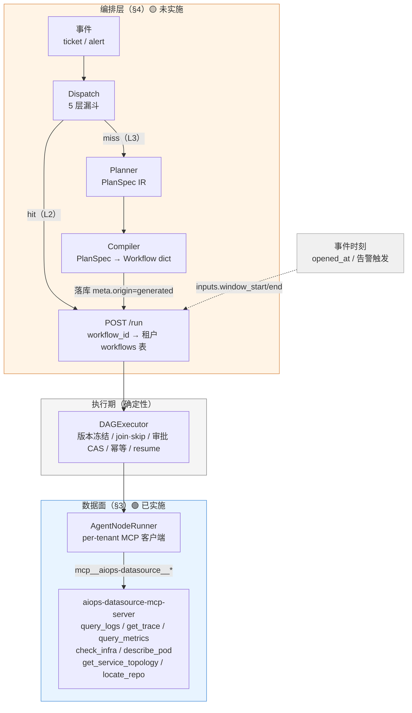
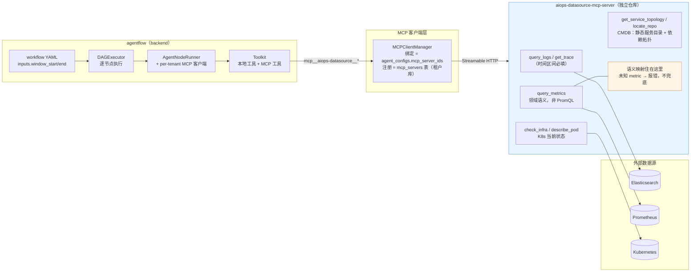

# AI 运维 Bug Fix 智能体平台设计文档（v5.6 — 编排层 × 数据面 合并版）

**版本**：v5.6
**最后更新**：2026-09-11
**基线**：design-v5.5.md（数据面 MCP 化，**已实施**）+ design-v5.4.md（动态编排，**设计稿**）
**取代**：design-v5.5.md、design-v5.4.md（两者内容已全量并入本文档，原稿保留仅供追溯）
**继承**：design-v5.3.md（多租户）、design-v5.2.md（第三轮评审签字版）——其原则与修正清单继续有效
**状态**：⚠️ **本文档是双状态的**——§3 数据面 🟢 **已实施并实测**；§4 编排层 🟡 **未实施（设计稿）**。
逐节标题带徽标，请按徽标读，不要把"v5.6 写完"误读成"v5.6 做完"。

---

## 1. 文档定位与合并说明

### 1.1 为什么合并

v5.4 与 v5.5 描述的是**同一个系统的两层**，此前分处两份文档、且一份在 git 外（v5.4 位于仓库根，
未入版本控制），导致三处实际成本：

- **接缝无人写**：v5.5 §1.3 自述"v5.5 工具是 v5.4 planner 可装配的 capability 底座"，但
  "planner 具体怎么装配这些工具"两边都没写（本文 §5 补齐）；
- **状态被误读**：两份文档一份"已完成"一份"design-only"，读者容易把前者当成"整体已实现"；
- **引用悬空**：全仓十余处注释分别指向两份文档的章节号，重构后易漂移（已实际发生，见 §1.4）。

### 1.2 两层关系（一句话）

- **§4 编排层（v5.4）** 解决"**编排怎么选 / 怎么编**"——面对事件，走既有 workflow 还是现编一张；
- **§3 数据面（v5.5）** 解决"**取数怎么安全、准确、可诊断**"——诊断用的数据从哪来、契约多硬。

**二者正交**：编排层的动态产物（Plan-as-DAG 编译出的 workflow）跑的仍是同一套数据工具；
数据面**不关心** workflow 是人工写的还是 planner 生成的。**前提关系**：编排层要落地，
必须先有数据面这份可信的工具底座——否则 planner 编排出来的图照样在错数据上得出结论
（§3.1 的三宗罪正是这类失败）。

### 1.3 状态总览（读前必看）

| 层 | 章节 | 来源 | 状态 |
|---|---|---|---|
| **数据面**（MCP 化） | §3 | v5.5 | 🟢 **已实施**：批 1/2/3 全部完成并实测，取数 **MCP-only** |
| **编排层**（动态编排） | §4 | v5.4 | 🟡 **未实施**：代码零实现，批次见 §7.2，缺口见 §4.9 |
| **两层接缝** | §5 | 本文档新写 | 🟡 仅方向性约定，未细化 |
| 安全与多租户交叠 | §6 | v5.4 §8 + v5.3 | 继承，动态侧未实施 |

### 1.4 旧章节号映射（供旧引用对照）

历史注释/文档中指向旧稿的章节，按此表对应到本文档：

| 旧引用 | 本文档 | 主题 |
|---|---|---|
| v5.5 §1 | §1、§3 | 文档定位（并入合并说明） |
| v5.5 §2 | §3.1 | 现状与缺口（直连实现三宗罪） |
| v5.5 §3 | §3.2 | 数据面目标架构 |
| v5.5 §4 | §3.3 | 工具规格 |
| v5.5 §5 | §3.4 | 两条硬约定 |
| v5.5 §6 | §3.5 | 实现约定 |
| v5.5 §7 / §7.1 | §3.6 / §3.6.1 | 实施批次与验收 / 时间窗下发 |
| v5.5 §8.1–8.5 | §3.7.1–3.7.5 | 设计的适用边界与局限 |
| v5.4 §1 | §1、§4 | 文档定位（并入合并说明） |
| v5.4 §2 | §4.1–4.2 | 四档执行体 / 复杂度判定 |
| v5.4 §3.1 | §4.3.1 | dispatch 结构化输出与校验缺口 |
| v5.4 §3.2 | §4.3.2 | 五层漏斗 |
| v5.4 §3.3 | §4.3.2 末 | 决策流向 |
| v5.4 §4 | §4.4 | 选路到已批准 workflow（L2） |
| v5.4 §5 | §4.5 | 动态合成 Plan-as-DAG（L3） |
| v5.4 §6 | §4.6 | 安全闸门与计划审批 |
| v5.4 §7.1–7.2 | §4.7.1–4.7.2 | 晋升流程 / 度量基础缺口 |
| v5.4 §7.3 | §4.7.3 | knowledge 命中预判（现状 mock） |
| v5.4 §8 | §6 | 与多租户的交叠 |
| v5.4 §9 | §4.8 | 成本与可观测 |
| v5.4 §10 | §7.2 | 实施批次（未实施） |
| v5.4 §11 | §8 | 残余风险与待办（诚实清单） |
| v5.4 §12 | §9、§10 | 条款映射 / 版本记录 |

> **注**：v5.5 §8 原编号中的"第 8 项（Worker 不热载 agent 配置）"已在 v5.5.1 重构时移入
> `docs/TODO.md`，并已修复（见 §3.7.2 注）。

---

## 2. 系统全景



**要点**：
- **规划期自由、执行期确定性**（§4 总原则）：AI 的自由度只进 planner 的受限输出；
  产物一旦编译成 workflow，执行期永远走确定性的冻结 DAG 机器，与人工 workflow 完全同构。
- **取数只有一条路**：进程内直连实现已在批 3 删除；本地只读工具仅剩非数据源类（§3.2）。
- **时间窗由调用方下发**（§3.6.1）：来自事件源，不由平台猜。

---

## 3. 数据面：MCP 化 🟢 已实施

> 来源 design-v5.5.md。状态：**批 1 / 批 2 / 批 3 全部完成并实测通过，MCP-only 已达成**。

### 3.1 现状与缺口（有实测证据）

实施前，直连实现（`agentflow/agents/datasources.py:RealDataSourceAdapter`）在真实测试床
联调中暴露三宗罪：

#### 3.1.1 查询语义错位（最严重）

`_promql` 的白名单键是 `cpu`/`memory`/`disk`/`disk_limit`/`restarts`，
而 LLM 按 `MetricsEvidenceSchema` 传的是
`cpu_percent`/`memory_percent`/`disk_percent`/`error_rate`/`p95_latency_ms`
——**五个名字无一命中**，全部落到函数末尾的兜底分支：

```python
# 默认：CPU 使用率（cores）
return f"sum(rate(container_cpu_usage_seconds_total{{{sel}}}[1m]))"
```

后果：五个指标返回**同一个数字**。实测 `metrics-analyst` 据此得出
"CPU 几乎空闲（约 0.7%），排除资源饱和类根因"——**结论方向完全错误，且看不出异常**。

> **这是整个设计最重要的一条教训**：真实数据 + 错误查询，比假数据更危险。
> mock 至少会让人怀疑；错配的真实数字看起来完全可信。

#### 3.1.2 无时间维度

- `query_metrics` 用 `/api/v1/query`（**瞬时查询**），不表达任何时间区间；
- `query_logs` 只按 `@timestamp` 倒序取 N 条，**无窗口**。

后果：诊断无法聚焦"故障发生的那几分钟"，只能看最近 N 条——故障已过去时窗口里全是噪声。

#### 3.1.3 未知输入静默兜底

未知 metric 不报错而是回退 CPU（见 §3.1.1 代码）。同类还有：容器未设 memory limit
时 `用量/0` 得 `+Inf`，agent 会把无穷大当成"内存爆了"。

### 3.2 目标架构



**要点**：
- **取数只有这一条路**——进程内直连实现（原 `agents/datasources.py`）已在批 3 删除；
- **语义映射住在 server 侧**（图中橙色）：调用方传 `metric=cpu_percent` 而非 PromQL，
  避免"不同指标映射到同一条查询"这类语义错位（§3.1.1）；
- **注册与绑定都在租户库**：server 注册行随租户库走（v5.3 P4），跨租户物理不可见；
- **接入方式**：复用 v5.3 既有的 `mcp_servers` 表 + `agent_configs.mcp_server_ids`
  绑定（控制面 API 已完备，无需改代码）；
- **工具命名**：agent 侧经 AgentScope 前缀化为
  `mcp__aiops-datasource__query_logs`，`readOnlyHint=True` 使只读工具自动 ALLOW。

### 3.3 工具规格

全部 `readOnlyHint=True`。**带时间的查询，`start_time`/`end_time` 为必填**。

| 工具 | 时间区间 | 查询目标 | 后端 |
|---|---|---|---|
| `query_logs` | `start_time`/`end_time` 必填 | `service`(可空)、`level`、`limit` | ES `_search` + `range` on `app.@timestamp` |
| `get_trace` | `start_time`/`end_time` 必填 | `trace_id` 必填 | ES + 调用链重建 + 故障 span 判定 |
| `query_metrics` | `start_time`/`end_time` 必填、`step_seconds` | `service` 必填、`metric` 必填（5 选 1） | Prometheus `/api/v1/query_range` |
| `check_infra` | **无** | `namespace`、`pod`(可空=列全部) | `kubectl get pods -o json` |
| `describe_pod` | **无** | `namespace`、`pod` 必填 | `kubectl describe pod` |
| `get_service_topology` | **无**（静态目录） | `service` 必填、`hops`（默认 2） | 内置 CMDB 目录 + 依赖图 |
| `locate_repo` | **无**（静态目录） | `service` 必填 | 内置 CMDB 目录 |

> 末四个查的是**当前状态 / 静态目录**，时间维度不适用——这是设计而非疏漏。
> 其中 CMDB 两个工具查的是「谁调谁、归属哪个团队/仓库」这类**静态服务目录**，
> 与前三者的**运行时观测数据**性质不同，但同样属于"取数"——故并入同一 server。

**返回契约**：`query_metrics` 返回窗口内聚合 `value`（**峰值**，诊断关心"是否打满"
而非均值）与 `min`/`max`/`avg`/`last` + 降采样 `series` + **回显 `window`**
（让调用方确知实际查了什么）。无数据时 `value` 为 `null` 并附**归因提示**。

**错误契约**：预期失败归一为 `{success:false, error:"[CODE] msg"}`，不抛裸异常。

### 3.4 两条硬约定

#### 3.4.1 查询必须带时间区间与目标（fail-closed）

时间格式非法 / `start >= end` / 跨度超 `DATASOURCE_MAX_RANGE_HOURS`（默认 24h）
→ **在发起任何上游请求之前**拒绝。不宽容解析、不静默取默认值。

理由：窗口错了，返回的数据就没有意义。早失败远好过给出一份"看起来正常"的答案。

#### 3.4.2 语义映射住 server 侧，禁止 PromQL 透传

**调用方传领域语义（`metric=cpu_percent`），不传 PromQL 表达式。**

映射（哪个指标用哪条表达式、如何换算百分比）是**领域知识**，其正确性决定诊断
方向。把它交给 LLM 现场编写，等于把 §3.1.1 的错误重新引入。因此：

- 未知 metric **一律报错**并列出可用清单（供调用方自我纠正）；
- **不提供** `promql:`/`cadvisor:` 逃生舱（v5.5 相较旧实现的刻意收紧）。

> 这与 applog-mcp-server（声明式 HTTP 透传）是两种取向：透传适合"接口本身即契约"
> 的场景，**指标查询不是**——「error_rate 该查什么」不是调用方该操心的事。

### 3.5 实现约定

| 项 | 约定 |
|---|---|
| server 粒度 | 一个进程覆盖 ES + Prom + K8s + CMDB（共享服务拓扑配置） |
| 端口 | `8300`（git=8000/8100、applog=8200/8101 之后） |
| 配置前缀 | 共享变量不前缀；领域变量 `DATASOURCE_*`（对齐 applog 的 `APPLOG_`） |
| 工具签名 | 字面书写（非 exec 生成）+ `Annotated[..., Field(...)]` |
| 依赖注入 | 上游 transport 可注入（`httpx.MockTransport`）——测试不触网 |
| 截断 | **流式按字节**（预算耗尽即停）+ UTF-8 码点边界回退 + **显式后缀** |
| kubectl | 命令白名单（只 get/describe）；`create_subprocess_exec` 非 shell |

> **截断必须显式可见**：静默截断会让模型用臆测补齐缺失部分（实测：agentflow 中
> `ws_git` 用 `text[-4000:]` 切掉 diff 头部，模型随即伪造了 `index 0000000..1111111`）。

### 3.6 实施批次与验收 🟢

| 批次 | 内容 | 状态 |
|---|---|---|
| **批 1** | 新建 `aiops-datasource-mcp-server` + 对真实测试床实测 | ✅ **已完成** |
| **批 2** | agentflow 注册 server + 绑定 agent + prompt 对齐 + **时间窗下发** + E2E | ✅ **已完成** |
| **批 3** | 删除直连实现（`datasources.py`、`build_datasource()`、相关测试与脚本），达成 **MCP-only** | ✅ **已完成** |

批 2 期间两条路径曾并存；**批 3 已删除直连实现**，现在取数只有 MCP 一条路。

**批 3 验收结果**（`run_76516f37fe`，2026-09-10）：

| 验收点 | 结果 |
|---|---|
| 取数全部经 MCP | ✅ 27 次 MCP 调用；**本地数据源调用 0 次** |
| 本地调用仅剩非数据源工具 | ✅ 29 次 = 工作区工具（ws_*）+ `locate_code`(CMDB) + `search_knowledge`(占位) |
| 诊断正确 | ✅ `rca=code_bug`(0.85)、`trace.failing_service=warranty-service` |
| 全链路闭环 | ✅ run → `success` |
| 回归 | ✅ 253 passed；ruff 债 67 → 43（删文件所致，零新增） |

**批 2 验收结果**（`run_84fc520a3b`，MCP-only 姿态，2026-09-10）：

| 验收点 | 结果 |
|---|---|
| 数据查询全部经 MCP | ✅ 44 次 MCP 调用（query_metrics 20 / query_logs 10 / check_infra+describe_pod 8 / get_trace 3）；**本地直连数据调用 0 次** |
| 本地调用仅限工作区工具 | ✅ 31 次全是 `ws_*`（读写代码、跑测试）——设计如此 |
| 指标值互不相同 | ✅ `cpu_percent=1.12`、`error_rate=0.0`、`p95_latency_ms=2.48` |
| 诊断结论正确 | ✅ `trace.failing_service=warranty-service`、`rca=code_bug`（0.9） |
| 时间窗真实生效 | ✅ 工具调用入参携带下发的窗口 |
| 全链路闭环 | ✅ run → `success`，commit 产出真实 SHA |

**批 1 验收结果**（对 minikube testbed 实测，2026-09-10）：

| 验收点 | 结果 |
|---|---|
| 5 个 metric 不再返回同一个值 | ✅ cpu=1.60 / error_rate=3.45 / p95=2074.23 各不相同；memory/disk 如实返回 null |
| 未知 metric 报错并列出可用项 | ✅ |
| 时间窗口真实生效 | ✅ 同查询：覆盖故障窗口=2 条、故障前=0、未来=0 |
| 超长窗口拒绝 | ✅ 216h > 24h 被拒并提示收窄 |
| `get_trace` 判出故障服务 | ✅ `failing_service=warranty-service`（排除 order-service 的 Feign 超时症状） |
| `check_infra`/`describe_pod` | ✅ 返回真实 6 个 pod 与 2210 字符 describe 文本 |
| 单元测试 / lint / mypy | ✅ 46 passed（全仓 106）/ ruff 全清 / mypy 无问题 |

#### 3.6.1 时间窗由调用方下发（批 2 新增的约定）

MCP 工具要求 `start_time`/`end_time` 必填，但**谁来给**是个新问题——agent 不知道
"当前时间"，自行编造窗口会得到错误的查询范围（正是本设计要消灭的失败模式）。

**约定**：窗口来自**事件源**（工单 `opened_at` / 告警触发时刻），由调用方算好后经
workflow `inputs.window_start` / `window_end` 传入；workflow 以 `$.inputs.*` 透传到各
取数节点，节点再交给 agent，agent 原样转发给工具。

- 取数节点声明 `require: [start_time, end_time]` —— 缺失即**快速失败**，不空转；
- `check_infra` / `describe_pod` 无时间参数，节点**不**下发窗口。

> 未采用「平台自动按 now-N 分钟填默认值」：那会让"诊断了哪段时间"变成隐式行为，
> 而窗口选错时返回的数据毫无意义却看不出异常——与 §3.1.1 的教训同源。

### 3.7 设计的适用边界与局限

> 本节只收录**设计本身的局限**——即"这样设计，就必然接受这样的后果"，评审需要知道的
> 那类。**实施债（某适配器还没换成生产实现、某依赖还没装、某性能项还没优化）一律
> 移到 `docs/TODO.md`**，不在此处堆积——否则"v5.6 做完"会被误读成"生产就绪"。

#### 3.7.1 `get_trace` 的故障 span 判定是**测试床特定经验**

词表（`feign` / `Read timed out` / `Connection refused` 视为下游调用症状）与
"完成/成功"关键字判定，来自当前测试床的日志/链路形态。**换一套服务、换一种
trace 埋点，这套启发式可能失效**——它不是通用算法，已加注释标注适用边界。

设计含义：把它放在 server 侧是对的（可随环境替换实现而不动 agent），但**它的正确性
依赖于部署环境**，不能当作跨环境保证。

#### 3.7.2 无数据**不掩盖**——宁可 null，也不给可疑数字

`memory_percent` / `disk_percent` 在当前测试床恒为 `null`（前者因容器未设 memory
limit → 百分比无定义；后者因 testbed 应用侧 `data_disk_total_bytes` 为 NaN）。

**这是设计立场而非缺陷**：数据源侧的配置问题/缺陷**不该在查询层被"修"成看起来正常
的数字**。返回 null + 归因提示，让调用方知道"这项判定不了"——与 §3.1.1 的教训同源
（真实数据 + 错误语义，比"没数据"更危险）。

> **注**：v5.5 原稿在此处曾登记"Worker 进程的 agent 配置为永久缓存、绑定新 MCP server
> 需重启"作为遗留项。该问题**已修复**（`911c7d3`：按库内指纹 TTL 热载），登记已移入
> `docs/TODO.md` 并在 §11 留痕，不再属于本文档范围。

#### 3.7.3 平台侧范围外事项（明确交由部署承担）

MCP server **不做** metrics / 限流 / Origin-Host 校验（对齐 applog-mcp-server 的 v1
取舍）。设计上认为这些应由**网关/服务网格**承担，不由业务 server 重复实现。

#### 3.7.4 两条硬约定带来的固有约束

- **时间窗由调用方下发**（§3.6.1）→ 平台**离不开事件源**。若事件源不提供时刻，就没有
  可信窗口；平台不会替它猜（宁可失败）。
- **语义映射住 server 侧**（§3.4.2）→ **新增指标必须改 server 并重启**，不能靠调用方
  现场扩展。这是为换取"查询语义可信"而接受的运维成本。

#### 3.7.5 数据面范围外但仍需生产化的部分

数据面只负责**取数 MCP 化**。系统里仍有若干**继承自 v5.2/v5.3、尚未生产化**的
本地简化实现。它们**不属于数据面设计范围**，但**会决定系统能否上生产**——已集中登记在
`docs/TODO.md`，此处只留索引（不重复内容，避免两处漂移）：

| 项 | TODO | 为何是生产阻塞 |
|---|---|---|
| ~~CMDB 是 mock + 硬编码个人路径 + 接口无 tenant~~ | §11（留痕） | ✅ **已解决**（2026-09-11）：CMDB 迁至 MCP，租户隔离随部署走；仓库映射改由配置驱动。**尾巴见 TODO §7** |
| 审批通知仍是日志桩 | §1 | 审批人收不到通知 → human-in-the-loop 断链 |
| MCP server 无部署资产 / 默认无认证 / 凭证明文 | §2 | 上不了生产环境 |
| 沙箱 exec 服务无认证、无 egress 控制 | §3 | 谁能连上就能执行代码 |

#### 3.7.6 局限汇总

| # | 局限 | 性质 |
|---|---|---|
| 1 | `get_trace` 启发式依赖部署环境（§3.7.1） | 设计的适用边界 |
| 2 | 无数据返回 null 而非兜底数字（§3.7.2） | 设计立场 |
| 3 | 不做 metrics/限流/Origin，交网关（§3.7.3） | 范围划分 |
| 4 | 时间窗必须由调用方给（§3.7.4） | 约定的固有约束 |
| 5 | 新增指标须改 server（§3.7.4） | 约定的运维成本 |
| 6 | CMDB / 通知 / 沙箱等仍未生产化（§3.7.5） | 范围外，见 TODO |

> **已解决项不再保留墓碑**（如"Worker 不热载配置"「本地直连实现暂留」），
> 历史见 git log 与 `docs/TODO.md` 的完成记录。

---

## 4. 编排层：动态编排 🟡 未实施（设计稿）

> 来源 design-v5.4.md。状态：**design-only，代码零实现**。批次见 §7.2，现状缺口见 §4.9。
> 本节保留设计全貌，但**读到的每一条都尚未落地**。

### 4.1 四档执行体

复杂度不是一条线，而是"该用哪一档执行体"。按能力递增、自治度递减四档：

| 档 | 执行体 | 触发 | 自治度 / 风险 |
|---|---|---|---|
| **L0** | 单 agent 直答（不建 run） | 只读解释、查状态、问知识 | 最高 / 最低 |
| **L1** | 白名单规则动作（runbook/operator：scale/restart/patch 等 `ActionExecutor` 动作） | 已知故障、有 SOP、单点、可逆 | 高 / 低 |
| **L2** | **catalog 内已批准 workflow**（如 bug-fix-pipeline / bug-fix-scenario2） | dispatch 命中 catalog 且信任门槛通过（§4.3） | 中 / 中，可信可放手 |
| **L3** | **动态合成 workflow**（planner 现组、compiler 编译） | 未命中 catalog、跨服务、根因未知、需代码改动、风险超 L2 上限 | 低 / 高，默认降权 |

**关键判断：决定"用固定还是动态"的不是影响面（severity），而是"是否见过 / 是否可规划"（难度）。**
影响面决定的是风险闸门（§4.6），不是编排档位。二者分开，判定才干净。

### 4.2 复杂度判定（两段式，别让模型空想）

对每个事件不都走 LLM 规划（成本/延迟/不可控），分两段：

1. **确定性预判（零 LLM）**：事件类型映射表 + 知识检索是否命中历史相似故障 +
   涉域广度（服务数/是否跨 trace）+ 是否需代码改动 + 是否已有 runbook →
   产出 baseline 档位（L0-L3）与难度分。
2. **LLM 细化（只兜灰色地带）**：仅当 baseline 落在"没命中 catalog 但有明显复杂度线索"时，
   才叫醒 dispatch/planner 做结构化细化。

评分用 **难度 × 风险** 二维，各取好量化的信号：

```
难度 = f(事件分类/知识命中,   // knowledge-lookup 检索是否命中历史（现为 mock，见 §4.7.3）
         涉域广度,            // 几个服务 / 几条 trace 链
         根因未知度,          // 单迹象 vs 需多维证据合成
         是否要代码改动)       // 需 fix 侧 = 升档 + 升风险

风险 = severity × 写操作(scale/PR/沙箱外) × 是否核心链路
```

难度决定 **L2 vs L3**；风险决定 **闸门**（谁批、何时自治）。两者落到一张结构化输出
（§4.3.1 `DispatchDecisionSchema.risk_notes`）。

**越权降权**：
- **固定（L2，validated）**：可信可放手，按 workflow 声明的 `max_risk` 自治。
- **动态（L3）**：**默认降权**——只读自治、写必审批（§4.6），直到该计划被验证并晋升回 L2（§4.7）。

### 4.3 Dispatch 与「catalog 命中判定」

Dispatch 是编排入口，承接现有 `triage`（升级而非另起）。要回答的问题分两层：
**该走 catalog 哪张 workflow（L2）？还是该现编一张（L3）？** 即**前置选路**。

#### 4.3.1 dispatch 结构化输出（强契约）

升级路径按 v5.3/registry 注册三步走 + DB 覆盖（`agents/schemas.py` / `agents/prompts.py` /
`agents/registry.py` + `POST /agent-configs` origin=custom）：新增 `dispatch` agent，
输出强契约 `DispatchDecisionSchema`（JSON Schema，注册进 `AGENT_SCHEMAS`）：

```jsonc
{
  "decision": "hit" | "miss" | "escalate",  // escalate = 不自治，转人工工单
  "workflow_ref": "bug-fix-scenario2",        // decision=hit 时给 catalog workflow_id/name
  "confidence": 0.8,
  "difficulty_est": { "score": 0.6, "factors": ["cross_service", "needs_code_change"] },
  "risk_est":     { "level": "medium", "notes": "写操作：需发 PR" },
  "summary": "一句话中文摘要"
}
```

> **现状缺口（诚实标注）**：agent 结构化输出当前**无运行时校验**——`scopes.run_agent`
> 用 `agent.reply` + `extract_json` 自由解析文本（`agents/scopes.py`），schema 只作 prompt
> 提示与 `/agents` 元数据。dispatch/planner 依赖强契约，需**新增 JSON-Schema 运行时校验层**
> （仅对 dispatch/planner 强制，其余 agent 不动），失败即重试/降级，不静默放行。

#### 4.3.2 命中判定 = 5 层漏斗

单一信号不可信（triage 输出粗：symptom_type 仅 hang/crash/slow/degraded；knowledge 命中现为 mock）。
做成**确定性优先、LLM 兜灰色地带的漏斗**——规则管边界（防幻觉命中/防漏），LLM 只管"候选多选一"：

| 层 | 动作 | 性质 |
|---|---|---|
| **1. 事件特征归一** | 确定性抽取：`symptom_type` + 事件对象 service(s)/资源 + 是否代码改动暗示 + severity | 确定性 |
| **2. 结构化过滤** | catalog workflow 声明 `applicability`（§4.4.1）：`symptom_types` ∩ `services` ∩ `needs_code_change` → 候选集 | 确定性，零 LLM，先筛后裁 |
| **3. 语义召回（可选）** | 候选为空时，workflow `description` × 事件摘要 embedding 相似度召回 top-k；冷启动（无向量库）跳过 | 可插拔 |
| **4. LLM 单选裁决** | 候选（name/description/applicability）连同事件特征喂 dispatch，输出 §4.3.1——**只做多选一或 miss/escalate**，不让模型自造 workflow_ref | LLM（小、结构化） |
| **5. 信任门槛** | catalog workflow 记 `status: draft|validated|retired` + 成功率 + 声明 `max_risk`（§4.4.1）：仅 `validated` **且** 事件风险 ≤ `max_risk` 才自治放行；`draft`/超限 → 仍可命中但**自动追加审批节点**（降权，§4.6.2）或转 L3 | 确定性 |

命中裁决与实际 run 结果**回灌**（§4.7.2 run 指标聚合）→ 更新命中率，驱动晋升/淘汰——
漏斗与 §4.7 是同一个度量的两个消费端。

**决策流向**：

```
事件(ticket/alert) → 归一 → [漏斗 2/3 候选] → LLM 单选裁决（漏斗 4）→ 信任门槛（漏斗 5）
   ├─ hit + 门槛过 → 选 workflow_ref，参数/结构适配（§4.4.2）→ POST /run（既有路径）
   ├─ hit + 门槛不过 → 同 workflow 但注入 approval 节点 或 转 L3（按风险定级 §4.6.2）
   ├─ miss → planner 规划（§4.5）→ compiler 编译落库 → POST /run
   └─ escalate → 人工工单（不自动执行）
```

### 4.4 选路到已批准 workflow（L2 路径）

#### 4.4.1 catalog 元数据扩展

catalog = 租户 `workflows` 表。现状 schema 仅 `id/name/yaml/created_at`
（`api/workflow_store.py`），不足支撑结构化过滤（§4.3.2 层 2）与信任门槛（层 5）。
扩展两种形式（二选一，推荐 **meta JSON 列**，不污染 YAML 解析）：

```jsonc
// workflows 表新增 meta JSON 列（migration：sqlite/PG 幂等补列）
{
  "applicability": {                     // 漏斗层 2 的结构化过滤键
    "symptom_types": ["hang", "slow"],
    "services": ["order-service", "*"],
    "needs_code_change": true
  },
  "status": "validated",                 // draft|validated|retired（层 5）
  "max_risk": "medium",                  // 层 5：事件风险高于此 → 不放行自治
  "approval_policy": "node_required",    // 命中后是否强制追加审批（层 5 降权）
  "success_rate": 0.92,                  // §4.7.2 聚合回写
  "origin": "catalog"                    // catalog | generated（§4.5.4）
}
```

> **诚实标注**：`workflows` 现无元数据列；元数据冷启动（无历史成功率）时
> `success_rate` 取默认或 `null`，信任门槛用 `status` 兜底（新入库默认 `draft`）。

#### 4.4.2 命中后的参数/结构适配

选路不是"整单照跑"，按事件风险对 workflow 做**声明式适配**（不手改 YAML，用现有 DAG 能力表达）：

- **参数填充**：`inputs.bug_report` ← 归一后的事件对象；`repos` 不走直传
  （v5.3 §7.3 封堵仍生效），由租户 CMDB/MCP 提供。
- **追加审批**：命中 `draft` 或事件风险 > workflow `max_risk` 时，注入 approval 节点
  （对齐现有 `bug-fix-pipeline.yaml` 的 `approve-changes`/`approve-commit` 结构）——
  把"该不该放手"做成图内节点，进审计、可跳过、可超时。
- **删负证据**：severity=low / 单服务时，可把诊断侧的负证据节点（metrics/infra 的
  `on_failure: continue`，见 `bug-fix-pipeline.yaml` 结构）标记跳过以省成本——
  由 compiler 统一做，规则先行。

### 4.5 动态合成（L3）Plan-as-DAG

catalog 未命中时进入 L3。**自由度边界（评审定稿）**：只从注册表 15 agent + 租户 MCP 工具装配；
个别能力缺口允许用 DB `agent_config`（origin=custom, role, system_prompt, mcp_server_ids）
**预置**的自定义 agent 补位，由管理动作先建后用；planner **不得现场自造 agent、不得声明自己的审批节点**。

#### 4.5.1 PlanSpec IR（planner 唯一产物）

Planner 不直接调 agent、不直接产出 YAML，只输出结构化中间表示：

```jsonc
{
  "intent": "结账链路超时诊断修复",
  "steps": [
    {"id": "s1", "capability": "trace-analyst",  "phase": "diagnose",
     "inputs": ["input.bug_report"], "input_hint": "复用 catalog 同构节点"},
    {"id": "s2", "capability": "code-locator",   "phase": "diagnose",
     "inputs": ["s1.output.failing_service"]},
    {"id": "s3", "capability": "fix-implementer","phase": "fix", "side_effect": true,
     "inputs": ["s2.output", "s1.output"]}
  ],
  "gates": [],                    // 不允许 planner 自填；审批由编译器注入（§4.5.3）
  "reason": "跨 warranty/checkout 两服务且需代码改动，catalog 无匹配"
}
```

- `phase: diagnose` = 只读，工具子集 ⊆ L1 白名单；`phase: fix` / `side_effect: true` = 写操作，**必**挂审批。
- `capability` 优先命中注册表 agent；缺口 `capability: "custom:repo-analyzer"` → 只允许引用租户 DB
  已预置的 origin=custom agent（§4.3.1 注册路线的 DB 侧），planner 给不出该 agent 就视为不可规划 → `escalate`。

#### 4.5.2 compiler（新增 `planner/compiler.py`）职责

编译器把 PlanSpec 编成**合法 Workflow dict**（随后走 `Workflow.load_yaml(dict)` 同一条静态校验）：

1. **capability → node.agent**：映射注册表 15 agent 或 DB 预置 custom agent；
   planner 无关的装配细节（MCP 绑定、工具子集、模型）全部由 runner 既有的 per-tenant 路径决定
   （`agents/runner.py` + `mcp_manager`），compiler 不复制这份逻辑。
2. **依赖 → edges**：按 step `inputs` 的声明建边；**只允许引用传递上游**
   （对齐 `check_params_refs` 只查 `transitive_upstreams|self`，`core/dag.py`）；
   params 引用写成 `$.nodes.{step}.output[.field]` / `$.inputs.{input}`。
3. **自动插审批（安全注入）**：每个 `phase: fix` / `side_effect` step 前置一个 approval 节点；
   approval **node id 用稳定语义命名**（`approve-plan` / `approve-change` / `approve-pr`，见 §4.5.3 约束），
   params 按现有折叠约定带 `approvers/timeout/name`（`core/dag.py:127-134`）。
4. **静态校验**：产物过 `DAG.build`（环/悬空/join 一致性）+ `check_params_refs`——
   **失败带错因回传 planner 重排**，重排设上限（§4.8.2），超限 `escalate`。
5. **图结构可选项**：编译器可把"止血 → 根治"画成两条并行/串行路径，用 `when`/join
   （`==`/`!=`，`core/expressions.py`）表达——把将来可能要的动态分支在**编译期**画进一张图。

#### 4.5.3 生成审批节点与 default-deny 的衔接（设计约束）

代码事实：审批 default-deny（v5.3 §4.2）对**任意 run 的审批节点一律生效**——
`service._check_approver`/`tenants.py:approvers_for(node_id)` 只按 tenant 配置的
`{node_id: [审批人] | "*": [默认]}` 匹配，命中才放行、空/未命中即 403。因此：

- 生成 workflow 的审批节点 **id 必须能被租户配置命中**。方案：approval node id 用
  **稳定语义命名空间**（`approve-change`、`approve-pr`…，与 L2 语义点对齐），
  租户只需为这些语义点或 `"*"` 配置审批人；
- compiler **禁止**使用租户配置之外的任意 node id 自建审批点（否则等于 planner 自选审批人，绕过管控）；
- 租户无匹配 key 也无 `"*"` 时：自动审批点 403 → 动态 run 直接 `escalate` 人工，不静默降级放行。

#### 4.5.4 生成产物落库与溯源

- 编译产物以普通 workflow 存入租户 `workflows` 表，`meta.origin = "generated"` +
  记录 `planner_session`（可回溯 planning 轨迹）；run 时照常 `Workflow.snapshot()` 版本冻结
  （`core/workflow.py:70-84`）——动态 run 与静态 run 在存储/审计/恢复层面完全同构。
- `generated` 与 `catalog` 并存；**只有经 §4.7 晋升流程才允许去掉 generated 标记**。

### 4.6 安全闸门（三层 + 风险阈值计划审批）

#### 4.6.1 编译期闸门（§4.5.2 内建）

1. 静态校验通过（环/悬空/join/params 引用）；
2. 每节点工具子集 ⊆ 租户 ToolPolicy allow、`phase` 与角色 stage 匹配（diagnose 只用 L1，fix 才 L2）；
3. scope 越界拒：计划触碰租户 namespace/MCP/repo 之外 → 编译失败，回传 planner 或 escalate。

#### 4.6.2 计划级人工审批（评审定稿：风险阈值触发）

L3 产物在**执行前**可整体停在"计划预览"。复用现有 approval + CAS
（waiting_approval / 超时 sweep 置 `REJECTED_CANCELED`，v5.2 §8.3 / `approval/sweeper.py`），
只是把审批对象从"单点结果"扩到"整张计划"。

| 风险档 | 条件（示意，可配） | 闸门 |
|---|---|---|
| **low（自治）** | 纯 diagnose（L1 只读）；不越租户 scope | 直接执行，无需计划审批 |
| **medium（节点级审批）** | 沙箱内代码修复 + 测试（不落库/不发 PR/不动外部资源） | 编译器注入 approval 节点（§4.5.2.3） |
| **high（计划审批）** | 发 PR / 提交 / 沙箱外副作用 / 动作执行（scale/restart/patch） | run 先落 `waiting_approval` 展示"计划预览"（步骤清单 + 依据），人批后执行 |
| **unknown / 新组合** | planner 高不确定性、未见过的能力组合 | 同 high：一律计划审批 |
| **越界** | 工具⊄ allow / 跨租户 scope / 编译失败超上限 | **拒绝执行**，escalate 人工 |

审批对象是"计划"而非中间产物：审批页展示编译后的 workflow 摘要（节点、能力、副作用标记、审批点）。
批/拒走既有 CAS（含时间守卫、终态不可逆）；审批人名单仍由租户 `approvers_for(node_id)` 决定
（§4.5.3 约束天然生效）。

#### 4.6.3 执行期兜底

- 副作用幂等：`external_operation_id` 复用照旧（v5.2 §8.4，副作用 agent 自动带
  `run_id:node_id` 确定性键）；动态 workflow 不改写这套，compiler 不新增副作用 agent 即不新增幂等面。
- default-deny 对生成图审批节点生效（§4.5.3）；沙箱执行、per-tenant MCP、namespace/配额
  （v5.3 P1-P4）全部随租户不变。
- 编译器不产出新的副作用 agent 类型 → 幂等键清单无需扩（若后续放开自由度，先扩 §4.5.2 幂等约束）。

### 4.7 闭环收敛：动态 → catalog（playbook 晋升）

动态合成别每次现编。系统目标：**越用越固定、越来越少走 L3**。

#### 4.7.1 晋升流程

1. L3 run 成功达阈值（同 `origin=generated` + workflow 语义等价归组，成功次数 / 样本量，
   可配，如 ≥5 且成功率 ≥0.9）**且** `postmortem`/recap 复盘无负面标记；
2. 进入**人工 review**（对比：编译产物 vs 实际执行路径是否有计划外节点/工具；审批是否都过；是否需要追加审批点）；
3. review 通过 → `meta.status = validated`、`origin = catalog`、补 `applicability`/`max_risk`；
4. 失败/低效的 L3 run → 负样本回灌 planner（§4.8.3 监控项里的"计划质量"）。

#### 4.7.2 晋升的度量基础（现状缺口）

诚实标注，晋升与漏斗（§4.3.2）都依赖 **run 指标聚合**，而现状**没有**：

- 无 `GET /runs` 列表/按 `workflow_name` 的成功率统计（现有仅为配额服务的 `count_active_runs`，
  sqlite/postgres store）；workflow 名在 `workflow_snapshots`，需 join runs 才能拿到；
- 复盘输出（recap/postmortem）存在该 run 的 nodes 表，但**无消费这些数据的聚合层**。

§4.4.1 的 `success_rate` 回写、§4.3.2 漏斗层 5、§4.7.1 阈值、planner 负样本，全部需要新增一个
**run 指标聚合**（按 `(tenant, workflow_name/meta.origin)` 维度，count/成功率/平均节点数/审批通过率），
作为实施批 C 的主体（§7.2）。

#### 4.7.3 knowledge 命中预判（现状 mock，独立待办）

- `search_knowledge` 工具当前是 **mock**（`agents/tools.py` 恒返回 `found: True, similar_incidents: [...]`），
  CMDB 也已于 v5.5.2 迁至 MCP——§4.2 复杂度判定的"知识命中"信号**仍无真后端**。
- 唯一真实接缝 = **租户 MCP**（v5.3 §7.1）：租户在 `mcp_servers` 配一个暴露 `search_knowledge`
  的 server 并在 `agent_configs.mcp_server_ids` 绑定，runner 即注入 toolkit。
- 设计取向：dispatch 预判把"知识命中"做成**可插拔弱信号**——事件分类表（确定性、内置先跑）+
  MCP 检索（真后端就位后启用）；在真后端缺失时不得把 mock 命中当作"见过"的依据
  （§4.3.2 信任门槛只信 workflow `status`/成功率，不信 mock）。

### 4.8 成本与可观测

#### 4.8.1 不规划的确定规则

L0/L1 与多数 L2 不走 LLM：事件分类命中内置映射表（symptom/服务/动作）→ 直接选执行体。
dispatch 只在"灰色地带"（候选为空但有线索）才消耗 LLM。目标：**平台稳态下 LLM 规划调用占比
< 事件总量的小数点级**，其余全确定性路径。

#### 4.8.2 规划预算（防 planner 空转）

| 预算 | 上限（示意，可配） | 超限动作 |
|---|---|---|
| 单事件 dispatch/planner token | 上限值 | 终止 → escalate |
| planner 迭代 | ≤3 次 | 停止重排 → escalate |
| compiler 重排回传 | ≤3 次 | 停止 → escalate |
| 生成 workflow 节点数 / 深度 | ≤30 节点 / ≤10 层 | 编译拒 → planner 收敛或 escalate |

#### 4.8.3 监控项（先于规模推广）

- 分档占比：L0/L1/L2/L3 各占事件多少；
- 规划侧：dispatch 命中率、miss→planner 转化率、计划审批通过率、编译失败率、规划失败（escalate）率；
- 收敛侧：L3→catalog 晋升率、generated run 成功率 vs catalog run 成功率、节点数/成本分布；
- 兜底：计划审批超时被 sweep 置终态的数量（应 ≈0 若审批页及时）。

### 4.9 编排层现状缺口（诚实清单）

以下为**代码级核实**（2026-09-11）确认的零实现项，实施拆解见 `docs/TODO.md` §4：

| # | 缺口 | 核实结论 |
|---|---|---|
| 1 | dispatch / planner / compiler 模块 | 不存在（`planner/compiler.py` 无） |
| 2 | `DispatchDecisionSchema` / `PlanSpec` / `applicability` / `max_risk` / `workflow_ref` | 全仓 0 命中 |
| 3 | JSON-Schema 运行时校验层（§4.3.1） | 不存在 |
| 4 | `workflows` 表 meta 列（§4.4.1） | schema 仍为 `id/name/yaml/created_at` |
| 5 | 计划级审批（§4.6.2） | 仅有节点级审批 |
| 6 | run 指标聚合 / 晋升闭环（§4.7） | 不存在 |
| 7 | **自然语言选路入口** | `POST /run` 强制要求 `workflow_id` 或 `workflow_yaml`，否则 400 |

> **同名干扰项（避免误判）**：全仓 `dispatch` 仅命中 `sandbox/exec_service.py:135` 的
> HTTP 路由分发；`agents/registry.py` 的 `fix-planner` 是**静态图内**产出修复计划的节点 agent，
> 不是选路 planner。**当前 workflow 一律人工在 `POST /run` 指定。**

---

## 5. 两层接缝：planner 如何装配数据面能力 🟡 未细化

> 本节为合并时新写：v5.4 只在 §4.5.2.1 写了一句"装配细节由 runner 既有 per-tenant 路径决定"，
> v5.5 只在 §1.3 写了一句"是 v5.4 planner 可装配的 capability 底座"，两边都没展开。
> 下列**仅汇总两份文档已明确约定的部分**，未约定的标为开放问题——**不在此发明新设计**。

### 5.1 已约定（有依据）

| 面 | 约定 | 依据 |
|---|---|---|
| 工具来源 | 生成图里的取数节点**不携带**任何数据源配置；工具由 runner 按 `(tenant, agent_name)` 绑定注入 | v5.4 §4.5.2.1 + v5.5 §3.2 |
| 装配点 | compiler **不复制** MCP 绑定/工具子集/模型逻辑，全部交 runner 既有路径 | v5.4 §4.5.2.1 |
| 隔离 | 使用哪个 server 由租户 `agent_configs.mcp_server_ids` 决定，跨租户物理不可见 | v5.3 P4 + v5.5 §3.2 |
| 时间窗 | 生成图的取数节点同样受"窗口由调用方下发"约束，须声明 `require: [start_time, end_time]` | v5.5 §3.6.1 |
| 权限 | 工具子集 ⊆ 租户 ToolPolicy allow；`readOnlyHint=True` 的 MCP 工具自动 ALLOW | v5.4 §4.6.1 + v5.5 §3.2 |
| 语义 | planner 只见**领域语义**（`metric=cpu_percent`）与工具名，不见 PromQL/后端细节 | v5.5 §3.4.2 |

**推论**：因为工具绑定走 runner 而非图，**新增一个数据源不需要重新生成 workflow**——
只需租户注册/绑定 MCP server（§3.2）。

### 5.2 开放问题（两份文档均未定，实施前需评审）

1. **capability 粒度**：planner 的 `capability` 是写 agent 名（`trace-analyst`）还是写**工具能力**
   （`query_logs`）？v5.4 §4.5.1 的两个例子都是 agent 名，但 L1 白名单是按工具定的。
2. **工具可用性预判**：planner 是否需要在规划期就知道"本租户没有绑定 ES server"？
   若不知道，会编出跑不通的图（执行期才失败）。
3. **生成图的时间窗来源**：L3 是被 dispatch 从事件触发的，窗口可由事件层下发；
   但若将来 L3 支持手动触发，窗口从哪来未定。
4. **CMDB 工具的双重身份**：`get_service_topology`/`locate_repo` 既是诊断工具
   （`code-locator` 用），也可能被 planner 用来**规划期探路**（判断涉域广度，§4.2 的"涉域广度"信号）。
   是否允许规划期调用 ——未定；这会影响 §4.8.1"确定性优先"的成本目标。

---

## 6. 安全与多租户交叠

| 面 | 关系 |
|---|---|
| catalog / 生成物归属 | workflow（含 generated）都在**租户自己的库**（v5.3 P4 + TenantStoresRouter），隔离语义不变 |
| workflow_ref 边界 | dispatch/planner **只能引用本租户 catalog**；跨租户不可见（查不到即 miss/escalate，404/非泄漏） |
| 跨租户晋升 | 强隔离下**不做隐式跨租户 playbook 复制**；要复用走平台层（main 仓库模板 / 评审后推广），不在运行时跨库拷贝 |
| 执行约束 | 动态 workflow 执行同受 per-tenant 工具策略 / MCP / namespace / 配额（v5.3 P1-P3）约束，编译器在生成期即做 scope 校验（§4.6.1.3） |
| 审批 | default-deny（v5.3 §4.2）对生成图生效（§4.5.3），无需新增授权模型 |
| 数据面 | 工具一律租户 MCP（§3.2）；`AGENTFLOW_SHARED_DATASOURCES` 语义已收窄为"`inputs.repos` 直传开关" |

---

## 7. 实施状态与批次

### 7.1 数据面 🟢 已完成

见 §3.6（批 1/2/3 及三份验收结果）。

### 7.2 编排层 🟡 未实施（排期建议）

> **实施状态（design-only）**：尚无实施。下列批次为排期建议，**须人工评审批准后按 A→B→C 顺序实施**；
> 每批独立提交。涉及 execution gap 的诚实标注已放在各节
> （§4.3.1 校验层、§4.4.1 元数据列、§4.7.2 指标聚合、§4.7.3 knowledge mock）。
> 详细拆解见 `docs/TODO.md` §4。

| 批次 | 内容 | 主要触碰点 |
|---|---|---|
| **批 A（命中判定 + dispatch）** | §4.4.1 catalog meta（migration 补列 + applicability/status/max_risk）+ §4.3 dispatch agent + DispatchDecisionSchema + JSON-Schema 运行时校验层 + §4.3.2 漏斗 1/2/4/5（语义召回 3 可后置） | `api/workflow_store.py`、`agents/schemas.py`/`prompts.py`/`registry.py`、新增校验 util；不动 executor |
| **批 B（动态合成 + compiler + 计划审批）** | §4.5 PlanSpec/compiler + 生成 workflow 落库（meta.origin=generated）+ §4.6.2 计划审批（waiting_approval 计划预览复用 approval+CAS）+ §4.5.3 审批节点 id 约束 | 新增 `planner/compiler.py`；service/approve 预览语义扩展 |
| **批 C（闭环收敛 + 观测）** | §4.7.1 晋升流程 + §4.7.2 run 指标聚合 + §4.8 监控项 + §4.3.2/§4.7.2 成功率回灌 | 新增聚合查询；postmortem/recap 数据消费；knowledge 真后端独立排期 |

**验证标准**：

1. `make test` 全量回归不回归（268 现存用例全绿）。
2. **批 A**：单测覆盖漏斗（结构化过滤命中/漏判、LLM 裁决 schema 校验失败重试、信任门槛 draft 追加审批、
   跨租户 ref → miss）；demo 走"已知故障 → 命中 L2 → 自治 run"。
3. **批 B**：E2E 走"未见故障 → dispatch miss → planner → compiler 落库 → 计划审批 → 执行"；
   编译失败带错因回传重排、超预算 escalate；生成 workflow 的审批节点被 default-deny 管住（403 断言）。
4. **批 C**：晋升阈值 + 成功率回写后，同一事件二次命中走 L2 而非 L3。
5. lint 改动文件清零。

---

## 8. 残余风险与待办（诚实清单）

> 数据面的局限见 §3.7（6 条）；下表为**编排层**的残余风险，均未实施故均为待办。

| # | 风险/待办 | 说明 | 优先级 |
|---|---|---|---|
| 1 | **前置选路的局限** | 一次 run 内不能"诊断中发现新情况再动态跳图"；需要时只能在编译期把分支画全。运行中重规划需 `subflow` Node.kind + 递归子执行器 + resume/审批子图化，属执行层大改，列为远期 | 中（远期） |
| 2 | **dispatch 是新的单点** | 每事件先过它：LLM 输出质量 + JSON-Schema 校验层鲁棒性决定整条链路；校验失败必须降级/escalate，不静默放行（§4.3.1） | 高 |
| 3 | **catalog 元数据冷启动** | 新 workflow 无历史成功率：`status=draft` 兜底 → 命中即追加审批，成功率统计随样本积累（§4.4.1/§4.7.2） | 中 |
| 4 | **knowledge 命中无真后端** | 复杂度判定的"知识命中"现为 mock，只能当弱信号；真后端走租户 MCP（§4.7.3），独立排期 | 中 |
| 5 | **计划审批 × 审批超时语义** | 计划预览挂起后走现有 sweep 超时置 `REJECTED_CANCELED`；需确认"计划级"超时窗口与执行期审批不同（计划可给更长窗口），避免误杀 | 中 |
| 6 | **规划成本与失败兜底** | 规划失败 → escalate 人工；监控保障（§4.8.3）先于规模放开，防止动态编排把成本/延迟打到每个事件 | 中 |
| 7 | 动态产物可解释/审计 | 已设计落 audit + snapshot（§4.5.4），但"计划质量"（节点数是否必要、是否低效绕行）缺量化，需 §4.7.2 聚合 + 复盘消费补 | 低 |
| 8 | planner 自由度后续放开 | 本轮 locked（§4.5 自由度边界）；若放开到"运行期自定义 agent/自造工具"，必须先补 §4.5.3/§4.6.3 的审批与幂等防线再评估 | 低（受控） |
| 9 | **两层接缝的开放问题** | §5.2 的 4 项（capability 粒度 / 工具可用性预判 / 生成图窗口来源 / CMDB 工具能否规划期调用）两份原稿均未定，批 B 前需评审 | 中 |

---

## 9. 与既往版本的条款映射

| 源条款 | 处置 |
|---|---|
| v5.2 §8.1/8.5 workflow 模型与版本冻结 | **继承**：动态产物 = 普通 workflow，`Workflow.load_yaml(dict)` + snapshot 照常 |
| v5.2 §8.2/8.4 DAG join/skip / 副作用幂等 | **继承**：编译器只产出符合既有语义的图，不新增执行语义；不新增副作用 agent |
| v5.2 §8.3 审批 CAS + 时间守卫 | **继承 + 展开**：新增"计划级"审批对象（§4.6.2），复用同一 CAS/sweep |
| v5.2 §9.4 数据源 / v5.3 §7 数据面 | **已落地并收紧**：取数 MCP-only（§3），共享数据源开关收窄为 repos 直传开关 |
| v5.2 15-agent 编队（M1） | **展开实现**：注册表 15 + DB 预置 custom 作为 L3 capability 装配池（§4.3.1/§4.5.1）；dispatch 升级自 triage |
| v5.2 §13 修正清单 / v5.3 §12 残余风险 | 全部继续有效 |
| v5.3 §4.2 审批 default-deny | **继承 + 约束**：对生成 workflow 的审批节点生效，node id 须稳定语义命名（§4.5.3） |
| v5.3 §6 Worker/双队列、P3/P4/P5 隔离 | **继承**：动态 run 由同一 Worker/executor 执行、同受租户库/namespace/配额约束（§6） |
| v5.3 §5 配置表在租户库 | **继承**：workflow catalog（含 generated）仍属租户库；本版增补 meta 元数据（§4.4.1） |
| v5.3 §4.3 错误码 | 继承：跨租户 ref → miss/escalate，不泄漏存在性 |

---

## 10. 版本记录

| 版本 | 日期 | 变更 |
|---|---|---|
| v5.2 | 2026-08-25 | 第三轮评审修正版（19 项修正清单，MVP/POC 签字） |
| v5.2.1 | 2026-09-09 | 实现状态注记（§17，不改签字结论） |
| v5.3 | 2026-09-09 | 多租户架构版：五条架构原则 + 管理库/Router/tenantctl 三组件 + 实施批次 |
| v5.4 | 2026-09-10 | 动态编排版（design-only） |
| v5.5 | 2026-09-10 | 数据面 MCP 化版（已完成）：批 1/2/3 全部实测通过，**取数 MCP-only** |
| v5.5.1 | 2026-09-11 | 原稿 §8 重构：设计局限与实施债拆分，实施债移入 `docs/TODO.md` |
| v5.5.2 | 2026-09-11 | CMDB 并入数据面：新增 `get_service_topology` / `locate_repo` |
| **v5.6** | 2026-09-11 | **编排层 × 数据面合并版**：把 design-v5.4（编排层）与 design-v5.5（数据面）全量并入单一文档，**取代二者**；新增 §1.3 状态总览与 §1.4 旧章节号映射、§2 系统全景图、**§5 两层接缝**（新写，含 4 项开放问题）、§7 实施状态分区。数据面内容与结论**未改动**，仅重编号；编排层保持 design-only 并汇总代码级核实缺口（§4.9）。未实施部分登记于 `docs/TODO.md` §4（2026-09-11 按优先级重排后编号） |
