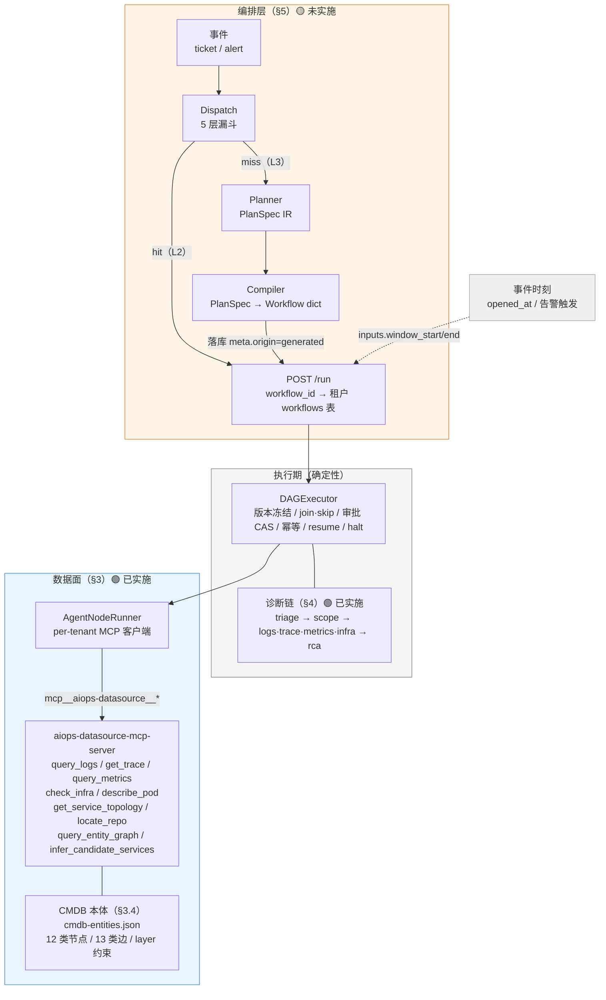
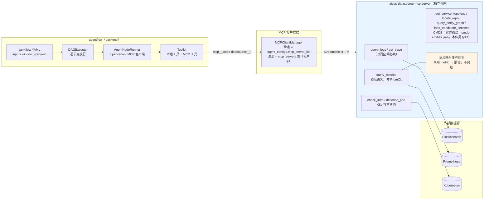

# AI 运维 Bug Fix 智能体平台设计文档（v5.8 — 编排层 × 数据面 × 诊断链 合并版）

**版本**：v5.8
**最后更新**：2026-09-21
**基线**：design-v5.6.md（**系统基线**：编排层 × 数据面合并版）+ design-v5.7.md（其上的**一次增量**：CMDB 业务域分层 + 诊断链「定位问题服务」）
**取代**：design-v5.7.md、design-v5.6.md（两者内容已全量并入本文档，原稿保留仅供追溯）
**继承**：design-v5.3.md（多租户）、design-v5.2.md（第三轮评审签字版）——其原则与修正清单继续有效
**状态**：⚠️ **本文档是多状态的**——§3 数据面（含 §3.4 CMDB 本体）🟢 **已实施并实测**；§4 诊断链 🟢 **已实施并 E2E 验证**；§5 编排层 🟡 **未实施（设计稿）**。
逐节标题带徽标，请按徽标读，不要把"v5.8 写完"误读成"v5.8 做完"。

---

## 1. 文档定位与合并说明

### 1.1 为什么合并

本文档是**第二次合并**。第一次（v5.6）把 v5.4 与 v5.5 合到一起；这一次（v5.8）把
v5.6 与它之上的增量 v5.7 合到一起。两次动机不同，先说清这一次——它决定了本文档的**合并方向**。

**v5.6 与 v5.7 不是两份平行文档，而是「基线 + 一次变更」。** v5.7 自述"基线：design-v5.6.md"，
它只做了三件事：CMDB 本体修订（业务域分层）、诊断链新增 `scope` 节点、以及由此而来的
取数广度 / 证据权重调整。两份分开摆，读者要在两份文档之间来回跳才能拼出"今天这个系统
长什么样"，而 v5.7 的每一节又都要求先读过 v5.6 才看得懂它引用的章节号。

所以本次的方向是 **「以 v5.6 的结构为骨架，把 v5.7 的内容并入它该在的位置」**，
不是两份首尾相接：

| v5.7 的哪一块 | 落到 v5.8 哪里 | 为什么是那儿 |
|---|---|---|
| §2 本体修订 | §3.4 | CMDB 自 v5.5.2 起就是**数据面**的一部分（`aiops-mcp-servers`），本体是那几个 CMDB 工具查的东西 |
| §3–§6 诊断链 | §4（**新章**） | 它是**已实施的执行链**，既不属于"数据面（工具契约）"，也不属于"编排层（动态选路/合成）"——v5.6 里根本没有它的位置 |
| §7.1 CMDB 实施清单 | §3.4.7 | 跟着本体走 |
| §7.2 编排侧实施清单 + 两段补记 | §4.11–§4.14 | 跟着诊断链走（改动都在诊断链的图上） |
| §7.3 验收判据 | §8.5 | 与 v5.6 §7 的实施状态合并 |
| §8 业界调研 | §10 | 独立成节：它支撑的是 §3.4 与 §4 的设计取舍，不专属于其中任何一节 |
| §9 开放问题 | §11 | 独立成节 |

**一条内容都没有丢**——旧稿每一个标题的落点见 §1.4。

第一次合并（v5.4 + v5.5 → v5.6）的动机保留在此。v5.4 与 v5.5 描述的是**同一个系统的两层**，
此前分处两份文档、且一份在 git 外（v5.4 位于仓库根，**未入版本控制**），导致三处实际成本：

- **接缝无人写**：v5.5 §1.3 自述"v5.5 工具是 v5.4 planner 可装配的 capability 底座"，但
  "planner 具体怎么装配这些工具"两边都没写（本文 §6 补齐）；
- **状态被误读**：两份文档一份"已完成"一份"design-only"，读者容易把前者当成"整体已实现"；
- **引用悬空**：全仓十余处注释分别指向两份文档的章节号，重构后易漂移（已实际发生，见 §1.4）。

> v5.6 那次合并留下的教训本次同样适用：合并**不是**把两份文档首尾相接，而是按主题
> 拆散重装。所以 §1.4 那张对照表不是附录性的礼节，它是**旧引用还能不能查得到的唯一依据**。

### 1.2 三层关系（一句话）

- **§5 编排层（源 v5.4）** 解决"**编排怎么选 / 怎么编**"——面对事件，走既有 workflow 还是现编一张；
- **§3 数据面（源 v5.5）** 解决"**取数怎么安全、准确、可诊断**"——诊断用的数据从哪来、契约多硬；
- **§4 诊断链（源 v5.7）** 解决"**服务名从哪来**"——在四个取数节点开跑之前，先定"这单说的是哪个服务"。

**三者正交**：编排层的动态产物（Plan-as-DAG 编译出的 workflow）跑的仍是同一套数据工具与
同一条诊断链；数据面**不关心** workflow 是人工写的还是 planner 生成的；诊断链**不关心**
自己是被哪张图调起来的。

**前提关系有两层**：

- 编排层要落地，必须先有数据面这份可信的工具底座——否则 planner 编排出来的图照样在错数据上
  得出结论（§3.1 的三宗罪正是这类失败）；
- 编排层要落地，还必须先有诊断链这一环——`scope` 解决的"问题服务定位"正是 §5 复杂度判定里
  "涉域广度""根因未知度"两个信号的**已有实现**（v5.6 时代这两个信号没有任何真实来源，
  服务名只能靠 trace 启发式或 agent 猜，见 §4.1）。

### 1.3 状态总览（读前必看）

| 层 / 能力 | 章节 | 来源 | 状态 |
|---|---|---|---|
| **数据面**（MCP 化） | §3 | v5.6（源 v5.5） | 🟢 **已实施**：批 1/2/3 全部完成并实测，取数 **MCP-only** |
| **CMDB 本体**（业务域分层） | §3.4 | v5.7（源 v5.7 §2） | 🟢 **已实施（2026-09-15）**：12 类节点 / 13 类边，**对外契约零改动**；⚠️ **业务语义内容留空**，工具侧召回 🟡 部分完成 |
| **诊断链**（定位问题服务） | §4 | v5.7 | 🟢 **已实施并 E2E 验证（2026-09-16）**；两处诚实缺口见 §4.7.4 |
| **编排层**（动态编排） | §5 | v5.6（源 v5.4） | 🟡 **未实施**：代码零实现，批次见 §8.3，缺口见 §5.9 |
| **两层接缝** | §6 | v5.6 新写 | 🟡 仅方向性约定，未细化 |
| 控制面（工单入口与 API 增量） | §8.4 | v5.6.1 | 🟢 已完成（2026-09-14） |
| 安全与多租户交叠 | §7 | v5.6（源 v5.4 §8 + v5.3） | 继承，动态侧未实施 |
| 工单回传闭环 | §13 | 本文档 | 🟢 已实施并端到端实测（2026-09-21） |

### 1.4 旧章节号映射（供旧引用对照）

历史注释/文档中指向旧稿的章节，按此表对应到本文档。

**本次合并（v5.6 / v5.7 → v5.8）**：

| 旧引用 | 本文档 | 主题 |
|---|---|---|
| v5.6 头部 / §1 | §1 | 文档定位（更名合并说明，补 v5.7 的并入方向） |
| v5.6 §1.1–1.4 | §1.1–§1.4 | 合并动机 / 两层→**三层**关系 / 状态总览 / 本章 |
| v5.6 §2 | §2 | 系统全景（补 `scope` 节点与 CMDB 本体） |
| v5.6 §3.1–3.3 | §3.1–§3.3 | 现状与缺口 / 目标架构 / 工具规格 |
| v5.6 §3.4 / §3.5 | §3.5 / §3.6 | 两条硬约定 / 实现约定 |
| v5.6 §3.6 / §3.6.1 | §3.7 / §3.7.1 | 实施批次与验收 / 时间窗下发 |
| v5.6 §3.7.1–3.7.6 | §3.8.1–3.8.6 | 设计的适用边界与局限 |
| v5.6 §4 | §5 | 编排层：动态编排（整体平移，仅内部引用重编号） |
| v5.6 §5 | §6 | 两层接缝 |
| v5.6 §6 | §7 | 安全与多租户交叠 |
| v5.6 §7.1 / §7.2 | §8.1 / §8.3 | 数据面 / 编排层实施状态 |
| v5.6 §7.3 / §7.3.1–7.3.4 | §8.4 / §8.4.1–8.4.4 | 控制面：工单入口与 API 增量 |
| v5.6 §8 | §9 | 残余风险与待办（诚实清单） |
| v5.6 §9 | §12 | 与既往版本的条款映射 |
| v5.6 §10 | §14 | 版本记录 |
| v5.7 头部 | §1.3、§4 | 状态声明（并入总览）与诊断链全章 |
| v5.7 §1 / §1.1 / §1.2 | §4.1 | 问题与目标 |
| v5.7 §2 / §2.1–§2.6 | §3.4 / §3.4.1–§3.4.6 | CMDB 本体修订 |
| v5.7 §3 / §3.1–§3.6 | §4.2–§4.7 | `scope` 节点（位置 / 定义 / join / 内部分层 / 工具输出 / 信息不足） |
| v5.7 §4 | §4.8 | 置信度驱动取数广度 |
| v5.7 §5 | §4.9 | 工单 service 的证据权重 |
| v5.7 §6 | §4.10 | `trace.failing_service` 降格为证据 |
| v5.7 §7.1 | §3.4.7 | CMDB 侧实施清单与验收 |
| v5.7 §7.2 | §4.11–§4.14 | 编排侧实施清单 / E2E / 两段补记 |
| v5.7 §7.3 | §8.5 | 验收判据（CMDB 与诊断链） |
| v5.7 §8 / §8.1–§8.6 | §10 / §10.1–§10.6 | 业界调研依据 |
| v5.7 §9 | §11 | 开放问题 |

**前一次合并（v5.5 / v5.4 → v5.6）的对照仍然有效**（对更早的注释）：

| 旧引用 | 本文档 | 主题 |
|---|---|---|
| v5.5 §1 | §1、§3 | 文档定位（并入合并说明） |
| v5.5 §2 | §3.1 | 现状与缺口（直连实现三宗罪） |
| v5.5 §3 | §3.2 | 数据面目标架构 |
| v5.5 §4 | §3.3 | 工具规格 |
| v5.5 §5 | §3.5 | 两条硬约定 |
| v5.5 §6 | §3.6 | 实现约定 |
| v5.5 §7 / §7.1 | §3.7 / §3.7.1 | 实施批次与验收 / 时间窗下发 |
| v5.5 §8.1–8.5 | §3.8.1–3.8.5 | 设计的适用边界与局限 |
| v5.4 §1 | §1、§5 | 文档定位（并入合并说明） |
| v5.4 §2 | §5.1–5.2 | 四档执行体 / 复杂度判定 |
| v5.4 §3.1 | §5.3.1 | dispatch 结构化输出与校验缺口 |
| v5.4 §3.2 | §5.3.2 | 五层漏斗 |
| v5.4 §3.3 | §5.3.2 末 | 决策流向 |
| v5.4 §4 | §5.4 | 选路到已批准 workflow（L2） |
| v5.4 §5 | §5.5 | 动态合成 Plan-as-DAG（L3） |
| v5.4 §6 | §5.6 | 安全闸门与计划审批 |
| v5.4 §7.1–7.2 | §5.7.1–5.7.2 | 晋升流程 / 度量基础缺口 |
| v5.4 §7.3 | §5.7.3 | knowledge 命中预判（现状 mock） |
| v5.4 §8 | §7 | 与多租户的交叠 |
| v5.4 §9 | §5.8 | 成本与可观测 |
| v5.4 §10 | §8.3 | 实施批次（未实施） |
| v5.4 §11 | §9 | 残余风险与待办（诚实清单） |
| v5.4 §12 | §12、§14 | 条款映射 / 版本记录 |

> **注**：v5.5 §8 原编号中的"第 8 项（Worker 不热载 agent 配置）"已在 v5.5.1 重构时移入
> `docs/TODO.md`，并已修复（见 §3.8.2 注）。

> **注（v5.8 起）**：`docs/TODO.md`、`README.md`、`ONBOARDING*.md` 等处指向 v5.6 / v5.7
> 的引用**已于同一次提交一并更新**（含顺带修掉几处"`design-v5.6.md` §8.1 —— 标准工作流的
> DAG 形态"：v5.6 §8 其实是「残余风险与待办」，DAG 形态原稿一直在 `design-v5.2.md` §8.1）。
> 若仍见到旧引用，按上表换算即可。

---

## 2. 系统全景



**要点**：
- **规划期自由、执行期确定性**（§5 总原则）：AI 的自由度只进 planner 的受限输出；
  产物一旦编译成 workflow，执行期永远走确定性的冻结 DAG 机器，与人工 workflow 完全同构。
  **诊断链走的也是这台机器**——`scope` 是普通节点，不是新增的执行语义（唯二的例外是
  `kind: approval` 与 `kind: halt`，见 §4.7.4）。
- **取数只有一条路**：进程内直连实现已在批 3 删除；本地只读工具仅剩非数据源类（§3.2）。
- **时间窗由调用方下发**（§3.7.1）：来自事件源，不由平台猜。
- **CMDB 是唯一的拓扑与业务语义来源**（§3.4）：没有遥测自动发现，这一点在 §10.1 的
  业界对照下不是"选了更差的路"，而是处境不同。
- **「查哪个服务」先于「查什么数据」**（§4）：`scope` 不解决取数，它解决的是取数的**目标**——
  这也是为什么它排在四个取数节点之前、并强制它们 `join: all`（§4.4）。

---

## 3. 数据面：MCP 化 🟢 已实施

> 来源 design-v5.5.md。状态：**批 1 / 批 2 / 批 3 全部完成并实测通过，MCP-only 已达成**。

### 3.1 现状与缺口（有实测证据）

实施前，直连实现（`agentflow/agents/datasources.py:RealDataSourceAdapter`）在真实测试床
联调中暴露三宗罪：

#### 3.1.1 查询语义错位（最严重）

`_promql` 的白名单键是 `cpu`/`memory`/`disk`/`disk_limit`/`restarts`，
而 LLM 按 `MetricsEvidenceSchema` 传的是
`cpu_percent`/`memory_percent`/`disk_percent`/`error_rate`/`p95_latency_ms`
——**五个名字无一命中**，全部落到函数末尾的兜底分支：

```python
# 默认：CPU 使用率（cores）
return f"sum(rate(container_cpu_usage_seconds_total{{{sel}}}[1m]))"
```

后果：五个指标返回**同一个数字**。实测 `metrics-analyst` 据此得出
"CPU 几乎空闲（约 0.7%），排除资源饱和类根因"——**结论方向完全错误，且看不出异常**。

> **这是整个设计最重要的一条教训**：真实数据 + 错误查询，比假数据更危险。
> mock 至少会让人怀疑；错配的真实数字看起来完全可信。

#### 3.1.2 无时间维度

- `query_metrics` 用 `/api/v1/query`（**瞬时查询**），不表达任何时间区间；
- `query_logs` 只按 `@timestamp` 倒序取 N 条，**无窗口**。

后果：诊断无法聚焦"故障发生的那几分钟"，只能看最近 N 条——故障已过去时窗口里全是噪声。

#### 3.1.3 未知输入静默兜底

未知 metric 不报错而是回退 CPU（见 §3.1.1 代码）。同类还有：容器未设 memory limit
时 `用量/0` 得 `+Inf`，agent 会把无穷大当成"内存爆了"。

### 3.2 目标架构



**要点**：
- **取数只有这一条路**——进程内直连实现（原 `agents/datasources.py`）已在批 3 删除；
- **语义映射住在 server 侧**（图中橙色）：调用方传 `metric=cpu_percent` 而非 PromQL，
  避免"不同指标映射到同一条查询"这类语义错位（§3.1.1）；
- **注册与绑定都在租户库**：server 注册行随租户库走（v5.3 P4），跨租户物理不可见；
- **接入方式**：复用 v5.3 既有的 `mcp_servers` 表 + `agent_configs.mcp_server_ids`
  绑定（控制面 API 已完备，无需改代码）；
- **工具命名**：agent 侧经 AgentScope 前缀化为
  `mcp__aiops-datasource__query_logs`，`readOnlyHint=True` 使只读工具自动 ALLOW。
- **CMDB 是这套 server 里唯一"非运行时观测"的一族**：它查的是静态实体图谱，
  与 ES/Prom/K8s 的运行期数据性质不同，但同样属于"取数"，故并入同一 server（本体见 §3.4）。

### 3.3 工具规格

全部 `readOnlyHint=True`。**带时间的查询，`start_time`/`end_time` 为必填**。

| 工具 | 时间区间 | 查询目标 | 后端 |
|---|---|---|---|
| `query_logs` | `start_time`/`end_time` 必填 | `service`(可空)、`level`、`limit` | ES `_search` + `range` on `app.@timestamp` |
| `get_trace` | `start_time`/`end_time` 必填 | `trace_id` 必填 | ES + 调用链重建 + 故障 span 判定 |
| `query_metrics` | `start_time`/`end_time` 必填、`step_seconds` | `service` 必填、`metric` 必填（5 选 1） | Prometheus `/api/v1/query_range` |
| `check_infra` | **无** | `namespace`、`pod`(可空=列全部) | `kubectl get pods -o json` |
| `describe_pod` | **无** | `namespace`、`pod` 必填 | `kubectl describe pod` |
| `get_service_topology` | **无**（静态图谱） | `service` 必填、`hops`（默认 2） | CMDB 实体图谱 `calls` 子图 |
| `locate_repo` | **无**（静态图谱） | `service` 必填 | CMDB 实体图谱（由 `app_codebase` 边派生，§3.4.2） |
| `query_entity_graph` | **无**（静态图谱） | `node_types`/`portfolios`/`key_attributes`/`edge_types`、`node_id`+`hops` | CMDB 实体图谱（**全 13 类边**） |
| `infer_candidate_services` | **无**（静态图谱） | `problem` 必填、`services`、`namespaces`、`max_hops`、`limit` | CMDB 实体图谱 + **确定性分层召回**（§3.4.7） |

> 末六个查的是**当前状态 / 静态图谱**，时间维度不适用——这是设计而非疏漏。
> 其中 CMDB 四个工具查的是「谁调谁、归属哪个业务域/仓库、有哪些事件」这类
> **静态实体图谱**（2026-09-15 起由 `cmdb-entities.json` 承载，见 `docs/cmdb-entities.md`），
> 与前三者的**运行时观测数据**性质不同，但同样属于"取数"——故并入同一 server。
>
> ⚠️ **本表在 v5.8 改了一处**：`query_entity_graph` 可跨的边类型 **11 → 13**（v5.7 的
> 本体修订新增 `enterprise_journey`/`domain_link`/`app_codebase`、删 `cross_journey_link`，
> 见 §3.4.2）。v5.6 原稿写的 11 是本表**当时的事实**，不是设计承诺——所以这里是陈旧而非矛盾。

**`query_entity_graph` 与 `get_service_topology` 在 2 跳以上给出不同结果，这是故意的。**
前者跨全部 13 类边、聚焦时按**无向邻域**展开（因为 `portfolio_link` 等边没有方向），
用于**探索结构**；后者只走 `calls` 一种边、方向**相对起点**定义，把"上游的其他下游"
（兄弟节点）排除在外，用于判断**爆炸半径 / 根因**。两者在 1 跳上一致，有测试钉住
这个包含关系（`test_focus_is_superset_of_topology_beyond_one_hop`）。

**返回契约**：`query_metrics` 返回窗口内聚合 `value`（**峰值**，诊断关心"是否打满"
而非均值）与 `min`/`max`/`avg`/`last` + 降采样 `series` + **回显 `window`**
（让调用方确知实际查了什么）。无数据时 `value` 为 `null` 并附**归因提示**。

**错误契约**：预期失败归一为 `{success:false, error:"[CODE] msg"}`，不抛裸异常。

### 3.4 CMDB 本体：业务域分层 🟢 已实施（2026-09-15）

> 来源 design-v5.7.md §2 + §7.1。状态：**本体部分已实施**（`aiops-mcp-servers` `e6c7a34`），
> 验收见 §3.4.7。**未实施**的部分（意图分类路由、"召回为空 → 全量给 LLM"的兜底）也在 §3.4.7，
> 不要读成"CMDB 全做完了"。

#### 3.4.1 节点类型（净 12 类：删 1 加 1）

**删除 `cross_journey_hub`**——新模型是收敛树，没有横向枢纽的位置。当前该类型节点数为 0，
删除不影响任何数据。
**新增 `domain`**（业务细域）——见下。

| 层 | 节点类型 | 说明 | 当前数据 |
|---|---|---|---|
| **业务** | `enterprise` | 企业视角的功能：销售 / 售后 / 零售 / 理赔 | 0 |
| | `journey` | 用户旅程：售后保养 / 销售线索管理 / 用户进店 | 0 |
| | `portfolio` | 业务领域：销售库存 / 售后服务选择 / 配件购买 | 6（⚠️ 见 §3.4.5） |
| | `domain` | **业务细域**——比 portfolio 更细，**与 portfolio 平行而非其子级** | 0 |
| **应用** | `app` | 应用/服务，**或其所在云环境**（见 §3.4.3） | 10 |
| **支撑** | `team` / `agent` / `tool` | 团队 / 智能体 / 工具 | 0 |
| **工程** | `codebase` / `wiki` | 代码仓库 / 知识文档 | 10 |
| **事件** | `incident` / `change` | 故障 / 变更 | 0 |

##### `domain` 的位置：与 portfolio 平行的第二条召回路径

**不做 `portfolio — domain` 层级。** domain 与 portfolio **平行地直连 app**，
边规则与 `tool` / `codebase` 同构（"跟 app 关联即可"）：

```
portfolio ──portfolio_link──┐
                            ├──→ app
domain    ──domain_link─────┘
```

**为什么平行比层级好**：

- **不破坏已定的节点规则**（app 仍不直连 app，业务分类仍不经过 app）
- **多一条独立召回路径** → §4.5 的交叉验证多一份素材：同一 app 被 portfolio 与 domain
  分别命中，证据强于单条路径
- **粒度可不同**：portfolio 粗（业务领域）、domain 细（细分职能），
  对"打印工单没反应"这种细粒度描述，domain 可能命中而 portfolio 不命中

**代价**：domain 不归属任何 portfolio，"它比 portfolio 更细"只是个**约定**，图上表达不出来。
如果将来需要"这个 domain 属于哪个 portfolio"，那要补 `portfolio — domain` 边——
**届时它仍然不与本文的分层约束冲突**（portfolio 与 domain 都不是 app）。

#### 3.4.2 边类型（11 → 13）与**分层约束**

关键设计：**给每类边打 `layer` 标签**，把"app 之间不能直接关联"这条规则变成**可校验的约束**，
而不是靠人记住。

| layer | 边类型 | 端点 | 方向 | 来源 |
|---|---|---|---|---|
| **business** | `enterprise_journey` | enterprise — journey | 无向 | 新模型 |
| | `journey_link` | journey — portfolio | 无向 | 已有 |
| | `portfolio_link` | portfolio — app | 无向 | 已有 |
| | `domain_link` | **domain — app** | 无向 | **本轮新增** |
| **runtime** | `calls` | app → app | 有向 | **本地新增**（见下） |
| **support** | `app_codebase` | app — codebase | 无向 | **本轮提升**（原 `refs.repo_ref`） |
| | `support` | app — team / app — wiki | 无向 | 已有（`support_kind` 区分） |
| | `agent_watches` | agent → app | 有向 | 已有 |
| | `tool_integrates` | tool → app | 有向 | 已有 |
| **event** | `incident_cluster_app` | incident → app | 有向 | 已有 |
| | `change_cluster_app` | change → app | 有向 | 已有 |
| | `change_causes_incident` | change → incident | 有向 | 已有 |
| | `storm_fan_out` | incident → incident | 有向 | 已有 |

**删除**：`cross_journey_link`（随 `cross_journey_hub` 一并删除）。

##### 分层约束（enforced，不是文档约定）

```
business 层：app 之间禁止直接边
```

加进 loader 校验清单：`layer == "business"` 的边，其两端**不得同时是 app**。
这样：

- 你的规则「app 与 app 之间不能直接关联，要通过 portfolio」**由校验器保证**——
  将来界面里想连一条 app—app 的业务归属边，会被直接拒掉
- `calls` 归入 **runtime 层**，语义是**观测到的运行时依赖事实**，不是业务归属。
  它是 `get_service_topology`（爆炸半径 / 上游根因）的唯一数据源，必须保留

> **为什么不是简单删掉 `calls`**：删掉它，`get_service_topology` 立即失去数据源，
> 而它是线上已交付、有 12 个测试钉住的生产形态工具。"爆炸半径"是诊断的核心概念，
> 不能因为分类树要保持干净而拿掉。**分层**这个建模既守住了你的规则，又保住了能力。

#### 3.4.3 App 兼作云环境

App 节点加 `attributes.kind ∈ {application, environment}`：

```json
{ "id": "app:order-service", "type": "app", "name": "order-service",
  "attributes": { "kind": "application", "namespace": "order", ... } }

{ "id": "app:azure-cn-north3", "type": "app", "name": "azure-cn-north3",
  "display_name": "azure-中国-北三区",
  "attributes": { "kind": "environment" } }
```

**为什么用属性而不是新节点类型**：app 与云环境的关系是"所在"，但按分层约束 app 之间
不能直连（business 层禁止），而"部署在"既不是业务归属也不是运行时依赖——用 `kind`
区分开后，LLM 判断相关性时能直接排除环境节点（工单问的是服务，不是机房）。

**留一个开放问题**（§11.3）：`app` 与它所在 `environment` 的关系要不要显式建模？如果要，
它是一类新边（`deployed_in`，app → app），会与"app 不直连"的规则冲突——需要先定这个。

#### 3.4.4 业务语义：让业务域"可检索 + 可判断"

**这是整个设计的地基。** 一个裸的 `portfolio:order` 对 LLM 毫无用处。

> **Journey / Portfolio 不是独立主体，是 service 的「业务标签层」。** CMDB **以 service
> 为主体**构造，业务层挂上去的目的是**给 service 提供可被问题命中的语义锚点**。
>
> 由此推出一条容易写反的规则：**`keywords` 该写什么，不由"这个业务域是什么"决定，
> 而由"用户会怎么描述它出问题"决定。** 写「售后服务选择」是业务视角；
> 写「退货 / 换货 / 保修查询 / 售后入口进不去」才是问题视角——后者才是能被 ticket
> 命中的。详见 §4.5。

业务域节点必须带两类**用途不同**的字段：

| 字段 | 用途 | 谁消费 | 为什么不能合并 |
|---|---|---|---|
| `keywords` | **检索键**——用户/工单里实际会说的词 | 确定性召回（不用模型，快、可扩展到 282 apps） | 检索要的是**高召回**：宁可多捞，词可以很粗 |
| `description` | **判断依据**——这业务域干什么、边界在哪 | LLM 推理 | 判断要的是**高精度**：需要语义，不是关键词 |
| `capability` | 业务能力名（参考站 Journey "Engage" 就是它） | 展示与归类 | 给人和 UI 看 |

各类节点的属性模型：

```json
// enterprise —— 企业功能
{ "attributes": { "description": "面向个人消费者的售后维修与保养业务",
                  "keywords": ["售后", "维修", "保养", "理赔", "退换"] } }

// journey —— 用户旅程
{ "attributes": { "capability": "After-sales Service",
                  "description": "用户从报修到服务完成的端到端旅程",
                  "keywords": ["报修", "预约保养", "上门服务", "服务进度"] } }

// portfolio —— 业务领域（粗粒度）
{ "attributes": { "description": "维护车辆/设备的保养计划与执行记录",
                  "keywords": ["保养计划", "保养记录", "保养提醒"] } }

// domain —— 业务细域（细粒度，与 portfolio 平行直连 app）
//   ★ 这里的 keywords 最容易写对：它就是"用户在描述这个细分职能时会用到的词"
{ "attributes": { "description": "打印保养工单并跟踪打印结果",
                  "keywords": ["打印工单", "工单打印不出来", "打印没反应", "打不出单"] } }

// app —— 业务角色（新增可选字段）
{ "attributes": { ..., "business_role": "负责扣款与退款" } }
```

**按本轮决定，内容留空。** 但要说清后果：

> ⚠️ **今天这一层没有内容，`scope` 节点只能退到 App 级真实字段**
> （`name` / `namespace` / `owner` / `tech`）做匹配——也就是上一轮建的那套。
> **业务域内容录入之前，这一环的上限就在那。** 这也正是为什么现在要把 schema 定死：
> 构建界面一上线，录入的就是这些字段。

顺带，这也**修掉了上一轮那个"中文匹配不上"的问题**——不是靠改匹配算法，是靠 `keywords`
里**录入用户真正会说的词**。「支付超时」匹配不上 owner「支付团队」，但如果
`portfolio:payment` 的 `keywords` 里有"支付"、"付款"、"扣款"，召回就成立了。

#### 3.4.5 ⚠️ 现有 6 个 Portfolio 必须清理

当前这 6 个是从 `namespace` 派生的：`order` / `payment` / `inventory` / `logistics` /
`common` / `account`。

**它们在新模型下是错的**：`namespace` 是 **k8s 部署分组**，不是**业务领域**。新模型里
Portfolio 应该是「销售库存」「售后服务选择」「配件购买」这类业务概念。`common` 尤其荒谬
——它装着两个 owner 完全不同的服务（`notification-service`「平台基础」+
`audit-service`「安全合规」）。

**处置**：在业务域数据录入时删除这批派生节点。**不要**把它们改名沿用——那会把
"部署分组"的语义残留带进业务分类。

#### 3.4.6 载体：**保持 JSON 文件**（DB 方案已评估并推迟）

**2026-09-15 复核后决定：CMDB 载体继续用 JSON 实体文件**（`af3e88a` 的方案不变）。

一度考虑过改为 PostgreSQL（复用 agentflow 的库、按租户建表），复核后**推迟**。

##### 为什么查询不需要数据库

逐条对照我们要的查询能力——**JSON（加载进内存）在每一项上都不差**：

| 查询需求 | JSON（内存） | PostgreSQL |
|---|---|---|
| 精确：结构化字段 | `n["attributes"]["tech"] == "Java"` | `attributes->>'tech' = '...'` |
| 精确：`keywords` 成员 | `set(n["keywords"]) & want` | `keywords && ARRAY[...]` |
| 子串包含 | `term in text` | `ILIKE '%…%'` |
| 模糊（相似度） | `difflib.SequenceMatcher`（stdlib） | `pg_trgm` |
| 多层下钻 | 递归遍历（**已实现**） | 递归 CTE |
| 规模 | 26 → 几万节点都在内存 | 无上限 |

**决定性的是数据量**：26 个节点、到 282 apps 也只有几百 KB。整份读进内存做匹配，
比走 SQL **更快**（无网络往返、无查询计划），且不需要 DB 驱动、不需要 DSN、
**不改变 MCP server "无状态只读"的性质**。

##### 数据库的价值在写入侧，不在查询侧

DB 真正解决的是：构建界面**增删改**节点/边、并发编辑、**单条更新**（不必全量重写文件）、
事务。这些 JSON 确实做不了。**但当界面还不存在、录入只有一两个人时，这是为一个尚未到来的
需求付运维成本。**

##### ⚠️ 记一笔：本方案评估中我自己论证过头的两条

留在这里避免以后重犯：

| 我当时的说法 | 实际 |
|---|---|
| "三种查询用 SQL 表达远比 Python 手写索引干净" | ❌ **说过头了**。内存匹配的 Python 表达同样干净，而且已经写完并有 86 个测试 |
| "引用完整性/唯一性由 DB 约束保证" | ⚠️ 成立，但**跨字段约束 SQL 也表达不了**（`id` 前缀等于 `type`、business 层禁 app—app），这部分优势比自己说的小 |
| "界面编辑数据库正常，编辑 JSON 别扭" | ⚠️ 成立但不致命。界面读写一个 JSON + 文件锁，对单用户/少用户足够 |

##### 推迟不是放弃——触发条件

出现以下任一条时重新评估：

- 构建界面要做，且**需要多人并发录入**
- 目录规模涨到**装不进一次 LLM 上下文**（届时 §4.5 的兜底失效，见 §10.2）
- 需要**审计每一次变更**（谁在什么时候改了哪条边）

##### 附：DB 方案的表结构草案（保留备用，将来可直接用）

```sql
CREATE EXTENSION IF NOT EXISTS pg_trgm;   -- 模糊匹配；不需要 pgvector（已放弃语义匹配）

CREATE TABLE cmdb_ontology (              -- 本体声明，替代 JSON 的 ontology 块
    tenant_id text NOT NULL, kind text NOT NULL, key text NOT NULL,
    label text NOT NULL, label_zh text, spec jsonb NOT NULL,
    PRIMARY KEY (tenant_id, kind, key)
);

CREATE TABLE cmdb_nodes (
    tenant_id    text NOT NULL,
    id           text NOT NULL,                    -- 'app:order-service'
    type         text NOT NULL,
    name         text NOT NULL,
    display_name text,
    attributes   jsonb  NOT NULL DEFAULT '{}',
    tags         text[] NOT NULL DEFAULT '{}',     -- 静态横切标签（派生指标不得入内）
    keywords     text[] NOT NULL DEFAULT '{}',     -- ★ 关键词匹配的主力
    refs         jsonb  NOT NULL DEFAULT '{}',
    notes        text,
    search_text  text GENERATED ALWAYS AS (
        name || ' ' || coalesce(display_name,'') || ' ' || array_to_string(keywords,' ')
    ) STORED,
    PRIMARY KEY (tenant_id, id),
    UNIQUE (tenant_id, type, name)
);

CREATE TABLE cmdb_edges (
    tenant_id text NOT NULL, id text NOT NULL, type text NOT NULL,
    from_id text NOT NULL, to_id text NOT NULL,
    attributes jsonb NOT NULL DEFAULT '{}',
    PRIMARY KEY (tenant_id, id),
    UNIQUE (tenant_id, type, from_id, to_id),
    FOREIGN KEY (tenant_id, from_id) REFERENCES cmdb_nodes (tenant_id, id) ON DELETE CASCADE,
    FOREIGN KEY (tenant_id, to_id)   REFERENCES cmdb_nodes (tenant_id, id) ON DELETE CASCADE
);

CREATE INDEX cmdb_nodes_search_trgm ON cmdb_nodes USING gin (search_text gin_trgm_ops);
CREATE INDEX cmdb_nodes_keywords     ON cmdb_nodes USING gin (keywords);
CREATE INDEX cmdb_edges_from        ON cmdb_edges (tenant_id, from_id);
CREATE INDEX cmdb_edges_to          ON cmdb_edges (tenant_id, to_id);
```

⚠️ 届时仍需注意：**DDL 归属**（表结构属 CMDB 领域但库由 agentflow 的 `tenantctl` 建，
若不纳入其 `schema_versions` 管理，两边版本会静默分家）。

#### 3.4.7 工具侧：确定性召回与实施清单

> 状态：本体 ✅ **已实施（2026-09-15）**；工具侧 🟡 **部分完成**——缺两项（见本节末）。

| 项 | 改动 | 状态 |
|---|---|---|
| 节点类型 | 删 `cross_journey_hub`、**新增 `domain`**（净 12 类）；`app.attributes` 加 `kind`（必填）、`business_role`（可选）；业务层四类各加属性模型（`description` / `keywords` / `capability`） | ✅ |
| 边类型 | 删 `cross_journey_link`；新增 `enterprise_journey`、`domain_link`、`app_codebase`；给全部边加 `layer`（**11 → 13**） | ✅ |
| 校验 | **business 层禁止 app—app**（在 **ontology 声明层**强制，见 §3.4.2）；新增业务层属性模型 | ✅ |
| 实体文件 | `refs.repo_ref` → 10 条 `app_codebase` 边；**删除 6 个派生 Portfolio**；业务语义字段留空 | ✅ |
| schema | 重新导出 `docs/cmdb-entities.schema.json`；`docs/cmdb-entities.md` 补分层 / domain / 业务语义章节 | ✅ |
| 工具 | 新增确定性召回能力；`infer_candidate_services` 降为**证据提供者** | 🟡 **部分完成** |

**验收结果**：`test_cmdb_backend.py` **零改动通过**；`get_service_topology` / `locate_repo`
改动前后输出**逐字节相同**（默认与 `DATASOURCE_REPO_ROOT` 两种模式均验证）——
本体大改（删 hub、加 domain、清空业务层、`refs`→边、加 `kind`）**完全没有影响对外契约**。
测试 144 → 164；全仓 270 通过；ruff / mypy 干净。

> 这条"对外契约零改动"不是巧合，是**判据**：本体的消费者是 agent 的提示词与
> `locate` / `topology` 两条既有路径，改动只允许增强它们，不允许改它们的形状——
> 否则一次本体重构会连带打掉线上已交付的能力（`calls` 边必须保留就是同一道理，§3.4.2）。

##### 分层匹配已实现的部分

**已做**：扫**全部节点类型**（不只 app）、业务层命中后沿业务边**下钻**到 app、
多路径命中**升一档**（交叉验证）、置信度按**证据类型**分档
（`high` 只留给直接证据：症状服务 / 工单 `cmdb_ci` 指定）。

**仍未做**：
① **意图分类**——`intent` 字段（`fault | change | inquiry`）已经输出了（§4.6 的 schema），
但**没有按它分支路由召回策略**，也就是没拿它去决定"找异常服务"还是"找变更影响范围"；
② 兜底「召回为空 → 全量给 LLM」（属 agentflow 侧行为，不在本工具内）。

##### ⚠️ 过程中修掉的 5 个匹配缺陷——全是"看起来在工作、实际没工作"

| # | 缺陷 | 症状 |
|---|---|---|
| 1 | `attrs.get("name")` 永远为空 | **按服务名匹配从未生效过**——服务名在 `node["name"]`，不在 attributes 里 |
| 2 | 匹配器不读 `keywords` | v5.7 新加的字段是死数据，加了等于没加 |
| 3 | 只扫 app 节点 | 业务层节点（journey/portfolio/domain）不可能被命中，加了只是装饰 |
| 4 | `_MIN_TEXT_MATCH_LEN = 3` | 为挡 `tech="Go"` 而设，却把 **33 个双字中文关键词全杀**——中文是双字词密集的语言，3 字符门槛等于关掉中文匹配 |
| 5 | 字段值**整串**匹配 | `tech: "Java / Spring Boot"` 整串永远匹配不上「升级 Java 版本」，必须按分隔符切**词元** |

> ⚠️ 其中 #1 被一个**假命题测试**掩盖了很久：`assert any("name" in reason)` 之所以通过，
> 是因为 reason 里的 `namespace` 恰好包含子串 `name`。已改为断言精确的 `name=order-service`。
>
> 这 5 个缺陷解释了为什么「加字段」在修复前**一点效果都没有**——字段加了，
> 但读它的代码要么没写、要么写错了键、要么被别的守卫挡掉。

### 3.5 两条硬约定

#### 3.5.1 查询必须带时间区间与目标（fail-closed）

时间格式非法 / `start >= end` / 跨度超 `DATASOURCE_MAX_RANGE_HOURS`（默认 24h）
→ **在发起任何上游请求之前**拒绝。不宽容解析、不静默取默认值。

理由：窗口错了，返回的数据就没有意义。早失败远好过给出一份"看起来正常"的答案。

#### 3.5.2 语义映射住 server 侧，禁止 PromQL 透传

**调用方传领域语义（`metric=cpu_percent`），不传 PromQL 表达式。**

映射（哪个指标用哪条表达式、如何换算百分比）是**领域知识**，其正确性决定诊断
方向。把它交给 LLM 现场编写，等于把 §3.1.1 的错误重新引入。因此：

- 未知 metric **一律报错**并列出可用清单（供调用方自我纠正）；
- **不提供** `promql:`/`cadvisor:` 逃生舱（v5.5 相较旧实现的刻意收紧）。

> 这与 applog-mcp-server（声明式 HTTP 透传）是两种取向：透传适合"接口本身即契约"
> 的场景，**指标查询不是**——「error_rate 该查什么」不是调用方该操心的事。

### 3.6 实现约定

| 项 | 约定 |
|---|---|
| server 粒度 | 一个进程覆盖 ES + Prom + K8s + CMDB（共享服务拓扑配置） |
| 端口 | `8300`（git=8000/8100、applog=8200/8101 之后） |
| 配置前缀 | 共享变量不前缀；领域变量 `DATASOURCE_*`（对齐 applog 的 `APPLOG_`） |
| 工具签名 | 字面书写（非 exec 生成）+ `Annotated[..., Field(...)]` |
| 依赖注入 | 上游 transport 可注入（`httpx.MockTransport`）——测试不触网 |
| 截断 | **流式按字节**（预算耗尽即停）+ UTF-8 码点边界回退 + **显式后缀** |
| kubectl | 命令白名单（只 get/describe）；`create_subprocess_exec` 非 shell |

> **截断必须显式可见**：静默截断会让模型用臆测补齐缺失部分（实测：agentflow 中
> `ws_git` 用 `text[-4000:]` 切掉 diff 头部，模型随即伪造了 `index 0000000..1111111`）。

### 3.7 实施批次与验收 🟢

| 批次 | 内容 | 状态 |
|---|---|---|
| **批 1** | 新建 `aiops-datasource-mcp-server` + 对真实测试床实测 | ✅ **已完成** |
| **批 2** | agentflow 注册 server + 绑定 agent + prompt 对齐 + **时间窗下发** + E2E | ✅ **已完成** |
| **批 3** | 删除直连实现（`datasources.py`、`build_datasource()`、相关测试与脚本），达成 **MCP-only** | ✅ **已完成** |

批 2 期间两条路径曾并存；**批 3 已删除直连实现**，现在取数只有 MCP 一条路。

**批 3 验收结果**（`run_76516f37fe`，2026-09-10）：

| 验收点 | 结果 |
|---|---|
| 取数全部经 MCP | ✅ 27 次 MCP 调用；**本地数据源调用 0 次** |
| 本地调用仅剩非数据源工具 | ✅ 29 次 = 工作区工具（ws_*）+ `locate_code`(CMDB) + `search_knowledge`(占位) |
| 诊断正确 | ✅ `rca=code_bug`(0.85)、`trace.failing_service=warranty-service` |
| 全链路闭环 | ✅ run → `success` |
| 回归 | ✅ 253 passed；ruff 债 67 → 43（删文件所致，零新增） |

**批 2 验收结果**（`run_84fc520a3b`，MCP-only 姿态，2026-09-10）：

| 验收点 | 结果 |
|---|---|
| 数据查询全部经 MCP | ✅ 44 次 MCP 调用（query_metrics 20 / query_logs 10 / check_infra+describe_pod 8 / get_trace 3）；**本地直连数据调用 0 次** |
| 本地调用仅限工作区工具 | ✅ 31 次全是 `ws_*`（读写代码、跑测试）——设计如此 |
| 指标值互不相同 | ✅ `cpu_percent=1.12`、`error_rate=0.0`、`p95_latency_ms=2.48` |
| 诊断结论正确 | ✅ `trace.failing_service=warranty-service`、`rca=code_bug`（0.9） |
| 时间窗真实生效 | ✅ 工具调用入参携带下发的窗口 |
| 全链路闭环 | ✅ run → `success`，commit 产出真实 SHA |

**批 1 验收结果**（对 minikube testbed 实测，2026-09-10）：

| 验收点 | 结果 |
|---|---|
| 5 个 metric 不再返回同一个值 | ✅ cpu=1.60 / error_rate=3.45 / p95=2074.23 各不相同；memory/disk 如实返回 null |
| 未知 metric 报错并列出可用项 | ✅ |
| 时间窗口真实生效 | ✅ 同查询：覆盖故障窗口=2 条、故障前=0、未来=0 |
| 超长窗口拒绝 | ✅ 216h > 24h 被拒并提示收窄 |
| `get_trace` 判出故障服务 | ✅ `failing_service=warranty-service`（排除 order-service 的 Feign 超时症状） |
| `check_infra`/`describe_pod` | ✅ 返回真实 6 个 pod 与 2210 字符 describe 文本 |
| 单元测试 / lint / mypy | ✅ 46 passed（全仓 106）/ ruff 全清 / mypy 无问题 |

> **CMDB 本体的验收见 §8.5**（它属于本数据面的第二批交付，2026-09-15）。

#### 3.7.1 时间窗由调用方下发（批 2 新增的约定）

MCP 工具要求 `start_time`/`end_time` 必填，但**谁来给**是个新问题——agent 不知道
"当前时间"，自行编造窗口会得到错误的查询范围（正是本设计要消灭的失败模式）。

**约定**：窗口来自**事件源**（工单 `opened_at` / 告警触发时刻），由调用方算好后经
workflow `inputs.window_start` / `window_end` 传入；workflow 以 `$.inputs.*` 透传到各
取数节点，节点再交给 agent，agent 原样转发给工具。

- 取数节点声明 `require: [start_time, end_time]` —— 缺失即**快速失败**，不空转；
- `check_infra` / `describe_pod` 无时间参数，节点**不**下发窗口。

> 未采用「平台自动按 now-N 分钟填默认值」：那会让"诊断了哪段时间"变成隐式行为，
> 而窗口选错时返回的数据毫无意义却看不出异常——与 §3.1.1 的教训同源。

### 3.8 设计的适用边界与局限

> 本节只收录**设计本身的局限**——即"这样设计，就必然接受这样的后果"，评审需要知道的
> 那类。**实施债（某适配器还没换成生产实现、某依赖还没装、某性能项还没优化）一律
> 移到 `docs/TODO.md`**，不在此处堆积——否则"v5.8 做完"会被误读成"生产就绪"。

#### 3.8.1 `get_trace` 的故障 span 判定是**测试床特定经验**

词表（`feign` / `Read timed out` / `Connection refused` 视为下游调用症状）与
"完成/成功"关键字判定，来自当前测试床的日志/链路形态。**换一套服务、换一种
trace 埋点，这套启发式可能失效**——它不是通用算法，已加注释标注适用边界。

设计含义：把它放在 server 侧是对的（可随环境替换实现而不动 agent），但**它的正确性
依赖于部署环境**，不能当作跨环境保证。

#### 3.8.2 无数据**不掩盖**——宁可 null，也不给可疑数字

`memory_percent` / `disk_percent` 在当前测试床恒为 `null`（前者因容器未设 memory
limit → 百分比无定义；后者因 testbed 应用侧 `data_disk_total_bytes` 为 NaN）。

**这是设计立场而非缺陷**：数据源侧的配置问题/缺陷**不该在查询层被"修"成看起来正常
的数字**。返回 null + 归因提示，让调用方知道"这项判定不了"——与 §3.1.1 的教训同源
（真实数据 + 错误语义，比"没数据"更危险）。

> **注**：v5.5 原稿在此处曾登记"Worker 进程的 agent 配置为永久缓存、绑定新 MCP server
> 需重启"作为遗留项。该问题**已修复**（`911c7d3`：按库内指纹 TTL 热载），登记已移入
> `docs/TODO.md` 并在 §14 留痕，不再属于本文档范围。

#### 3.8.3 平台侧范围外事项（明确交由部署承担）

MCP server **不做** metrics / 限流 / Origin-Host 校验（对齐 applog-mcp-server 的 v1
取舍）。设计上认为这些应由**网关/服务网格**承担，不由业务 server 重复实现。

#### 3.8.4 两条硬约定带来的固有约束

- **时间窗由调用方下发**（§3.7.1）→ 平台**离不开事件源**。若事件源不提供时刻，就没有
  可信窗口；平台不会替它猜（宁可失败）。
- **语义映射住 server 侧**（§3.5.2）→ **新增指标必须改 server 并重启**，不能靠调用方
  现场扩展。这是为换取"查询语义可信"而接受的运维成本。

#### 3.8.5 数据面范围外但仍需生产化的部分

数据面只负责**取数 MCP 化**。系统里仍有若干**继承自 v5.2/v5.3、尚未生产化**的
本地简化实现。它们**不属于数据面设计范围**，但**会决定系统能否上生产**——已集中登记在
`docs/TODO.md`，此处只留索引（不重复内容，避免两处漂移）：

| 项 | TODO | 为何是生产阻塞 |
|---|---|---|
| ~~CMDB 是 mock + 硬编码个人路径 + 接口无 tenant~~ | §12（留痕） | ✅ **已解决**（2026-09-11）：CMDB 迁至 MCP，租户隔离随部署走；仓库映射改由配置驱动。**尾巴见 TODO §9** |
| 审批通知仍是日志桩 | §1 | 审批人收不到通知 → human-in-the-loop 断链 |
| MCP server 无部署资产 / 默认无认证 / 凭证明文 | §2 | 上不了生产环境 |
| 沙箱 exec 服务无认证、无 egress 控制 | §3 | 谁能连上就能执行代码 |

> ⚠️ **CMDB 那一行的"已解决"要按范围读**：解决的是**接口与 tenant 隔离**，
> **数据本身仍是 mock（10 个服务）**，且业务语义层**内容为空**（§3.4.4）。
> 载体已是实体图谱（v5.6.2），本次又做了本体修订（§3.4），但"换的是载体与模型，
> 不是数据源"这条结论到 v5.8 仍然成立。

#### 3.8.6 局限汇总

| # | 局限 | 性质 |
|---|---|---|
| 1 | `get_trace` 启发式依赖部署环境（§3.8.1） | 设计的适用边界 |
| 2 | 无数据返回 null 而非兜底数字（§3.8.2） | 设计立场 |
| 3 | 不做 metrics/限流/Origin，交网关（§3.8.3） | 范围划分 |
| 4 | 时间窗必须由调用方给（§3.8.4） | 约定的固有约束 |
| 5 | 新增指标须改 server（§3.8.4） | 约定的运维成本 |
| 6 | CMDB / 通知 / 沙箱等仍未生产化（§3.8.5） | 范围外，见 TODO |
| 7 | **CMDB 业务语义层内容为空**（§3.4.4）→ 分层召回的上限就在 App 级字段 | 数据未录入，非设计缺陷；录入前后能力差一个档 |
| 8 | **召回只有关键词一道防线**（§4.5）→ 词表未覆盖的说法彻底漏召 | 放弃 embedding 的代价，兜底见 §4.5 |

> **已解决项不再保留墓碑**（如"Worker 不热载配置"「本地直连实现暂留」），
> 历史见 git log 与 `docs/TODO.md` 的完成记录。

---

## 4. 诊断链：定位问题服务 🟢 已实施（2026-09-16）

> 来源 design-v5.7.md §1–§7。状态：**编排侧已实施并 E2E 验证**（§4.11 / §4.12），
> **两处未实施**见 §4.7.4，CMDB 工具侧的两项未完成见 §3.4.7。
> 本节讲的是**已交付的静态诊断链**，与 §5 的"动态编排（未实施）"是两回事。

### 4.1 问题与目标

#### 4.1.1 问题

上一轮把 CMDB 落成了实体图谱（12 类节点 / 11 类边 / 文件承载），但**业务语义层是空的**：

- Portfolio 节点是**裸名字**（`{"id": "portfolio:order", "name": "order", "attributes": {}}`），
  而且这 6 个是从 `namespace` 派生的——**k8s 部署分组冒充业务域**
- Journey / Enterprise 节点数为 0
- 结果：**LLM 无法判断"这张工单跟哪些服务相关"**。拿「用户反馈结账卡住」去对 `order`
  这个词，可判断的信息几乎为零

同时诊断链上**没有"定位问题服务"这一环**。服务名的实际来源只有两条，都不可靠：

| 路径 | 机制 | 问题 |
|---|---|---|
| `trace-analyst` 的 `failing_service` | ES 链路日志启发式 | 只在有 trace 时成立；是**测试床特定经验**（§3.8.1） |
| 各 analyst 从 triage 摘要里猜 | LLM 自由发挥 | `metrics-analyst` 提示词自己在劝"不要反复试不同 service 做开放式探索——会耗尽轮次" |

而工单上其实**带着** `bug_report.cmdb_ci.name`，`create_ticket` 把它落到 ticket 的
`service` 列——**但它只被存储和展示，不参与任何路由**（`_ticket_inputs()` 只把
`bug_report` + 时间窗放进 `inputs`）。

> **本小节描述的是 v5.7 实施前的状态**（决策依据，保留不改写）。现状已不同：
> `scope` 节点会读 `cmdb_ci.name`（§4.3），且当时用于核实的 `workflows/*.yaml`
> 仓库目录**已于 2026-09-16 删除**——workflow 的真源是数据库，种子在
> `agentflow/seed/workflows/`（见 `CLAUDE.md` 6.0）。

#### 4.1.2 目标

1. **业务域分层建模**：Enterprise → Journey → Portfolio → App 四级收敛树，让"服务承载什么
   业务"在图上有据可查
2. **业务语义可检索**：业务域节点带 `keywords`（检索键）与 `description`（判断依据），使
   LLM 判断有据可依、并使**确定性召回**成为可能
3. **诊断链新增 `scope` 节点**：在 triage 之后、取数之前，基于 CMDB 定位问题服务，
   输出带置信度的候选集——**取代"靠 trace 启发式 + agent 猜"的现状**
4. **工单自带的 service 作为高权重先验**，可被推翻但需给反证，且**始终扩展一跳**

### 4.2 位置与数据流

```
triage ──┬──→ scope ──┬──→ logs
         │            ├──→ trace
         │            ├──→ metrics
         └────────────┴──→ infra        ← 四条边都要显式声明，见 §4.4
```

`scope` 在 triage 之后、四个取数节点之前。**服务名必须先定下来，四个取数节点才有意义**——
现在它们拿到的只有 triage 的一句摘要。

### 4.3 `scope` 节点定义

```yaml
scope:
  agent: service-scoper
  join: all
  required_edges: [triage]
  params:
    bug: "$.nodes.triage.output.summary"
    bug_report: "$.inputs.bug_report"     # ← 必须单独传，见下
    start_time: "$.inputs.window_start"
    end_time: "$.inputs.window_end"
  on_failure: abort                        # 定不出服务，后面全是空转
```

**`bug_report` 必须单独传**：triage 的输出 schema 只有
`{symptom_type, severity, summary}`，`cmdb_ci.name` 在 triage 之后就丢了。这是当前链路的
一个真实缺陷，不补上这条，工单自带的 service 信息永远到不了 `scope`。

> **注意 `on_failure: abort` 与"信息不足"不是一回事**——前者是节点跑挂了（失败），
> 后者是正常但无法继续。两者的终态与对用户的措辞都不同，见 §4.7。

### 4.4 ⚠️ 四个取数节点必须改 `join`——否则会静默失效

`params` 的引用本身没问题：`check_params_refs`（`core/dag.py:255-264`）允许引用
**任意传递上游**，不限于直接前驱。所以 `logs` 可以同时引用 `triage` 与 `scope`。

**但默认 `join: any` 的语义是"至少一条 ACTIVE 入边即 READY"**
（`executor/dag_executor.py:259-260`）。`logs` 有了 triage 和 scope 两条入边之后，
**triage 一完成它就被调度**——此时 `scope` 还没跑，`candidate_services` 是 `None`。

所以四个取数节点每一个都要写：

```yaml
logs:
  join: all
  required_edges: [triage, scope]
```

这正是标准流水线里 `locate` 节点**已经踩过**的坑（该 YAML 已于 2026-09-16 随 `workflows/` 一并删除，原注释见 git 历史；节点定义现只存在于租户库的 `workflows` 表与 `agentflow/seed/workflows/`），原话：

> 默认 join: any 会让它在 triage 一完成就被调度（trace 尚未跑完 → failing_service 为 null，
> 导致 code-locator 只能按 ticket 的 subcategory 猜服务，可能定位错仓库）

**代价**：四个取数节点不能再在 triage 完成的瞬间启动，必须等 scope。这是**必要**的
——它们本来就依赖服务名，没有服务名的"并行取数"是假并行。

> **这条坑的另一半在 §4.11 第 1 点**：`required_edges` 要求的是**直接**上游，
> 声明了却没有对应边，图会**加载失败**（而不是跑错）。一个坑两个方向，都得记住。

### 4.5 节点内部：问题域分层 ↔ 方案域分层

#### 4.5.1 核心思路：映射不是一步到位的

**问题描述常常根本不含服务名。** "打印工单没反应"里没有任何技术实体——
直接匹配 service 必然落空。所以映射必须**双向、分层**：

| | 做什么 | 目的 |
|---|---|---|
| **问题域侧** | 关键词提取 + **高层抽象**——把具体现象抬到业务概念 | 让问题能在**不同层次**找到落点 |
| **方案域侧** | CMDB **以 service 为主体**构造，但把 service 与 domain / portfolio / journey 的关系建好 | 让任一层落点都能**下钻**到 service |

两侧对接的地方就是匹配：**问题在某一层命中 → 沿 CMDB 关系下钻到 service**。

> **这改变了 §3.4.4 的定位**：Journey / Portfolio **不是独立主体，是 service 的「业务标签层」**。
> 它们的 `keywords` / `description` 存在的意义，是给 service 提供**可被问题命中的语义锚点**。
> 所以 `keywords` 该写什么，不由"这个业务域是什么"决定，而由"**用户会怎么描述它出问题**"决定。

#### 4.5.2 ticket 类型是异质的，映射目标也不同

| ticket 类型 | 例子 | 真正要找的 | 主用策略 |
|---|---|---|---|
| **技术故障** | "order-service 报错" | 显式服务名 | **精确名匹配**（app 层） |
| **业务操作问题** | "打印工单没反应" | 承担「打印工单」职能的服务 | **高层抽象 → journey/portfolio 层命中 → 下钻**（依赖 `keywords` 覆盖） |
| **变更 / 升级** | "升级 Java 版本" | 哪些服务用了 Java | **属性过滤**（`attributes.tech`）——确定性、精确 |

对变更类 ticket 问"定位**异常**服务是**问错了问题**——"升级 Java"没有异常，
要找的是"哪些服务在变更影响范围内"。

#### 4.5.3 流程

```
问题描述（自然语言 + bug_report）
   │
   ▼ ① 关键词提取 + 高层抽象（agentflow，LLM）
   │     具体现象 → 高层业务概念
   │     "打印工单没反应" → 业务动作「打印工单」、业务域「工单管理」
   │     "升级 Java"      → 技术栈「Java」（不是业务域）
   ▼
   ② 分层关键词匹配（MCP server，**无模型**，逐层尝试）
   │     ├─ app 层        ← name / namespace / owner / tech
   │     ├─ domain 层     ← keywords（**粒度最细，误召最少**）
   │     ├─ portfolio 层  ← keywords（精确包含 + 模糊）
   │     ├─ journey 层    ← keywords / capability
   │     └─ enterprise 层 ← keywords
   ▼
   ③ 沿图下钻（MCP server，图操作）
   │     命中的每个节点 → 沿 journey_link / portfolio_link / domain_link
   │                       取其下全部 app
   ▼
   ④ 合并 + 交叉验证 + LLM 判断（agentflow）
   │     多层命中同一 app → 置信度叠加（见下）
   ▼
   候选服务集
```

#### 4.5.4 匹配只用关键词——精确 + 模糊，不做语义

**2026-09-15 决定：放弃语义（embedding）匹配，只做关键词的精确与模糊匹配。**

| 匹配类型 | 机制 | 例 |
|---|---|---|
| **精确** | 结构化字段等值 / `keywords` 数组成员 / 子串包含 | `tech = 'Java / Spring Boot'` |
| **模糊** | `pg_trgm` 相似度 / 编辑距离容忍拼写差异 | "order-sevice" → "order-service" |

这条决定带来两个后果，**一好一坏**：

- ✅ **架构变干净**：MCP server 不再需要任何模型依赖，回到纯粹的只读数据服务；
  也**与业界实践一致**（调研显示业界从不拿 embedding 做服务召回，见 §10.2）
- ⚠️ **`keywords` 词表从"重要"变成"唯一"**：语义匹配原本能兜住词表未覆盖的说法
  （"打印工单没反应"里没有「打印」也能靠语义捞到）；现在没有第二道防线——
  **词表里没有，就是彻底漏召**。所以 §3.4.4 那条"`keywords` 由用户会怎么说决定"的规则
  从建议升级为**硬要求**，`cmdb-business-terms-draft.md` 里那列占位词必须用真实工单词替换

#### 4.5.5 兜底：召回为空 → 回退全量给 LLM

**关键词匹配的漏召率高于语义匹配，所以必须有兜底**：当所有层的匹配**都为空**时，
**不要返回空结果就结束**——把**全量目录**交给 LLM 判断。

这在我们的规模下可行（26 节点；到 282 apps 仍在单次上下文内），且是纯关键词方案唯一
可靠的防线。**目录大到装不下时，这个兜底会失效——那时才需要重新评估召回策略**
（届时的选项见 §10.2 的调研结论，而不是反过来先上向量）。

> ⚠️ **这条兜底在 agentflow 侧尚未实现**（§4.7.4 的未实施项之一）。也就是说，
> 今天"关键词一条都没命中"的后果是**候选集为空**，而不是回退全量。

#### 4.5.6 层级衰减：命中越高层，越不能单独作数

**这是分层映射的固有风险**——命中 enterprise 层（如"零售业务有问题"）下钻出来可能是
**全量服务**，等于没缩。所以必须衰减：

| 命中层 | 下钻覆盖 | 初始置信 | 说明 |
|---|---|---|---|
| `app` | 1 个 | **high** | 确定性最高 |
| `domain` | 该细域下几个 | **high**（略低于 app） | 粒度最细，误召最少 |
| `portfolio` | 该域下若干 | medium | |
| `journey` | 跨多域 | low | |
| `enterprise` | 可能全量 | **极低** | **不足以单独作为候选依据**——必须与更细层的命中共同出现 |

> ⚠️ 这张表与"路径叠加"的具体规则**都是拍出来的，没有数据支撑**——开放问题 §11.8。

#### 4.5.7 交叉验证：分层映射最大的增益

**同一 app 被多个层次独立命中 → 置信度显著提高。** 这是可计算的信号，不是感觉。
`domain` 与 `portfolio` **平行直连 app**（§3.4.1），所以它们天然构成两条**互相独立**的路径：

```
"打印工单没反应"
   ├─ domain「工单打印」  命中 → 下钻 → {ticket-service}
   ├─ portfolio「订单交易」命中 → 下钻 → {order-service, pricing-service}
   └─ journey「售后工单」  命中 → 下钻 → {ticket-service, notification-service}
                                          ↑
                        ticket-service 被 2 条独立路径命中 → 置信度叠加
```

**注意 `domain` 在这里的价值**：如果 `keywords` 只写到 portfolio 那层（「订单交易」），
"打印"这个词根本不在它下面——**domain 是让细粒度描述也能命中的那一层**。
这也正是把 domain 设成"与 portfolio 平行"而非"其子级"的实际收益：
两条路径各写各的 `keywords`，互不挤占。

命中路径数 / 命中层数进 `reasons`，也是 LLM 判断的明确先验。**这是"从不同层次映射到
解决方案域"这句话最实在的收益**——单层匹配只有"命中/未命中"，分层匹配有"被几条独立
证据支持"。

#### 4.5.8 边界：② ③ 住 MCP server，① ④ 住 agentflow

MCP server 是只读数据服务，**不要为了"更聪明"给它加模型依赖**（它现在全是
`readOnlyHint=True` 的工具，agentflow 侧据此自动放行）。抽象与判断需要模型，归 agentflow；
匹配与图操作是确定性的，归 server。

#### 4.5.9 精确优先，模糊只在精确未命中时补位

匹配策略有明确的**优先级顺序**，不是同级并列：

1. **结构化精确**（`name` / `namespace` / `tech` / `keywords` 成员）——确定性最高
2. **子串包含**——确定性，但比等值宽松
3. **模糊**（`pg_trgm` 相似度）——**只在上面都没命中时才启用**

理由：模糊匹配是**误召和漏召的共同来源**。用它兜底可以，用它主查会把噪声灌进候选集。

#### 4.5.10 为什么召回层必须存在（不能全给 LLM）

10 个服务时确实可以全塞给 LLM。但目录一大就爆上下文。召回负责**把大目录收到 ~10**，
LLM 只在这个短名单上做判断。**这是设计能扩展的前提**，也是 §3.4.4 里
`keywords` 必须存在的原因。

注意这不是绝对约束——**兜底策略（召回为空 → 全量给 LLM）本身就是"全给 LLM"**，
只是限定在"关键词一条都没命中"时才触发。

### 4.6 `service-scoper` 工具与输出

工具：
- `query_entity_graph(node_types=["app", "portfolio", "journey"])` —— 拉业务域全景作判断依据
- `get_service_topology(service, hops=2)` —— 确定性扩展
  （`upstream`=爆炸半径 / `downstream`=上游根因）

输出 schema：

```json
{
  "intent": "fault | change | inquiry",
  "abstractions": ["打印工单", "工单管理"],
  "matched_domains": [
    { "type": "journey", "name": "customer-server-journey",
      "display_name": "Customer Server Journey", "app_count": 27 }
  ],
  "ambiguous": false,
  "candidate_services": [
    { "service": "ticket-service",
      "confidence": "high",
      "impact": "medium",
      "matched_layers": ["journey", "portfolio"],
      "hit_paths": 2,
      "reasons": ["journey「售后工单」命中 → 下钻",
                  "portfolio「工单打印」命中 → 下钻",
                  "2 条独立路径交叉命中"],
      "business_paths": [
        { "enterprise": "OTR", "journey": "Customer Server Journey",
          "portfolio": "Work Order", "domain": null }
      ],
      "in_domain": true,
      "evidence_source": "graph_match"
    }
  ],
  "primary_service": "ticket-service",
  "expand_search": false,
  "insufficient": false,
  "summary": "..."
}
```

> **2026-09-17 补**：`matched_domains` / `ambiguous` / `business_paths` / `in_domain` /
> `evidence_source` 五个字段是这次加的，起因见下面两段。
>
> **同名跨域**：实测 `VLMS` 同时属于 Work Order / Handover / Workshop（分属两个 journey），
> 对「VLMS 打不开」返回的三个候选**同分、同层、reasons 一字不差**——调用方只能看名字后缀猜。
> 把业务域路径放进输出，歧义才是**可见**的。`in_domain` 的 `null`（无域线索）与 `false`
> （确实不在域内）**语义不同**，不能合。
>
> **伪归因**：`evidence_source` 针对的是一次真实事故——工单里没有服务名
> （`bug_report.cmdb_ci` 是空的），scope 却写「症状服务 order-service **由 ticket 明确给出**」，
> 实际是从上游 triage 的**散文摘要**里读到的。`upstream_summary` 不是不能用，
> 是**必须如实标出来**；把它写成 `ticket_*` 会让下游把未经验证的假设当成已证实的事实。

**`confidence` 与 `impact` 保持两个独立的轴**（沿用上一轮的设计）：前者是"它有关的证据
有多强"，后者是"如果有关影响多大"。把 `tier1` 折进置信度会让一个仅凭拓扑相邻的候选
拿到与工单指定服务同等的标签——那是把重要性冒充成可能性。

**`matched_layers` / `hit_paths` 是分层映射的产物**（§4.5）：命中层越细、独立路径越多，
证据越强。这两个字段不是装饰——它们是 `confidence` 的**可核对依据**，
也是 LLM 判断时的明确先验。

⚠️ **注意 `abstractions` 可能与 `candidate_services` 断层**：如果高层抽象做出来了
（`["打印工单"]`）但在 CMDB 里**找不到任何落点**，说明**业务域语义没录入**——
这要**如实上报**（`candidate_services: []` + 说明），而不是硬凑一个服务出来。
这正是 §3.4.4 说"业务语义是地基"的实际含义。

### 4.7 输入不足：停止并请求补充（不得硬推）

**原则**：ticket 信息不足以支撑后续推导时，**停止流程让用户补充**——而不是拿现有信息
硬凑一个候选集。这与本设计的 fail-closed 精神一致（§4.6 的"断层要如实上报"是同一个原则的
局部版本，这一节是它的流程级版本）。

#### 4.7.1 什么算"不够"

| 情形 | 判定 |
|---|---|
| 高层抽象做出来了，但**在任何层都找不到落点** | 不够——业务域语义没录入，或描述太模糊 |
| 命中的全部候选 **置信度都是 `low`** 且 `hit_paths` 均为 1 | 不够——等于没有可区分的证据 |
| ticket 缺**时间窗**（`window_start`/`window_end`） | 不够——数据查询工具是必填的（§3.7.1） |
| 意图无法判定（既不像故障也不像变更） | 不够 |

**注意最后一条与 `on_failure: abort` 的区别**：abort 是**失败**（节点跑挂了），
而"信息不足"是**正常但无法继续**——两者的终态、可恢复性、对用户的措辞都不同，不能混用。

#### 4.7.2 机制：原地暂停 vs 停止后重跑

| | (A) 停止本次 run + 重新发起 | (B) 新增 `kind: clarification` 节点，原地暂停 |
|---|---|---|
| 复用 | 全部现有机制 | 需新 node kind + 状态 + CAS + 端点 |
| 用户体验 | 补充后**重跑**，前面的诊断白做 | 补充后**从断点继续**（checkpoint 已落盘） |
| 与"停止流程"字面 | 部分符合 | **符合** |
| 成本 | 低 | 中（但是 `kind: approval` 的自然扩展） |

**推荐 (B)**，理由是平台已有全部底层能力：审批节点已经实现了「暂停 → 落盘 → 人给输入 →
`output` 落地 → resume」，clarification 只是把**二值决定**换成**结构化自由输入**。

**关键洞察（解掉了一个看似冲突的地方）**：run 的 `inputs` 在创建时冻结（版本冻结语义，
见 §12 的 v5.2 §8.1/8.5 一行），
所以补充的信息**不能**走 inputs。但它**可以走节点输出**——审批节点就是这么做的
（人的决定成为该节点的 output，下游用 `$.nodes.<id>.output` 引用）。
**输入冻结因此不构成障碍**，不需要解冻 inputs，也就不会破坏版本冻结语义。

#### 4.7.3 需要新增的东西（若走 B）

1. `kind: clarification` 节点类型
2. 一个与 `WAITING_APPROVAL` 并列的状态（如 `WAITING_INPUT`），同样进
   `ACTIVE_RUN_STATUSES`（否则并发配额会提前释放）
3. 节点输出 schema：`{ question, needed_fields: [{field, why, example}] }`
4. 一个提交端点的语义（参照 approve/reject），**必须带 CAS + 超时**——
   超时语义与审批不同：审批超时走拒绝路径，**clarification 超时应走"信息不足终止"**
   而不是默认一个答案（默认答案就是硬推）
5. ticket 状态加 `waiting_input`（现在只有 `new / running / resolved / failed`）

⚠️ 待定：**超时后要不要自动终止**。自动终止更安全；但如果用户只是慢，
误杀会让人重来。建议：超时后**不自动终止**，转为"长期挂起"并通知，由人或 sweeper
按租户策略处置——**但这条需要你定**。

#### 4.7.4 实施现状（2026-09-17）：做了 (A)，没做 (B)

**已实施的是 (A)**，以**执行层通用原语**的形态：`kind: halt` 节点
（`core/dag.py` 的 kind、`CLAUDE.md` 约束 3.1）。它**不是** scope 专属——
三个触发点共用同一个终点：`scope.insufficient` / `rca.insufficient` / `locate.found == false`；
halt 的 `reason`/`missing` 由 executor 从**触发它的那条入边**的上游输出搬运，
产出另带 `triggered_by` 说明"是谁停的"。判"中断"用 `halt_triggered()`
（判据是图上的 `kind`，随 snapshot 冻结），`GET /runs/{id}` 另给
`outcome: completed|halted`。

**为什么当时走 (A) 而不是 (B)**：(A) 复用全部现有机制、零执行语义改动（只加一个 node kind）；
(B) 需要 `kind: clarification` + `WAITING_INPUT` + CAS + 提交端点 + ticket 状态，
是一整条链路。**但这是工程成本的取舍，不是设计结论**——下表 (B) 的两个好处 (A) 一个都没拿到。

**补记：resume 对 halted run 是空操作（实测）。** 发过 halt 的 run，`run.status` 已是终态：

```
POST /runs/{id}/resume  →  {"ok": true, "status": "resumed"}      ← 接口说"已恢复"
Worker 日志             →  [run_xxx] run 已终态，忽略 resume      ← 实际什么都没做
```

（`worker.py:171` 拿 `TERMINAL` 拦下；已登记为 `docs/TODO.md` §23.2。
**接口回 `ok: true` 而实际 no-op 是个独立的小缺陷，值得单独修。**）
即便绕过这道门，executor 侧也会立刻再全跳过一遍——`_process_skips` 第一句就是
「halt 已触发 → 其余 PENDING 全 SKIPPED」，而 halt 是 DONE、随 checkpoint 恢复。

**所以补信息的实际路径是：新建工单 → 重发 → 整条诊断链从头跑。**
（顺带确认了两个缺口：① `POST /tickets/{tid}/run` 的 `TicketRunRequest` **只有
`workflow_id`，没有 inputs 覆盖口**；② **没有工单更新端点**。二者叠加 =
**不新建工单就无法补充信息**。）

**残留问题（登记为开放问题，见 §11.10）**：
- 补信息要重跑整条诊断链 —— 这正是 (B) 要解决的
- 没有工单更新端点/inputs 覆盖口 —— 比 (B) 小得多，可先行

### 4.8 置信度驱动取数广度

| 置信度 | 取数行为 |
|---|---|
| `high` | 只查 `primary_service` |
| `medium` | 查 top-3 候选 |
| `low` | `expand_search: true` → 查 top-5 + 各自一跳拓扑邻居 |

低置信时 token 开销上升是**有意**的——故障说不清时本来就该多查。

> 这一档位设计的来源见 §10.4：Dynatrace 的"置信度不领先就不给答案"值得借鉴，
> 我们把它落成"低置信 → 多查"而非"低置信 → 不给答案"。

### 4.9 工单 service 的证据权重

按你的要求，落成三条规则：

1. **进候选时起始置信度直接给 `high`**，理由记为「工单 cmdb_ci 指定」——比 LLM 从文本
   推出来的权重大
2. **LLM 可以推翻它**，但**推翻必须在 `reasons` 里给出反证**（如"该服务窗口内无任何
   ERROR 日志，而 keywords 命中的是另一个服务"）
3. **即使工单指定了服务，也仍然扩展一跳**

第 3 条是关键：**"不能完全依赖"不只是"要怀疑它错"，更是"它对，但不够"**——工单写的
服务是**症状出现的服务**，不等于**根因所在服务**。这正是 `get_service_topology` 里
`downstream`=上游根因那套语义的用武之地。

### 4.10 `trace.failing_service` 降格为证据

现状：它是**唯一**真正驱动下游的信号。新位置：

| | 信号 | 时机 | 性质 |
|---|---|---|---|
| **主** | `scope` 基于 CMDB 的定位 | 早 | 宽、有业务语义 |
| **证据** | `trace` 的 `failing_service` | 晚 | 窄，但是**真实运行时证据** |

**两者不一致时不要丢掉一方，而是记下来**——这往往正说明"症状服务 ≠ 根因服务"，
是有价值的信号。

具体接法：`locate` 节点**保持不变**（继续用 `failing_service`），把它与
`scope.primary_service` 一起交给 `root-cause` 节点做交叉判断。**只改 `rca` 的 params
和提示词，不动 `locate` 的接线**——把改动面控制在最小。

### 4.11 编排侧实施清单 ✅ 已实施并 E2E 验证（2026-09-16）

| 项 | 改动 | 状态 |
|---|---|---|
| 新 agent | `service-scoper`（提示词 + `CandidateServicesSchema`），注册进 `DIAGNOSE_AGENTS` / `AGENT_STAGES`(detect) / `AGENT_DESCRIPTIONS` | ✅ |
| workflow | 新增 `scope` 节点；`logs`/`trace`/`metrics`/`infra` 加 `join: all` + `required_edges: [triage, scope]`；**两个 pipeline 都改了** | ✅ |
| `rca` | params 加 `scope_primary`；提示词加「`scope` 与 `trace` 不一致时如何裁决」 | ✅ |
| prompt | 四个取数 agent 加 `_SERVICES_RULE`（按置信度档位取用候选；为空才退回宽查询） | ✅ |

> ⚠️ 注册表因此从 **15 个 agent 变成 16 个**。v5.6 原稿中所有"注册表 15 agent"
> 的计数（§5.5.1、§5.5.2.1、§12）已相应改写——**这不是设计变更，是计数陈旧**。

#### 4.11.1 实现时踩到、值得记住的三点

1. **`required_edges` 必须是「直接」上游，传递上游不算**。`_check_join_consistency`
   （`core/dag.py:212`）拿 `node.upstreams`（= in_edges 的 source）做子集判断。
   `logs` 声明 `required_edges: [triage, scope]` 就必须**同时有** `triage → logs`
   与 `scope → logs` **两条直接边**——只写后者会报
   `required_edges 不是其上游: ['triage']`。（这正是 `join: all` 那个坑的另一半：
   前者是"不声明会过早调度"，后者是"声明了但没有对应边会加载失败"。）
2. **新 agent 默认没有任何 MCP 工具**。`agent_configs.mcp_server_ids` 是两态语义
   （NULL/`[]` = 无 server）。加完 agent 必须显式绑定：
   `PUT /agent-configs/service-scoper -d '{"mcp_server_ids":["<mid>"]}'`
   ——对内置 agent 是 upsert，不传的文本字段回退内置默认，不会覆盖提示词。
3. **run 用的是库里保存的 workflow，不是仓库里的 YAML**。改完 YAML 必须写回：
   `PUT /workflows/{wid} -d '{"name":..., "yaml":...}'`，否则 run 跑的还是旧流程
   （本次就差点漏掉——库里那份是改之前保存的）。
   **这是"新租户初始化缺播种"的一个侧面**：`tenantctl provision` 只建库建表、
   不播种 workflow 与数据面绑定，新租户的 `workflows` 表是空的 → 起不来诊断。

   > **✅ 已解决（2026-09-18，`docs/TODO.md` §13）**：租户库建好时，
   > `TenantStoresRouter._build()` 会往**三张表**一起播默认数据——
   > `workflows` + `mcp_servers` + `agent_configs`（agent↔server 绑定），新租户开箱可用。
   > **只播 workflow 不够**：绑定为空 ⇒ 每个 agent 零工具，run 会跑完但全在空转。
   > 语义是**空表才播、绝不覆盖**，id 一律 `seed-` 前缀，逃生阀
   > `AGENTFLOW_SEED_DEFAULTS=0`；数据面 server 地址走 `AGENTFLOW_MCP_DATASOURCE_URL`
   > （URL 环境相关，不在种子里写死）。种子在 `agentflow/seed/`。
   >
   > ⚠️ **但上面这条「改完 YAML 必须写回」对已开通租户仍然成立**——种子只在**空表**时播，
   > 改了 seed 文件对已存在的租户没有任何效果。改已有租户仍走 `PUT /workflows/{wid}`。

### 4.12 E2E 实测与验收判据

#### 4.12.1 E2E 实测（工单「订单服务打印结账单无反应」，租户 `otr`）

- `scope` 节点 `done`，12.7s，**调用了 `infer_candidate_services`**，输出
  `intent=fault`、`primary_service=order-service`、`expand_search=true`，
  候选含 order-service(high) + 9 个拓扑邻居(medium)，并给出 5 条 `abstractions`
- **join 语义实测有效**：`scope` 于 `02:41:58` 结束，四个取数节点**统一在
  `02:42:00` 启动**——若 `join` 未生效它们会在 triage 结束（`02:41:45`）就启动，早 15 秒
- `rca` 明确做了交叉核对：*"`scope_primary=order-service` 与工单语义一致"*
- 全链跑通至审批节点（13 done / 1 `waiting_approval`），817k tokens / $0.07
- **诚实度符合预期**：`scope` 主动标注"1 跳映射为**静态拓扑而非运行时观测**"；
  `rca` 在证据缺失时写"窗口内全服务日志 0 条…**不可当作 0**"而非编造

#### 4.12.2 验收判据

- CMDB：`business` 层 app—app 连边被拒（反例测试）；`calls` 归 runtime 层后
  `get_service_topology` 的 12 个测试**零改动通过**
- workflow：`logs` 在 `scope` 未完成时**不得**被调度（回归测试，对应 scenario2 里
  `locate` 那个坑）；`cmdb_ci.name` 能被 `scope` 读到
- 端到端：一张带 `cmdb_ci.name` 的工单 → `scope` 输出的候选集里该服务置信 `high`，
  且**包含它的一跳邻居**

### 4.13 补记（2026-09-18）：审批决策点与 `on_reject` 的落地形态

§4.11 那张表记的是 2026-09-16 的形态，**当时诊断链上没有任何人工决策点**：
`plan → fix` 直连，plan 一出 `fix` 立刻改代码。实测暴露过——
`run_b156f65142` 的 plan 自己写着「第 3、4 步落地前必须先核对…否则可能修错位置」，
而它第 3、4 步（`code_fix`）**已经跑完了**。现已补上，形状变成：

```
scenario1（含 K8s 止血分支）: plan → approve-plan → { fix , approve-remediate → remediate }
scenario2（纯代码修复）      : plan → approve-plan → fix
```

审批节点总数 **5 个**：两条 pipeline 都有 `approve-plan` 与 `approve-commit`；
`approve-remediate` 是 scenario1 独有的（只有它有 `remediate` 分支）。
命名遵守 §5.5.3 那条约束（**approval node id 用稳定语义命名**）——
那条写的是"将来 compiler 该这么命名"，现在被静态图先印证了。

**`on_reject` 的语义（`abort` | `continue`，默认 `abort`）**，每个审批节点必须**显式声明**：

- `abort` → 驳回 = **中止整条 run**（run 判 `failed`，节点状态保留 `rejected`）；
- `continue` → 沿图上 `when: approved == false` 的边路由（**图里必须写了那条边**）。

⚠️ 两条踩过的坑，都是**静默**的：

1. **不写 = `abort`**。若图里同时又写了 `approved == false → recap` 边，那条边
   **永远不可达**——图在骗人，但加载与运行都不报错。
2. **判据看状态、不看动作**。queue 模式下 Worker 经 `from_checkpoint` 重建后直接
   `run()`，**不经过 `approve()`** → 写在 `approve()` 里的中止逻辑**完全不生效**，
   run 照样报 `done`，只有下游被 SKIPPED。故判据是 `rejected_abort_node()`
   （`executor/dag_executor.py:291`，读节点状态 + 图上的 `on_reject` 声明）。
   此前 `on_reject` 是**死配置**——全仓只有解析那三行，没有任何消费方。

约定全文见 `CLAUDE.md` 约束 4.1，缺陷与实测见 `docs/TODO.md` §21。
**超时不走这条**（`REJECTED_CANCELED` 是 `on_timeout` 的语义，尚未实现）。

### 4.14 补记（2026-09-21）：`problem-log-diagnose` 收敛为「诊断输出」单门，修复段整体删除

**只动了这一条流程**，上面的形状描述对 `agentflow/seed/workflows/` 的两条
（scenario1 / scenario2）**仍然成立**——它们照旧是
`plan → approve-plan(abort) → fix → test → review → approve-commit(continue) → commit`。

`problem-log-diagnose`（Problem Center「分析new」）改成了：

```
triage → logs, locate → rca → plan → diagnose-output   ← kind: approval，**终态节点，无出边**
rca    → halt (insufficient == true)
locate → halt (found == false)
```

**为什么**：Problem Center 里人要拍板的是「这条问题单要不要处理、派给谁做」，不是让平台
在沙箱里替人改代码。三种裁定（拒绝重跑 / 忽略关单 / 升级开单）收在同一道门上，**升级的下游
动作（建工单、绑号、置终态）住在 APM 侧**——工单号要绑到 APM 的 `problem_record.evidence`，
而 agentflow 没有也不该有 APM 的客户端（今天是 APM → agentflow 单向）。

**三点值得留的**：

1. **`continue` + 没有驳回出边 = 引擎允许的第三种形态**（前两种是 `abort`+无边、
   `continue`+有边）。`_check_on_reject_consistency` 只拦反方向那个矛盾组合，**加载期不查
   这一形态**，所以只能靠测试守（`tests/test_problem_log_diagnose_workflow.py`
   的 `test_gate_is_terminal_with_no_out_edges` / `test_gate_is_continue_so_reject_does_not_abort`）。
2. **语义代价（不是 bug）**：门是终态后，通过与否**只看节点状态**——两条路的 run 都是
   `done` → API `success` → viewmodel `completed`。人否了诊断，run 仍报成功，
   痕迹只在门节点的 `rejected` 与审批记录里。这是 `TERMINAL` 含 `REJECTED` 的固有属性，
   换 `abort` 就会把"人否决"变成"执行失败"，取舍见 `CLAUDE.md` §4.1。
3. ~~**删掉修复段后这条流程不含任何 `WORKSPACE_AGENTS`**，`service.py` 的 `_prepare_workspace`
   会提前 return——run 不再准备 git 工作区（更省更快）。~~
   ⚠️ **这条是错的，当天就被证伪并修掉**，留在这里当反面教材：
   `code-locator` **也碰工作区**（用 `ws_read_file` / `ws_list_files` 读仓库，`CLAUDE.md` §9.6
   说那两个工具刻意不经沙箱，但**仍要求工作区先 prepare**），而修复段删除后图里就只剩它一个。
   于是：工作区不准备 → `ws_*` 全部 fail-closed 报「在本次 run 未 prepare」→ `code-locator`
   退到 MCP 上逐个猜项目名 → **实测烧掉 16 万 token、耗尽迭代预算、输出非 JSON** →
   `locate.found == false` → **整条诊断链在 halt 处中断**。
   症状是「诊断分析不出问题」，离根因（一个跟诊断无关的名单）非常远。
   修法：`WORKSPACE_AGENTS` 加 `code-locator`——**判据是"这个 agent 用不用工作区"，
   不是"它写不写代码"**；并加回归测试钉住（`test_workspace_gets_prepared_for_the_diagnosis_chain`）。
   代价是那条"更省更快"没了：工作区照旧准备。**正确性优先。**
   > 这条值得留的教训：把"某个早退分支不再触发"当成**收益**写进提交信息之前，
   > 得先确认**那个分支是唯一让某件事发生的地方**——这次不是，而我没有回头核。

`docs/TODO.md` §25（`ws_git` 允许 `push`）的前提随之变动，见该节的「前提变动」注。

---

## 5. 编排层：动态编排 🟡 未实施（设计稿）

> 来源 design-v5.4.md。状态：**design-only，代码零实现**。批次见 §8.3，现状缺口见 §5.9。
> 本节保留设计全貌，但**读到的每一条都尚未落地**。
>
> 与 §4 的关系：§4 是**已交付的静态诊断链**（triage 之后一路走到审批门），
> 本节是**还没写的动态选路/合成层**。两者不冲突：planner 将来产出的图，
> 跑的仍是 §4 那套节点与 §3 那套工具。

### 5.1 四档执行体

复杂度不是一条线，而是"该用哪一档执行体"。按能力递增、自治度递减四档：

| 档 | 执行体 | 触发 | 自治度 / 风险 |
|---|---|---|---|
| **L0** | 单 agent 直答（不建 run） | 只读解释、查状态、问知识 | 最高 / 最低 |
| **L1** | 白名单规则动作（runbook/operator：scale/restart/patch 等 `ActionExecutor` 动作） | 已知故障、有 SOP、单点、可逆 | 高 / 低 |
| **L2** | **catalog 内已批准 workflow**（如 bug-fix-pipeline / bug-fix-scenario2） | dispatch 命中 catalog 且信任门槛通过（§5.3） | 中 / 中，可信可放手 |
| **L3** | **动态合成 workflow**（planner 现组、compiler 编译） | 未命中 catalog、跨服务、根因未知、需代码改动、风险超 L2 上限 | 低 / 高，默认降权 |

**关键判断：决定"用固定还是动态"的不是影响面（severity），而是"是否见过 / 是否可规划"（难度）。**
影响面决定的是风险闸门（§5.6），不是编排档位。二者分开，判定才干净。

> **补充（v5.8）**：L2/L3 共享的那条诊断链现在有了 `scope`（§4），
> 于是 §5.2 里"涉域广度""根因未知度"两个信号第一次有了**确定性来源**——
> v5.6 时代它们只能靠 triage 的一句摘要。这不改变本节的任何结论（仍未实施），
> 但批 A/C 的判定输入比设计时更实了。

### 5.2 复杂度判定（两段式，别让模型空想）

对每个事件不都走 LLM 规划（成本/延迟/不可控），分两段：

1. **确定性预判（零 LLM）**：事件类型映射表 + 知识检索是否命中历史相似故障 +
   涉域广度（服务数/是否跨 trace）+ 是否需代码改动 + 是否已有 runbook →
   产出 baseline 档位（L0-L3）与难度分。
2. **LLM 细化（只兜灰色地带）**：仅当 baseline 落在"没命中 catalog 但有明显复杂度线索"时，
   才叫醒 dispatch/planner 做结构化细化。

评分用 **难度 × 风险** 二维，各取好量化的信号：

```
难度 = f(事件分类/知识命中,   // knowledge-lookup 检索是否命中历史（现为 mock，见 §5.7.3）
         涉域广度,            // 几个服务 / 几条 trace 链
         根因未知度,          // 单迹象 vs 需多维证据合成
         是否要代码改动)       // 需 fix 侧 = 升档 + 升风险

风险 = severity × 写操作(scale/PR/沙箱外) × 是否核心链路
```

难度决定 **L2 vs L3**；风险决定 **闸门**（谁批、何时自治）。两者落到一张结构化输出
（§5.3.1 `DispatchDecisionSchema.risk_notes`）。

**越权降权**：
- **固定（L2，validated）**：可信可放手，按 workflow 声明的 `max_risk` 自治。
- **动态（L3）**：**默认降权**——只读自治、写必审批（§5.6），直到该计划被验证并晋升回 L2（§5.7）。

### 5.3 Dispatch 与「catalog 命中判定」

Dispatch 是编排入口，承接现有 `triage`（升级而非另起）。要回答的问题分两层：
**该走 catalog 哪张 workflow（L2）？还是该现编一张（L3）？** 即**前置选路**。

> ⚠️ **别与 §4.3 的 `scope` 混**：dispatch 选的是**图**，scope 选的是**服务**。
> 两者的输入都是事件特征，但一个在编排期（未实施）、一个在诊断链执行期（已实施）。

#### 5.3.1 dispatch 结构化输出（强契约）

升级路径按 v5.3/registry 注册三步走 + DB 覆盖（`agents/schemas.py` / `agents/prompts.py` /
`agents/registry.py` + `POST /agent-configs` origin=custom）：新增 `dispatch` agent，
输出强契约 `DispatchDecisionSchema`（JSON Schema，注册进 `AGENT_SCHEMAS`）：

```jsonc
{
  "decision": "hit" | "miss" | "escalate",  // escalate = 不自治，转人工工单
  "workflow_ref": "bug-fix-scenario2",        // decision=hit 时给 catalog workflow_id/name
  "confidence": 0.8,
  "difficulty_est": { "score": 0.6, "factors": ["cross_service", "needs_code_change"] },
  "risk_est":     { "level": "medium", "notes": "写操作：需发 PR" },
  "summary": "一句话中文摘要"
}
```

> **现状缺口（诚实标注）**：agent 结构化输出当前**无运行时校验**——`scopes.run_agent`
> 用 `agent.reply` + `extract_json` 自由解析文本（`agents/scopes.py`），schema 只作 prompt
> 提示与 `/agents` 元数据。dispatch/planner 依赖强契约，需**新增 JSON-Schema 运行时校验层**
> （仅对 dispatch/planner 强制，其余 agent 不动），失败即重试/降级，不静默放行。

#### 5.3.2 命中判定 = 5 层漏斗

单一信号不可信（triage 输出粗：symptom_type 仅 hang/crash/slow/degraded；knowledge 命中现为 mock）。
做成**确定性优先、LLM 兜灰色地带的漏斗**——规则管边界（防幻觉命中/防漏），LLM 只管"候选多选一"：

| 层 | 动作 | 性质 |
|---|---|---|
| **1. 事件特征归一** | 确定性抽取：`symptom_type` + 事件对象 service(s)/资源 + 是否代码改动暗示 + severity | 确定性 |
| **2. 结构化过滤** | catalog workflow 声明 `applicability`（§5.4.1）：`symptom_types` ∩ `services` ∩ `needs_code_change` → 候选集 | 确定性，零 LLM，先筛后裁 |
| **3. 语义召回（可选）** | 候选为空时，workflow `description` × 事件摘要 embedding 相似度召回 top-k；冷启动（无向量库）跳过 | 可插拔 |
| **4. LLM 单选裁决** | 候选（name/description/applicability）连同事件特征喂 dispatch，输出 §5.3.1——**只做多选一或 miss/escalate**，不让模型自造 workflow_ref | LLM（小、结构化） |
| **5. 信任门槛** | catalog workflow 记 `status: draft|validated|retired` + 成功率 + 声明 `max_risk`（§5.4.1）：仅 `validated` **且** 事件风险 ≤ `max_risk` 才自治放行；`draft`/超限 → 仍可命中但**自动追加审批节点**（降权，§5.6.2）或转 L3 | 确定性 |

命中裁决与实际 run 结果**回灌**（§5.7.2 run 指标聚合）→ 更新命中率，驱动晋升/淘汰——
漏斗与 §5.7 是同一个度量的两个消费端。

> ⚠️ **层 3 与 §4.5.4 的决定有张力，需评审（v5.8 记）**：§4.5.4（源 v5.7）已决定
> **CMDB 服务召回放弃 embedding，只做关键词**，依据是 §10.2 的业界调研。
> 而层 3 仍然是 embedding 召回——对象不同（这里是 **workflow 的 `description`**，
> 不是服务身份），所以严格说两者不冲突；但"放弃语义召回"这个结论的**边界**
> 两份文档都没有写，层 3 该保留还是借此一并去掉，**请评审时定**（见 §9.10）。

**决策流向**：

```
事件(ticket/alert) → 归一 → [漏斗 2/3 候选] → LLM 单选裁决（漏斗 4）→ 信任门槛（漏斗 5）
   ├─ hit + 门槛过 → 选 workflow_ref，参数/结构适配（§5.4.2）→ POST /run（既有路径）
   ├─ hit + 门槛不过 → 同 workflow 但注入 approval 节点 或 转 L3（按风险定级 §5.6.2）
   ├─ miss → planner 规划（§5.5）→ compiler 编译落库 → POST /run
   └─ escalate → 人工工单（不自动执行）
```

### 5.4 选路到已批准 workflow（L2 路径）

#### 5.4.1 catalog 元数据扩展

catalog = 租户 `workflows` 表。现状 schema 仅 `id/name/yaml/created_at`
（`api/workflow_store.py`），不足支撑结构化过滤（§5.3.2 层 2）与信任门槛（层 5）。
扩展两种形式（二选一，推荐 **meta JSON 列**，不污染 YAML 解析）：

```jsonc
// workflows 表新增 meta JSON 列（migration：sqlite/PG 幂等补列）
{
  "applicability": {                     // 漏斗层 2 的结构化过滤键
    "symptom_types": ["hang", "slow"],
    "services": ["order-service", "*"],
    "needs_code_change": true
  },
  "status": "validated",                 // draft|validated|retired（层 5）
  "max_risk": "medium",                  // 层 5：事件风险高于此 → 不放行自治
  "approval_policy": "node_required",    // 命中后是否强制追加审批（层 5 降权）
  "success_rate": 0.92,                  // §5.7.2 聚合回写
  "origin": "catalog"                    // catalog | generated（§5.5.4）
}
```

> **诚实标注**：`workflows` 现无元数据列；元数据冷启动（无历史成功率）时
> `success_rate` 取默认或 `null`，信任门槛用 `status` 兜底（新入库默认 `draft`）。

#### 5.4.2 命中后的参数/结构适配

选路不是"整单照跑"，按事件风险对 workflow 做**声明式适配**（不手改 YAML，用现有 DAG 能力表达）：

- **参数填充**：`inputs.bug_report` ← 归一后的事件对象；`repos` 不走直传
  （v5.3 §7.3 封堵仍生效），由租户 CMDB/MCP 提供。
- **追加审批**：命中 `draft` 或事件风险 > workflow `max_risk` 时，注入 approval 节点
  （对齐现有 bug-fix 流水线的审批门结构——**`approve-plan` / `approve-commit` /
  `approve-remediate`，见 §4.13 与 design-v5.2.md §8.1**）——
  把"该不该放手"做成图内节点，进审计、可跳过、可超时。
- **删负证据**：severity=low / 单服务时，可把诊断侧的负证据节点（metrics/infra 的
  `on_failure: continue`）标记跳过以省成本——由 compiler 统一做，规则先行。

> **v5.6 原稿此处写作"见 §8.1"，那是一个**悬空引用**（v5.6 §8 是"残余风险"，没有 8.1）。
> 它真正指的始终是 **design-v5.2.md §8.1**（DAG 形态原稿，位于仓库上一级目录，
> 不在 `backend/docs/`）。v5.8 就地改正，并在此留痕。

### 5.5 动态合成（L3）Plan-as-DAG

catalog 未命中时进入 L3。**自由度边界（评审定稿）**：只从注册表 **16** agent + 租户 MCP 工具装配
（v5.6 时是 15；v5.7 新增 `service-scoper`，见 §4.11）；
个别能力缺口允许用 DB `agent_config`（origin=custom, role, system_prompt, mcp_server_ids）
**预置**的自定义 agent 补位，由管理动作先建后用；planner **不得现场自造 agent、不得声明自己的审批节点**。

#### 5.5.1 PlanSpec IR（planner 唯一产物）

Planner 不直接调 agent、不直接产出 YAML，只输出结构化中间表示：

```jsonc
{
  "intent": "结账链路超时诊断修复",
  "steps": [
    {"id": "s1", "capability": "trace-analyst",  "phase": "diagnose",
     "inputs": ["input.bug_report"], "input_hint": "复用 catalog 同构节点"},
    {"id": "s2", "capability": "code-locator",   "phase": "diagnose",
     "inputs": ["s1.output.failing_service"]},
    {"id": "s3", "capability": "fix-implementer","phase": "fix", "side_effect": true,
     "inputs": ["s2.output", "s1.output"]}
  ],
  "gates": [],                    // 不允许 planner 自填；审批由编译器注入（§5.5.3）
  "reason": "跨 warranty/checkout 两服务且需代码改动，catalog 无匹配"
}
```

- `phase: diagnose` = 只读，工具子集 ⊆ L1 白名单；`phase: fix` / `side_effect: true` = 写操作，**必**挂审批。
- `capability` 优先命中注册表 agent；缺口 `capability: "custom:repo-analyzer"` → 只允许引用租户 DB
  已预置的 origin=custom agent（§5.3.1 注册路线的 DB 侧），planner 给不出该 agent 就视为不可规划 → `escalate`。

#### 5.5.2 compiler（新增 `planner/compiler.py`）职责

编译器把 PlanSpec 编成**合法 Workflow dict**（随后走 `Workflow.load_yaml(dict)` 同一条静态校验）：

1. **capability → node.agent**：映射注册表 **16** agent 或 DB 预置 custom agent；
   planner 无关的装配细节（MCP 绑定、工具子集、模型）全部由 runner 既有的 per-tenant 路径决定
   （`agents/runner.py` + `mcp_manager`），compiler 不复制这份逻辑。
2. **依赖 → edges**：按 step `inputs` 的声明建边；**只允许引用传递上游**
   （对齐 `check_params_refs` 只查 `transitive_upstreams|self`，`core/dag.py`）；
   params 引用写成 `$.nodes.{step}.output[.field]` / `$.inputs.{input}`。
3. **自动插审批（安全注入）**：每个 `phase: fix` / `side_effect` step 前置一个 approval 节点；
   approval **node id 用稳定语义命名**（`approve-plan` / `approve-change` / `approve-pr`，见 §5.5.3 约束），
   params 按现有折叠约定带 `approvers/timeout/name`（`core/dag.py:127-134`）。
4. **静态校验**：产物过 `DAG.build`（环/悬空/join 一致性）+ `check_params_refs`——
   **失败带错因回传 planner 重排**，重排设上限（§5.8.2），超限 `escalate`。
5. **图结构可选项**：编译器可把"止血 → 根治"画成两条并行/串行路径，用 `when`/join
   （`==`/`!=`，`core/expressions.py`）表达——把将来可能要的动态分支在**编译期**画进一张图。

#### 5.5.3 生成审批节点与 default-deny 的衔接（设计约束）

代码事实：审批 default-deny（v5.3 §4.2）对**任意 run 的审批节点一律生效**——
`service._check_approver`/`tenants.py:approvers_for(node_id)` 只按 tenant 配置的
`{node_id: [审批人] | "*": [默认]}` 匹配，命中才放行、空/未命中即 403。因此：

- 生成 workflow 的审批节点 **id 必须能被租户配置命中**。方案：approval node id 用
  **稳定语义命名空间**（`approve-change`、`approve-pr`…，与 L2 语义点对齐），
  租户只需为这些语义点或 `"*"` 配置审批人；
- compiler **禁止**使用租户配置之外的任意 node id 自建审批点（否则等于 planner 自选审批人，绕过管控）；
- 租户无匹配 key 也无 `"*"` 时：自动审批点 403 → 动态 run 直接 `escalate` 人工，不静默降级放行。

> **这条约束已被静态图先印证（v5.8 补）**：§4.13 的两条 pipeline 用的正是
> `approve-plan` / `approve-commit` / `approve-remediate` 这套稳定语义命名——
> 写的时候是"将来 compiler 该这么命名"，现在人写的图先照着做了。
> 静态图与生成图共用同一套审批人配置，这条约束的必要性因此更容易验证。

#### 5.5.4 生成产物落库与溯源

- 编译产物以普通 workflow 存入租户 `workflows` 表，`meta.origin = "generated"` +
  记录 `planner_session`（可回溯 planning 轨迹）；run 时照常 `Workflow.snapshot()` 版本冻结
  （`core/workflow.py:70-84`）——动态 run 与静态 run 在存储/审计/恢复层面完全同构。
- `generated` 与 `catalog` 并存；**只有经 §5.7 晋升流程才允许去掉 generated 标记**。

### 5.6 安全闸门（三层 + 风险阈值计划审批）

#### 5.6.1 编译期闸门（§5.5.2 内建）

1. 静态校验通过（环/悬空/join/params 引用）；
2. 每节点工具子集 ⊆ 租户 ToolPolicy allow、`phase` 与角色 stage 匹配（diagnose 只用 L1，fix 才 L2）；
3. scope 越界拒：计划触碰租户 namespace/MCP/repo 之外 → 编译失败，回传 planner 或 escalate。

#### 5.6.2 计划级人工审批（评审定稿：风险阈值触发）

L3 产物在**执行前**可整体停在"计划预览"。复用现有 approval + CAS
（waiting_approval / 超时 sweep 置 `REJECTED_CANCELED`，v5.2 §8.3 / `approval/sweeper.py`），
只是把审批对象从"单点结果"扩到"整张计划"。

| 风险档 | 条件（示意，可配） | 闸门 |
|---|---|---|
| **low（自治）** | 纯 diagnose（L1 只读）；不越租户 scope | 直接执行，无需计划审批 |
| **medium（节点级审批）** | 沙箱内代码修复 + 测试（不落库/不发 PR/不动外部资源） | 编译器注入 approval 节点（§5.5.2.3） |
| **high（计划审批）** | 发 PR / 提交 / 沙箱外副作用 / 动作执行（scale/restart/patch） | run 先落 `waiting_approval` 展示"计划预览"（步骤清单 + 依据），人批后执行 |
| **unknown / 新组合** | planner 高不确定性、未见过的能力组合 | 同 high：一律计划审批 |
| **越界** | 工具⊄ allow / 跨租户 scope / 编译失败超上限 | **拒绝执行**，escalate 人工 |

审批对象是"计划"而非中间产物：审批页展示编译后的 workflow 摘要（节点、能力、副作用标记、审批点）。
批/拒走既有 CAS（含时间守卫、终态不可逆）；审批人名单仍由租户 `approvers_for(node_id)` 决定
（§5.5.3 约束天然生效）。

#### 5.6.3 执行期兜底

- 副作用幂等：`external_operation_id` 复用照旧（v5.2 §8.4，副作用 agent 自动带
  `run_id:node_id` 确定性键）；动态 workflow 不改写这套，compiler 不新增副作用 agent 即不新增幂等面。
- default-deny 对生成图审批节点生效（§5.5.3）；沙箱执行、per-tenant MCP、namespace/配额
  （v5.3 P1-P4）全部随租户不变。
- 编译器不产出新的副作用 agent 类型 → 幂等键清单无需扩（若后续放开自由度，先扩 §5.5.2 幂等约束）。

### 5.7 闭环收敛：动态 → catalog（playbook 晋升）

动态合成别每次现编。系统目标：**越用越固定、越来越少走 L3**。

#### 5.7.1 晋升流程

1. L3 run 成功达阈值（同 `origin=generated` + workflow 语义等价归组，成功次数 / 样本量，
   可配，如 ≥5 且成功率 ≥0.9）**且** `postmortem`/recap 复盘无负面标记；
2. 进入**人工 review**（对比：编译产物 vs 实际执行路径是否有计划外节点/工具；审批是否都过；是否需要追加审批点）；
3. review 通过 → `meta.status = validated`、`origin = catalog`、补 `applicability`/`max_risk`；
4. 失败/低效的 L3 run → 负样本回灌 planner（§5.8.3 监控项里的"计划质量"）。

#### 5.7.2 晋升的度量基础（现状缺口）

诚实标注，晋升与漏斗（§5.3.2）都依赖 **run 指标聚合**，而现状**没有**：

- 无 `GET /runs` 列表/按 `workflow_name` 的成功率统计（现有仅为配额服务的 `count_active_runs`，
  sqlite/postgres store）；workflow 名在 `workflow_snapshots`，需 join runs 才能拿到；
- 复盘输出（recap/postmortem）存在该 run 的 nodes 表，但**无消费这些数据的聚合层**。

§5.4.1 的 `success_rate` 回写、§5.3.2 漏斗层 5、§5.7.1 阈值、planner 负样本，全部需要新增一个
**run 指标聚合**（按 `(tenant, workflow_name/meta.origin)` 维度，count/成功率/平均节点数/审批通过率），
作为实施批 C 的主体（§8.3）。

> **部分前置于 v5.6.1 已交付（v5.8 补）**：§8.4.2 的 `GET /runs` 列表、节点
> `duration_ms`/`attempts` 已经在了——**它们是这个聚合的数据底座**，但"聚合本身"仍未做。

#### 5.7.3 knowledge 命中预判（现状 mock，独立待办）

- `search_knowledge` 工具当前是 **mock**（`agents/tools.py` 恒返回 `found: True, similar_incidents: [...]`），
  CMDB 也已于 v5.5.2 迁至 MCP——§5.2 复杂度判定的"知识命中"信号**仍无真后端**。
- 唯一真实接缝 = **租户 MCP**（v5.3 §7.1）：租户在 `mcp_servers` 配一个暴露 `search_knowledge`
  的 server 并在 `agent_configs.mcp_server_ids` 绑定，runner 即注入 toolkit。
- 设计取向：dispatch 预判把"知识命中"做成**可插拔弱信号**——事件分类表（确定性、内置先跑）+
  MCP 检索（真后端就位后启用）；在真后端缺失时不得把 mock 命中当作"见过"的依据
  （§5.3.2 信任门槛只信 workflow `status`/成功率，不信 mock）。

### 5.8 成本与可观测

#### 5.8.1 不规划的确定规则

L0/L1 与多数 L2 不走 LLM：事件分类命中内置映射表（symptom/服务/动作）→ 直接选执行体。
dispatch 只在"灰色地带"（候选为空但有线索）才消耗 LLM。目标：**平台稳态下 LLM 规划调用占比
< 事件总量的小数点级**，其余全确定性路径。

#### 5.8.2 规划预算（防 planner 空转）

| 预算 | 上限（示意，可配） | 超限动作 |
|---|---|---|
| 单事件 dispatch/planner token | 上限值 | 终止 → escalate |
| planner 迭代 | ≤3 次 | 停止重排 → escalate |
| compiler 重排回传 | ≤3 次 | 停止 → escalate |
| 生成 workflow 节点数 / 深度 | ≤30 节点 / ≤10 层 | 编译拒 → planner 收敛或 escalate |

#### 5.8.3 监控项（先于规模推广）

- 分档占比：L0/L1/L2/L3 各占事件多少；
- 规划侧：dispatch 命中率、miss→planner 转化率、计划审批通过率、编译失败率、规划失败（escalate）率；
- 收敛侧：L3→catalog 晋升率、generated run 成功率 vs catalog run 成功率、节点数/成本分布；
- 兜底：计划审批超时被 sweep 置终态的数量（应 ≈0 若审批页及时）。

### 5.9 编排层现状缺口（诚实清单）

以下为**代码级核实**（2026-09-11）确认的零实现项，实施拆解见 `docs/TODO.md` §6：

| # | 缺口 | 核实结论 |
|---|---|---|
| 1 | dispatch / planner / compiler 模块 | 不存在（`planner/compiler.py` 无） |
| 2 | `DispatchDecisionSchema` / `PlanSpec` / `applicability` / `max_risk` / `workflow_ref` | 全仓 0 命中 |
| 3 | JSON-Schema 运行时校验层（§5.3.1） | 不存在 |
| 4 | `workflows` 表 meta 列（§5.4.1） | schema 仍为 `id/name/yaml/created_at` |
| 5 | 计划级审批（§5.6.2） | 仅有节点级审批 |
| 6 | run 指标聚合 / 晋升闭环（§5.7） | 不存在 |
| 7 | **自然语言选路入口** | `POST /run` 强制要求 `workflow_id` 或 `workflow_yaml`，否则 400 |

> **同名干扰项（避免误判）**：全仓 `dispatch` 仅命中 `sandbox/exec_service.py:135` 的
> HTTP 路由分发；`agents/registry.py` 的 `fix-planner` 是**静态图内**产出修复计划的节点 agent，
> 不是选路 planner。**当前 workflow 一律人工在 `POST /run` 指定。**
>
> ⚠️ 上表的核实日期是 2026-09-11。§4 那批改动（scope / service-scoper / 审批决策点）
> **不触碰本表任何一行**——它们加的是静态图里的节点与 agent，不是选路层（§5.3 的
> dispatch 至今不存在，"前置选路"仍是人工指定 workflow）。**编排层依然 0 实现。**

---

## 6. 两层接缝：planner 如何装配数据面能力 🟡 未细化

> 本节为 v5.6 合并时新写：v5.4 只在 §5.5.2.1 写了一句"装配细节由 runner 既有 per-tenant 路径决定"，
> v5.5 只在 §1.3 写了一句"是 v5.4 planner 可装配的 capability 底座"，两边都没展开。
> 下列**仅汇总两份文档已明确约定的部分**，未约定的标为开放问题——**不在此发明新设计**。

### 6.1 已约定（有依据）

| 面 | 约定 | 依据 |
|---|---|---|
| 工具来源 | 生成图里的取数节点**不携带**任何数据源配置；工具由 runner 按 `(tenant, agent_name)` 绑定注入 | v5.4 §5.5.2.1 + v5.5 §3.2 |
| 装配点 | compiler **不复制** MCP 绑定/工具子集/模型逻辑，全部交 runner 既有路径 | v5.4 §5.5.2.1 |
| 隔离 | 使用哪个 server 由租户 `agent_configs.mcp_server_ids` 决定，跨租户物理不可见 | v5.3 P4 + v5.5 §3.2 |
| 时间窗 | 生成图的取数节点同样受"窗口由调用方下发"约束，须声明 `require: [start_time, end_time]` | v5.5 §3.7.1 |
| 权限 | 工具子集 ⊆ 租户 ToolPolicy allow；`readOnlyHint=True` 的 MCP 工具自动 ALLOW | v5.4 §5.6.1 + v5.5 §3.2 |
| 语义 | planner 只见**领域语义**（`metric=cpu_percent`）与工具名，不见 PromQL/后端细节 | v5.5 §3.5.2 |

**推论**：因为工具绑定走 runner 而非图，**新增一个数据源不需要重新生成 workflow**——
只需租户注册/绑定 MCP server（§3.2）。

> **v5.7 的 `scope` 是这条推论的一个反例边界（v5.8 补）**：`service-scoper` 这个**新 agent**
> 加完必须**显式绑定 MCP server** 才有工具（§4.11 第 2 点）。也就是说"新增数据源不用改图"
> 成立，但"新增 **agent** 要补一次绑定"是另一件事——**图的形状没变，agent 的装配面变了**。
> 批 B 的 compiler 若会生成新 agent，就得一并处理这一步。

### 6.2 开放问题（两份文档均未定，实施前需评审）

1. **capability 粒度**：planner 的 `capability` 是写 agent 名（`trace-analyst`）还是写**工具能力**
   （`query_logs`）？v5.4 §5.5.1 的两个例子都是 agent 名，但 L1 白名单是按工具定的。
2. **工具可用性预判**：planner 是否需要在规划期就知道"本租户没有绑定 ES server"？
   若不知道，会编出跑不通的图（执行期才失败）。
3. **生成图的时间窗来源**：L3 是被 dispatch 从事件触发的，窗口可由事件层下发；
   但若将来 L3 支持手动触发，窗口从哪来未定。
4. **CMDB 工具的双重身份**：`get_service_topology`/`locate_repo` 既是诊断工具
   （`code-locator` 用），也可能被 planner 用来**规划期探路**（判断涉域广度，§5.2 的"涉域广度"信号）。
   是否允许规划期调用 ——未定；这会影响 §5.8.1"确定性优先"的成本目标。

> **第 4 条在 v5.8 有了新料**：`query_entity_graph` / `infer_candidate_services` 现在
> **已经在执行期被 `scope` 用于"探路"**（§4.6），且是确定性的（无模型）。
> 于是"规划期探路"的问题可以换个问法：**planner 能不能直接复用 `scope` 的输出？
> ——但那要先有一个 run**（§4.7.4 里 halt 之后不能续跑，也是同一件事的另一面）。

---

## 7. 安全与多租户交叠

| 面 | 关系 |
|---|---|
| catalog / 生成物归属 | workflow（含 generated）都在**租户自己的库**（v5.3 P4 + TenantStoresRouter），隔离语义不变 |
| workflow_ref 边界 | dispatch/planner **只能引用本租户 catalog**；跨租户不可见（查不到即 miss/escalate，404/非泄漏） |
| 跨租户晋升 | 强隔离下**不做隐式跨租户 playbook 复制**；要复用走平台层（main 仓库模板 / 评审后推广），不在运行时跨库拷贝 |
| 执行约束 | 动态 workflow 执行同受 per-tenant 工具策略 / MCP / namespace / 配额（v5.3 P1-P3）约束，编译器在生成期即做 scope 校验（§5.6.1.3） |
| 审批 | default-deny（v5.3 §4.2）对生成图生效（§5.5.3），无需新增授权模型 |
| 数据面 | 工具一律租户 MCP（§3.2）；`AGENTFLOW_SHARED_DATASOURCES` 语义已收窄为"`inputs.repos` 直传开关" |
| CMDB 本体（v5.8 补） | `cmdb-entities.json` 随 MCP server 部署走（**不是**租户库表）——租户维度由"每个租户注册/绑定自己的 server"实现（v5.3 P4），**不是**文件里带 tenant 字段 |

> CMDB 那一行值得单列，因为它是本文档里**唯一一处"租户隔离由部署形态而非库结构保证"**的数据。
> 代价写在 §3.8.5：CMDB 的数据与本体目前是全局一份 mock，租户差异要靠各自的 server 实例。

---

## 8. 实施状态与批次

### 8.1 数据面（含 CMDB 本体）🟢 已完成

- **MCP 化**：见 §3.7（批 1/2/3 及三份验收结果）。
- **CMDB 本体修订**：见 §3.4.7（2026-09-15 实施并验收，对外契约零改动）；
  ⚠️ 工具侧两项未完成（意图分类路由、召回为空兜底）也在该节。

### 8.2 诊断链与执行链 🟢 已完成（2026-09-16 ~ 2026-09-21）

| 日期 | 交付 | 位置 |
|---|---|---|
| 2026-09-15 | CMDB 本体 + 确定性召回（MCP 侧） | §3.4 |
| 2026-09-16 | `scope` 节点 + `service-scoper` agent + 四取数节点 `join: all` + `rca` 交叉核对 | §4.11 / §4.12 |
| 2026-09-17 | `kind: halt` 中断原语（三个触发点） | §4.7.4 |
| 2026-09-18 | 修复链加审批决策点（`approve-plan` / `approve-remediate`）+ `on_reject` 落地 | §4.13 |
| 2026-09-21 | `problem-log-diagnose` 收敛为「诊断输出」单门 | §4.14 |

### 8.3 编排层 🟡 未实施（排期建议）

> **实施状态（design-only）**：尚无实施。下列批次为排期建议，**须人工评审批准后按 A→B→C 顺序实施**；
> 每批独立提交。涉及 execution gap 的诚实标注已放在各节
> （§5.3.1 校验层、§5.4.1 元数据列、§5.7.2 指标聚合、§5.7.3 knowledge mock）。
> 详细拆解见 `docs/TODO.md` §6。

| 批次 | 内容 | 主要触碰点 |
|---|---|---|
| **批 A（命中判定 + dispatch）** | §5.4.1 catalog meta（migration 补列 + applicability/status/max_risk）+ §5.3 dispatch agent + DispatchDecisionSchema + JSON-Schema 运行时校验层 + §5.3.2 漏斗 1/2/4/5（语义召回 3 可后置） | `api/workflow_store.py`、`agents/schemas.py`/`prompts.py`/`registry.py`、新增校验 util；不动 executor |
| **批 B（动态合成 + compiler + 计划审批）** | §5.5 PlanSpec/compiler + 生成 workflow 落库（meta.origin=generated）+ §5.6.2 计划审批（waiting_approval 计划预览复用 approval+CAS）+ §5.5.3 审批节点 id 约束 | 新增 `planner/compiler.py`；service/approve 预览语义扩展 |
| **批 C（闭环收敛 + 观测）** | §5.7.1 晋升流程 + §5.7.2 run 指标聚合 + §5.8 监控项 + §5.3.2/§5.7.2 成功率回灌 | 新增聚合查询；postmortem/recap 数据消费；knowledge 真后端独立排期 |

**验证标准**：

1. `make test` 全量回归不回归（基线以 `docs/TODO.md` §10 为准；v5.6 写死"268 现存用例"时
   的口径已随 §3.4/§4 的交付上移，别再照抄那个数字）。
2. **批 A**：单测覆盖漏斗（结构化过滤命中/漏判、LLM 裁决 schema 校验失败重试、信任门槛 draft 追加审批、
   跨租户 ref → miss）；demo 走"已知故障 → 命中 L2 → 自治 run"。
3. **批 B**：E2E 走"未见故障 → dispatch miss → planner → compiler 落库 → 计划审批 → 执行"；
   编译失败带错因回传重排、超预算 escalate；生成 workflow 的审批节点被 default-deny 管住（403 断言）。
4. **批 C**：晋升阈值 + 成功率回写后，同一事件二次命中走 L2 而非 L3。
5. lint 改动文件清零。

> ⚠️ **批 A 之前先看 §9.10**：漏斗层 3（embedding 召回的**边界**）需要先定，
> 否则批 A 会照着一条边界未明的结论去实现。

### 8.4 控制面：工单入口与 API 增量 🟢 已完成（2026-09-14）

本节记录一轮**控制面**的实证补齐。它既不属于 §3 数据面、也不属于 §5 编排层 ——
前者管"取数怎么可信"，后者管"图怎么选/怎么编"，而这里管的是**流程的入口与可观测**：
一条事件从哪进来、跑到哪了、每一步花了多少。

属于 §5.1 L0/L1 之前的**落地前提**：v5.4 编排层设想"事件(ticket/alert) → dispatch"，
但在此之前**控制面连工单都不存**，dispatch 无从谈起。

#### 8.4.1 工单成为一等实体

改造前 `ticket` 只是 `POST /run` body 的一个字段，被拍平成 run 的 `inputs` 存一次，
**此后再无任何 API 能读回** —— 「这条 run 来自哪个工单」不可查，也没有"待处理工单"列表。

新增 `api/ticket_store.py` + 4 个端点：

| 端点 | 作用 |
|---|---|
| `POST /tickets` | 建工单；`number`/`service`/`namespace` 可从 `bug_report.cmdb_ci` 兜底取 |
| `GET /tickets` | 列表（`?status=&limit=&offset=`） |
| `GET /tickets/{tid}` | 详情；跨租户 404（不泄漏存在性） |
| `POST /tickets/{tid}/run` | **组合端点**：取工单 inputs → 建 run → 回挂工单，省掉前端四次往返 |

**存储位置**：租户库的 `tickets` 表（`TenantStores.ticket`），与 workflow/mcp/agent_config 同级。
行内另带 `tenant_id` 且每个方法强制过滤 —— 租户库形态下是第二道防线，单库回退形态下是唯一隔离手段。

> **v5.8 补**：这个组合端点后来被证明**缺一个口**——`TicketRunRequest` 只有 `workflow_id`，
> 没有 inputs 覆盖口，叠加"没有工单更新端点"，等于**不新建工单就无法补充信息**（§4.7.4）。

#### 8.4.2 run 可观测性补齐

`GET /runs/{id}` 此前只返 8 个字段，且**不回显 `inputs`**。这直接冲击 §3.7.1 的约定 ——
时间窗由调用方下发（`window_start/end`），却**查不回来**，"这次诊断的是哪段时间"无从核对。

| 补的字段 | 为什么必须 |
|---|---|
| `inputs` | §3.7.1 要求窗口由调用方给，不给回显就无法核对 |
| `created_at`/`updated_at` | 前端显示"多久前"、算总耗时 |
| 节点 `error` | `cp.error` 一直存在，只是没映射 —— 失败原因前端看不到 |
| 节点 `started_at`/`ended_at`/`duration_ms` | 做不出耗时条；随 checkpoint 走（`nodes` 表无时间列） |
| 节点 `attempts` | 重试次数（`node_attempts` 表此前无任何 API 暴露） |

新增 `GET /runs` 列表（此前只能单查，前端拿不到历史）。
**排序注意**：`created_at` 只到秒（sqlite `CURRENT_TIMESTAMP` 无小数位），
同秒内创建的 run 靠 `run_id` 定序，不代表真实先后。

#### 8.4.3 `/agents` 富化

改造前只返 `name/description/tools/stage`，且 **`tools` 只含本地注册表、不含 MCP** ——
后果是注册表里 7 个 agent 显示 "no tools"，恰恰是最依赖取数的 7 个
（triage / log-analyst / trace-analyst / metrics-analyst / infra-locator / fix-planner / postmortem）。
页面上的 "Total Tools" 与 "Ready" 两个 KPI 因此是**误导的**。

（当时注册表是 15 个 agent；§4.11 新增 `service-scoper` 后为 16 个——这段描述的是**改造前**的事实，
不是今天的计数。）

补齐：`role`/`enabled`/`origin`/`reasoning_enabled`/`mcp_server_ids`/`bound_servers`，
并把 `tools` 拆成 **`local_tools`**（含 `level`/`needs_approval`）与 **`mcp_tools`**。
`level`/`needs_approval` 是前端推导**自治 tier**（T1 只读 / T2 起草待批 / T3 受限执行 /
T3+ 半自动）的唯一依据 —— 只给工具名推不出来。

新增 `GET /agents/{name}`（详情：完整 `system_prompt` + 输出 schema + DB 覆盖状态）
与 `GET /agents/stats`（按 agent 聚合执行统计；**样本为空时各值为 `null` 而非 0**，
前端要能区分"没跑过"与"跑了但为 0"）。

`/agents` 由无鉴权改为**需要租户上下文** —— 返回值含 MCP 绑定（租户数据）。

> **v5.8 补**：`GET /agents/{name}` 的"完整 system_prompt"后来成了一个**诊断工具**——
> 改完提示词没重启 API/Worker 时，拿它跟 trace 里 `kind=llm_call` 的
> `payload.messages[0].content[0].text` 逐字对比，就能确认 Worker 是不是旧进程。
> 见 `docs/TODO.md` §18。

#### 8.4.4 与编排层的衔接

这批能力**正是 §5 的前置**：

- §5.2 复杂度判定的输入是"事件特征归一"（symptom/service/severity）—— 现在有了工单实体，
  这些字段第一次有了承载；
- §5.7.2 明说"晋升与漏斗都依赖 run 指标聚合，而现状没有" —— §8.4.2 的
  `/runs` 列表与按节点的 `duration_ms` 是那个聚合的数据底座；
- §5.1 L2/L3 的分档与 §5.6.2 的计划审批，都要展示"这张图要跑什么" ——
  §8.4.3 的 `local_tools.level/needs_approval` 与 MCP 工具面是它的依据。

> 这批仍是**控制面**补齐，不改变 §5 的结论（编排层依然 0 实现）。
> 详细验收见 `docs/E2E_VERIFICATION_zh-CN.md`。

### 8.5 验收判据（CMDB 本体与诊断链）

- CMDB：`business` 层 app—app 连边被拒（反例测试）；`calls` 归 runtime 层后
  `get_service_topology` 的 12 个测试**零改动通过**（原文重复于 §4.12.2，此处为汇总口径）
- workflow：`logs` 在 `scope` 未完成时**不得**被调度（回归测试，对应 scenario2 里
  `locate` 那个坑）；`cmdb_ci.name` 能被 `scope` 读到
- 端到端：一张带 `cmdb_ci.name` 的工单 → `scope` 输出的候选集里该服务置信 `high`，
  且**包含它的一跳邻居**

---

## 9. 残余风险与待办（诚实清单）

> 数据面的局限见 §3.8（8 条）；下表为**编排层**的残余风险，均未实施故均为待办。
> **诊断链 / CMDB 侧的未实施项不在本表**，分别在 §4.7.4（(B) 未做、兜底未接）与
> §3.4.7（意图分类、召回兜底）；开放问题见 §11。

| # | 风险/待办 | 说明 | 优先级 |
|---|---|---|---|
| 1 | **前置选路的局限** | 一次 run 内不能"诊断中发现新情况再动态跳图"；需要时只能在编译期把分支画全。运行中重规划需 `subflow` Node.kind + 递归子执行器 + resume/审批子图化，属执行层大改，列为远期 | 中（远期） |
| 2 | **dispatch 是新的单点** | 每事件先过它：LLM 输出质量 + JSON-Schema 校验层鲁棒性决定整条链路；校验失败必须降级/escalate，不静默放行（§5.3.1） | 高 |
| 3 | **catalog 元数据冷启动** | 新 workflow 无历史成功率：`status=draft` 兜底 → 命中即追加审批，成功率统计随样本积累（§5.4.1/§5.7.2） | 中 |
| 4 | **knowledge 命中无真后端** | 复杂度判定的"知识命中"现为 mock，只能当弱信号；真后端走租户 MCP（§5.7.3），独立排期 | 中 |
| 5 | **计划审批 × 审批超时语义** | 计划预览挂起后走现有 sweep 超时置 `REJECTED_CANCELED`；需确认"计划级"超时窗口与执行期审批不同（计划可给更长窗口），避免误杀 | 中 |
| 6 | **规划成本与失败兜底** | 规划失败 → escalate 人工；监控保障（§5.8.3）先于规模放开，防止动态编排把成本/延迟打到每个事件 | 中 |
| 7 | 动态产物可解释/审计 | 已设计落 audit + snapshot（§5.5.4），但"计划质量"（节点数是否必要、是否低效绕行）缺量化，需 §5.7.2 聚合 + 复盘消费补 | 低 |
| 8 | planner 自由度后续放开 | 本轮 locked（§5.5 自由度边界）；若放开到"运行期自定义 agent/自造工具"，必须先补 §5.5.3/§5.6.3 的审批与幂等防线再评估 | 低（受控） |
| 9 | **两层接缝的开放问题** | §6.2 的 4 项（capability 粒度 / 工具可用性预判 / 生成图窗口来源 / CMDB 工具能否规划期调用）两份原稿均未定，批 B 前需评审 | 中 |
| 10 | **§4.5.4 放弃 embedding 的适用边界未写**（v5.8 新增） | CMDB 服务召回已明确"只做关键词"（§4.5.4，依据 §10.2），但 §5.3.2 漏斗层 3 仍保留 workflow `description` 的 embedding 召回。**对象不同（服务身份 vs 图描述）**，两者严格说不冲突；但"放弃语义召回"这条结论的**边界**两份原稿都没写，层 3 保留还是借此一并去掉，需在批 A 前评审 | 中（批 A 前） |
| 11 | **halt 之后不可续跑**（v5.8 新增） | `POST /runs/{id}/resume` 对 halted run 回 `ok: true` 而实际 no-op（§4.7.4），补信息只能新建工单重跑整条诊断链。接口层面的假成功是个独立小缺陷（`docs/TODO.md` §23.2） | 中 |

---

## 10. 业界调研依据（2026-09-15）

对商业 AIOps（Datadog / Dynatrace / ServiceNow）、CMDB/ITSM 厂商、开源生态（Prometheus +
Alertmanager / Zabbix）做了对抗性验证调研（27 来源 / 125 主张 / 25 条验证 / 19 存活）。
以下是**影响本设计**的结论。

> ⚠️ **样本局限（读这一节前必须知道）**：存活结论只来自上述五家。点名的新 Relic、
> Splunk ITSI、Moogsoft、BigPanda、PagerDuty、BMC Helix、OpenText、OpenTelemetry、
> SkyWalking、Grafana **零存活结论**。证据几乎全部来自**厂商自己的文档**，不是独立测评。
> 多条"没有 X"的结论是**证据缺失**（argument from absence），不是正面否证。

### 10.1 业界主路径是遥测自动发现，CMDB 是辅助

| 产品 | 服务图从哪来 |
|---|---|
| Datadog Service Map | **APM 插桩的服务**；边 = 观测到的聚合调用；无人工注册，30 天无 trace 老化 |
| Dynatrace Smartscape | 从摄入的指标/事件/日志/链路**自动创建更新**，"你什么都不用手工配" |
| ServiceNow | 拓扑来自 **Basic Discovery**（自动发现）或 Service Maps |

CMDB 与它们的连接方向是**出向**的（Dynatrace 把 Smartscape **导出进** ServiceNow CMDB）。
ServiceNow 自己把「基于 tag 的告警聚类」定位成"**在没有一个填充完整的 CMDB 时**也能开始
用 AIOps"——厂商自己用负面框架描述 CMDB。

> ⚠️ 但"CMDB 不完整会限制告警关联"这个具体主张**在验证中被驳回（0-3）**。
> 所以"CMDB 不可靠"这个印象**主要建立在厂商定位与证据缺失上，没有实测研究支撑**。

**对本设计的含义**：我们**没有遥测自动发现**，CMDB 是**唯一的拓扑来源**。所以"以 CMDB 为
主路径"对我们不是"选了业界认为更差的路"，而是**处境不同**——这一点不能被本节结论推翻。

### 10.2 召回是确定性的，且从不使用 embedding 做服务定位

Alertmanager 的分组/抑制/静默全靠 **label + 配置文件 matcher**，不含依赖图、不含拓扑、
不含服务目录；Zabbix 的全局事件关联是 **tag 配对 + 抑制**，条件只有 tag 名/值、主机组。

**向量检索在商业 AIOps 里确实有落地，但索引的语料是人写的排障文档，不是服务身份。**
Dynatrace Davis CoPilot 每 6 小时对环境共享的排障指南做向量索引，按语义相似度检索——
**目标是文档，不是 CMDB CI、不是服务实体、不是拓扑节点**。

**对本设计的含义**：

- §3.4.4 的 `keywords` 字面匹配**符合业界实践**，不是权宜之计
- §4.5 的**分层关键词匹配**（精确 + 模糊，不做语义）**与业界一致**——这条调研结论
  直接支持了 2026-09-15 放弃 embedding 的决定
- 代价是**没有第二道防线**：漏召只能靠 §4.5.5 的"召回为空 → 回退全量给 LLM"兜底，
  而那个兜底要求**目录能装进 LLM 上下文**。目录大到装不下时，这个方案会失效

### 10.3 「自由文本 → 服务身份」在样本里不存在

所有入口都是**结构化的**：工单带 CI 引用，告警带 label，直接消费。**没有任何产品文档记录了
把自由文本故障描述映射到服务身份这一步**，也没有找到服务实体本身的 embedding 索引。

唯一被采样到的 LLM SRE agent（HolmesGPT）**两次对抗验证都没过**（1-2、0-3）——
它实际是直接消费告警 label。**"LLM-based RCA"这个桶在本次调研中没有站得住的证据。**

**对本设计的含义**：§4 整节是**行业空白**。可能是真空，**也可能空白的原因是业界不需要**
（它们的服务身份从插桩和 label 免费得到）。我们做它，是因为我们没有那些来源——
这是**被迫的选择，不是主动的差异化**，设计上要按"没有先例可抄"来对待：多做防御、
多在测试上钉死。

### 10.4 根因输出形态是厂商分歧，不是共识

| 厂商 | 输出 |
|---|---|
| ServiceNow Predictive AIOps | **带置信分的候选集**（plural CIs + confidence scores + reasoning） |
| Dynatrace | **单个根因实体，不暴露置信度**。内部有 0-1 排名，但**只在 top 明显领先时才显示**（如 0.8 vs 0.01），否则干脆不显示 |

**对本设计的含义**：§4.6 的"带置信度的候选集"与 ServiceNow 同形，**站得住**。
Dynatrace 那个**置信度门控**（不明显领先就不给答案）值得借鉴——已落进 §4.8 的档位设计。

### 10.5 术语没有统一，且我们可能与 Dynatrace 方向相反

- `fault propagation` **在 Dynatrace 文档里 grep 零命中**——不是业界术语
- `blast radius` 是**真实在用的**
- Datadog 用**空间位置**表达（左 = 靠近客户/入口，右 = 更可能是根因），
  并建议"一次一依赖地 pivot"
- Dynatrace 把 blast radius 用于**下游受影响集**、root cause 用于**上游起源**

⚠️ **我们的 `upstream`=爆炸半径（谁调用我）、`downstream`=根因候选（我调用谁），
方向词与 Dynatrace 的因果方向可能正好相反**（该结论票数 2-1，建议复核）。
懂 Datadog/Dynatrace 的人看我们的工具输出会拧——复核后决定是否调整措辞。

### 10.6 业务域分层建模：没找到机制层面的证据

唯一相关的是一句产品表面命名（ServiceNow Service Maps 提供 "business-service-context
topology"）。**没有验证到 Journey/Portfolio/App 这类分层在运行时参与 incident→service
定位。** 这个结论置信度 **low**，是覆盖缺口而非已验证的否定。

**对本设计的含义**：§3.4 的四级分层**没有业界先例可抄**。它的价值主张必须自己论证
（我们论的是：让 LLM 有语义可判断），不能靠"业界这么做"背书。

---

## 11. 开放问题

> 这些是**设计层面未定**的问题（区别于 §9 的"已定但未实施"）。
> 带日期的条目是实施过程中新暴露的。

1. **`keywords` 谁来写？** 这是整个设计的地基，而构建界面还没做。要不要先按现有 10 个服务的
   真实语义**起草一份 `keywords` 草稿**交人工审校？（与上一轮派生 Portfolio 同一手法——
   只用真实信息，但需人工过一遍）
2. **`expand_search` 由谁决定？** `scope` 节点自己定（LLM 判断，简单但不可控），
   还是由 workflow 的 `when` 条件边按置信度定（可控但 DAG 要加条件边与分支）？
3. **`app` 与它所在 `environment` 的关系要不要显式建模？** 若要，是一类新边
   （`deployed_in`，app → app），会与"app 不直连"的分层约束冲突——需先定这个。
4. **`support` 要不要拆成 `app_team` / `app_wiki` 两条？** 现在合并成一条 + `support_kind`，
   但 `app_codebase` 本轮已经独立成边了，四条 app 支撑关系里三条独立、一条合并，不太一致。
5. **`enterprise` 的粒度**：销售 / 售后 / 零售 / 理赔是并列的四个 enterprise，
   还是"零售"是根、其余是其下？这决定这棵树是一层还是两层。
6. **意图分类的类别集**：§4.5 暂定「故障处置 / 变更升级 / 咨询其他」三类。够不够？
   变更类里"升级 Java 版本"和"调整配置"要不要再分（前者靠属性过滤就能精确命中，
   后者可能要靠业务域）？**类别集直接决定召回策略的路由表**，是 §4.5 的地基。
7. **`upstream` / `downstream` 措辞要不要改？** 见 §10.5——我们的方向词可能与
   Dynatrace 的因果方向正好相反。改名的代价是 `get_service_topology` 的返回契约
   （12 个测试 + 可能的调用方），收益是跨产品沟通不拧。**建议先复核再定，别急着改。**
8. **层级衰减与路径叠加的具体规则**：§4.5.6 给的 `app→high / domain→high / portfolio→medium /
   journey→low / enterprise→极低` 以及"命中路径数叠加"**都是拍出来的**，没有数据支撑。
   需要一组真实 ticket 做校准——**这是最该先攒数据的地方**：攒 20~30 张已归档工单
   （带人工标注的真实服务），跑一遍看命中的层次分布，再回来定阈值。
   在那之前，这套规则应当**可配置**，不要硬编码进提示词。
9. **高层抽象会不会过度收敛？** §4.5 依赖 LLM 把"打印工单没反应"抽象成「工单管理」。
   但如果抽象错了（比如抬到了「售后」这种过宽的层），会**静默地召回一大堆无关服务**，
   而 `hit_paths` 还会因为命中而升高——**错误会被置信度放大而不是暴露**。需要考虑：
   抽象结果是否要**回显给人确认**，或者对过宽的抽象层做惩罚而非奖励。
10. **§4.7 的 (B) `kind: clarification` 要不要做？**（2026-09-17 新增）
    现状见 §4.7.4：做了 (A) `kind: halt`，流程会停，但停了就是**终止**——
    resume 是空操作，补信息得新建工单 + 整条诊断链重跑。
    (B) 买到的是**断点续跑**（前面查过的证据不重跑）。
    分两步问：
    - **先做小的**：给工单加更新端点 / 给 `TicketRunRequest` 加 inputs 覆盖口——
      至少让人**不用新建工单**就能重跑。与 (B) 无关，独立成立。
    - **再做大的**：(B) 本身，按 §4.7.3 列的 5 项新增来。
    代价对比：诊断链越长（现在 6 个取证/定位节点），(A) 重跑浪费越大，(B) 越值。

---

## 12. 与既往版本的条款映射

| 源条款 | 处置 |
|---|---|
| v5.2 §8.1/8.5 workflow 模型与版本冻结 | **继承**：动态产物 = 普通 workflow，`Workflow.load_yaml(dict)` + snapshot 照常 |
| v5.2 §8.2/8.4 DAG join/skip / 副作用幂等 | **继承 + 被静态图先验证**：编译器只产出符合既有语义的图，不新增执行语义；不新增副作用 agent。§4.4 的 `join: all` 与 §4.7.4 的 `kind: halt` 都是在既有语义内做的 |
| v5.2 §8.3 审批 CAS + 时间守卫 | **继承 + 展开**：新增"计划级"审批对象（§5.6.2），复用同一 CAS/sweep；§4.13 的 `on_reject` 把"驳回后怎么办"补成了显式声明 |
| v5.2 §9.4 数据源 / v5.3 §7 数据面 | **已落地并收紧**：取数 MCP-only（§3），共享数据源开关收窄为 repos 直传开关 |
| v5.2 15-agent 编队（M1） | **展开实现 + 扩编**：注册表现为 **16**（v5.7 增 `service-scoper`，§4.11），外加 DB 预置 custom 作为 L3 capability 装配池（§5.3.1/§5.5.1）；dispatch 升级自 triage |
| v5.2 §13 修正清单 / v5.3 §12 残余风险 | 全部继续有效 |
| v5.3 §4.2 审批 default-deny | **继承 + 约束**：对生成 workflow 的审批节点生效，node id 须稳定语义命名（§5.5.3）；§4.13 的静态图已按此命名 |
| v5.3 §6 Worker/双队列、P3/P4/P5 隔离 | **继承**：动态 run 由同一 Worker/executor 执行、同受租户库/namespace/配额约束（§7） |
| v5.3 §5 配置表在租户库 | **继承**：workflow catalog（含 generated）仍属租户库；本版增补 meta 元数据（§5.4.1） |
| v5.3 §4.3 错误码 | 继承：跨租户 ref → miss/escalate，不泄漏存在性 |
| v5.6 §3.3 工具规格 | **就地更新**：`query_entity_graph` 可跨边类型 11 → 13（§3.4.2 的本体修订），对外契约其余部分不变 |
| v5.6.2 CMDB 实体图谱化 | **继续推进**：v5.7 的本体修订（§3.4）改的是同一份 `cmdb-entities.json`；`get_service_topology`/`locate_repo` 输出**再次**逐字节不变 |
| v5.6 §4 编排层 | **原样平移**为 §5（仅内部引用重编号）；结论不变，仍是 **0 实现** |

---

## 13. 工单回传闭环 🟢 已实施（2026-09-21）

> 本章横跨**三个仓**：`multi-agent-workflow`（判据）· `aiops-mcp-servers`（投递能力）·
> `aiops-apm-anomaly-detector`（接收端）。前十二章讲的是"怎么诊断出根因"，这一章讲
> **诊断完怎么把结论送回原系统** —— 也是唯一一条**对外产生副作用**的路径。

### 13.1 问题：没交付的 run 是**绿的**

实测（`run_843dd83d86`，19 节点跑完）：

| 节点 | 输出 | 表现 |
|---|---|---|
| `fix` | 真实补丁（写盘前校验可用空间 + try-with-resources） | 绿 |
| `test` | `passed: true` | 绿 |
| `commit` | `pr_url: ""` / `pr_number: 0` —— **没有任何交付物** | 绿 |
| `ticket-done` | `{"delivered": false, "note": "平台尚未提供出站 HTTP 能力…"}` | **绿** |

整条 run `status=success`、`outcome=completed`。**最后一个节点在说"我没投出去"，
而整条链一路绿灯** —— 看板会把它算成已闭环，工单在原系统里根本没被更新。

这不是 agent 撒谎（`ticket-done` 那句是诚实的）；是**平台把"跑完了"当成了"通过了"**。

### 13.2 「跑完了」≠「通过了」：结论字段

`executor/dag_executor.py` 的 `VERDICT_FIELDS` —— 这几个 agent 的输出里有一个**结论
字段**，显式为 `False` 时节点判 **FAILED**（红），而不是 DONE（绿）：

```python
VERDICT_FIELDS = {"tester": "passed", "reviewer": "approved", "ticket-done": "delivered"}
```

三条设计约束：

1. **只认 `is False`**。字段缺失 / `None` **不判** —— 判据必须单边定义。那些情况该由
   节点的 `require` 或输出契约去管；用"没填"推断"没通过"会把"agent 没按契约输出"
   误报成"测试没过"。
2. **放在 executor 层而不是让 runner 抛**。runner 里抛会走 `_run_with_retry` 的
   `on_error`，而 `on_failure: continue` 会把它转成**负证据**、节点照样标 DONE ——
   那正是要避免的"看着成功"。
3. **失败要保留输出**。`WorkflowNodeFailed.output` 带着证据（测试跑了什么、哪几条没过、
   为什么没投出去）；丢掉它，节点详情里只剩一句结论。理由链
   `failed → issues → summary → note` 的**链尾是 `note`**，因为 `ticket-done` 的
   "为什么不交付"写在那儿。

### 13.3 三仓链路

```
agentflow                                   aiops-datasource-mcp-server        aiops-apm-anomaly-detector
─────────────────────────────────────       ─────────────────────────────      ──────────────────────────
ticket-done 节点                             returnApmTicketStatus               POST /v1/problems/ticket-status
  绑 aiops-datasource（mcp_server_ids）   →    谓词 + URI 由 server 侧配置     →    按工单号反查问题单
  结论字段 delivered                         fail-closed；上游失败归一为           resolved → escalated→resolved
  进 SIDE_EFFECT_AGENTS（幂等键）            success:false + 真实原因             其余 → 只追加证据
```

**谁是派单方，谁才是状态的真源。** `INC-YYYYMMDD-NNNN` 这个工单号由 APM 自己取号生成
（`SequenceStore.next_ticket_number`），agentflow 只是原样收下、再原样送回 —— 所以回传
端手里**没有 `record_id`**，必须有一条反查路径（见 13.5）。

### 13.4 投递能力：`returnApmTicketStatus`（MCP 写工具）

```python
returnApmTicketStatus(ticket_id, status, description) -> dict
#   ticket_id    本仓派出的工单号（INC-…），原样取自入参 ticket.number，不许编造
#   status       resolved | failed | insufficient   ← 原系统状态机只认这三个
#   description  一段话的处置结论（根因 / 做了什么 / 还有什么没做）
```

**「谓词 + URI」由 server 侧配置，不由 agent 传**（`DATASOURCE_APM_TICKET_URL` /
`..._METHOD`）。回调地址是**部署属性**，不是这次 run 的属性。早先的形态是把工单入参
里的 `callback_url` 一路透传到 agent 输出里，两个问题：① 那个值是 LLM 组装的输出，
等于让模型决定往哪个地址 POST；② 同一个原系统每张工单都要重传一遍，传错/漏传就
**静默投不出去**。

**它是本 server 第一个写入工具**，因此 `tools/__init__.py` 的注册从"全部
`readOnlyHint=True`"改成**按模块分别标注**：`readOnlyHint` 不是装饰性元数据 ——
agent 侧据此自动放行工具，把写工具标成只读等于让它无需授权就能产生外部副作用。

> agentflow 侧的 allow 名单实际由 `allow_names_for_agent` 取**全部工具名**生成、不看这个
> 注解，所以标 `False` 不会让 agent 调不到；标 `True` 却会让**别的**消费方误判它没有副作用。

### 13.5 接收端：按工单号反查，人的裁定优先

三个判据，都写在 `router/problems.py` 与 `statestore/records.py` 里：

**① 反查的真源是 `evidence`，不是 `resolve_reason`。**
升级那一步写下的 `{decision:"escalate", ticket_id, ticket_number}` 是结构化真源；
`reason` 里那份（`escalated:<号>`）是**给人看的副本** —— 单号为空时它退化成
`"escalated"`，拿它当唯一判据会静默漏。两处都看。

**② 只有 `resolved` 改问题单状态。**

| 回传 status | 问题单动作 |
|---|---|
| `resolved` | `escalated` → `resolved`（reason=`agentflow:resolved:<号>`） |
| `failed` | 只追加证据，**状态不动** |
| `insufficient` | 同上 |

后两个都是"还没修好"，单子仍该挂 `escalated` 等人处理。改成别的状态等于**替现场编造
一个结论** —— 这与本仓在 `/ignore` 上已经栽过的是同一类错误（"界面上说忽略却在库里写
resolved"）。

**③ 人的裁定优先。** 问题单若已被人工置为 `resolved` / `closed`，回传**只追加证据、
不改状态**。反过来的话，一次迟到的回传会覆盖掉人刚做的判断。

**幂等**：按 `(ticket_id, status, description)` 去重。判据**刻意排除时间戳** ——
带上 `reported_at` 的话它永远为假、幂等形同虚设，而症状恰好是"看不出问题"
（重放时多一条证据，界面照常渲染）。

### 13.6 fail-closed 链：投不出去必须是**红的**

每一环都不许把"没投出去"洗成"成功"：

```
未配 DATASOURCE_APM_TICKET_URL  →  工具报 CONFIG_ERROR（不是静默成功）
status 非法 / description 空    →  工具报错，且**不发请求**
上游 4xx/5xx / 连不上           →  归一为 success:false + 真实原因（不抛不吞）
        ↓
agent 如实填 delivered:false    →  VERDICT_FIELDS 判节点 FAILED
        ↓
整条 run 变红
```

**为什么每一步都要 fail-closed**：绿着一条没交付的 run 比红着更危险 —— 看板会把它算成
已闭环。宁可难看，不要撒谎。

### 13.7 ⚠️ 跨仓的 `ticket_id` 同词异义

**这是本章最容易踩的一个坑，两个仓用同一个词指不同的东西：**

| 位置 | `ticket_id` 指的是 |
|---|---|
| MCP 工具参数 | **`INC-YYYYMMDD-NNNN`**（本仓派出的工单号） |
| APM 仓内部 | **agentflow 内部 id**（`row.get("id")`）；`INC-…` 在那边叫 `ticket_number` |

所以接收端**不能**按 `ticket_id` 查 —— 按 `ticket_number` 查（其 `find_by_ticket`
两个都认，但主判据是后者）。

### 13.8 实施状态与验证

| 环节 | 位置 | 状态 |
|---|---|---|
| 结论字段 `ticket-done: delivered` | `agentflow/executor/dag_executor.py` | 🟢 已实施 |
| `ticket-done` 进 `SIDE_EFFECT_AGENTS` | 同上 | 🟢 已实施 |
| 写工具 + fail-closed | `aiops-datasource-mcp-server` `tools/ticket.py` | 🟢 已实施 |
| 接收端点 `POST /v1/problems/ticket-status` | `aiops-apm-anomaly-detector` | 🟢 已实施 |
| 端到端（真 MCP 调用 → PG 落库） | — | 🟢 已实测 |

**实测记录（2026-09-21）**：经 MCP 协议真调一次工具（不是 curl 冒充），APM 侧
`state=escalated → resolved`、`resolve_reason=agentflow:resolved:INC-…`、证据只落 1 条
（工具被调两次，幂等生效）；非法 status 被工具拦下且**不发请求**；未派出去过的工单号
返回 404 → `delivered: false`。

### 13.9 残余缺口（诚实清单）

1. **`running` 状态的僵尸 run 没有自愈路径。** 实测 `run_dfa3801aee`：4 天前创建、
   `updated` 停在创建后 1 秒、`review` 节点卡在 `running`。它**既不能被 trigger 认领**
   （CAS 只从 `queued`）**也不能被 resume**（CAS 只接受 `paused` / `waiting_approval`）——
   重启 Worker 也救不回来。根因是 Worker 崩溃/被杀后没有 lease/heartbeat。**未修。**
2. **审批表没有决策时间列**（只有 `timeout_at`）。Runtime Detail 的审批历史能给出
   "谁批的、批没批"，但给不出"什么时候批的"。要补得先加列 + 迁移。**未修。**
3. **锁竞争超时对外是 HTTP 500 空响应体。** `run_ticket` 只捕获
   `TenantQuotaExceeded` / `InputsValidationError`，`_acquire_tenant_lock` 的
   `TimeoutError` 直接漏出去。抢不到锁是**运行态**问题（redis 抖了/有人占着），
   不是服务端 bug —— 500 空响应让运维无从下手。**未修。**
4. `returnApmTicketStatus` 目前是**单地址**配置：多原系统（多租户各接自己的工单平台）
   需要按租户解析地址，尚未设计。

---

## 14. 版本记录

| 版本 | 日期 | 变更 |
|---|---|---|
| v5.2 | 2026-08-25 | 第三轮评审修正版（19 项修正清单，MVP/POC 签字） |
| v5.2.1 | 2026-09-09 | 实现状态注记（§17，不改签字结论） |
| v5.3 | 2026-09-09 | 多租户架构版：五条架构原则 + 管理库/Router/tenantctl 三组件 + 实施批次 |
| v5.4 | 2026-09-10 | 动态编排版（design-only） |
| v5.5 | 2026-09-10 | 数据面 MCP 化版（已完成）：批 1/2/3 全部实测通过，**取数 MCP-only** |
| v5.5.1 | 2026-09-11 | 原稿 §8 重构：设计局限与实施债拆分，实施债移入 `docs/TODO.md` |
| v5.5.2 | 2026-09-11 | CMDB 并入数据面：新增 `get_service_topology` / `locate_repo` |
| v5.6.1 | 2026-09-14 | **控制面补齐 + 租户库物理隔离修复**（见 §8.4）：① PG 模式 `provision` 真的建独立库 `agentflow-{tenant}` —— 修掉三张无 tenant_id 列的控制面表跨租户可见（实测未开通租户能列别人的 workflow）；② 工单成为一等实体（`ticket_store` + 4 端点），并纳入 `TenantStores` 路由；③ `GET /runs` 列表 + run 详情补 inputs/时间戳/节点 error·耗时·重试；④ `/agents` 富化（local_tools 带 level/needs_approval、mcp_tools、bound_servers）+ `GET /agents/{name}` + `GET /agents/stats`。均经真实 PG+Kafka 端到端验证（15 节点全绿）。未实施部分见 `docs/TODO.md` §4/§5 |
| v5.6.2 | 2026-09-15 | **CMDB 实体图谱化**（数据面，`aiops-mcp-servers`）：`cmdb-entities.json` 成为 CMDB 唯一载体，12 类节点 / 11 类边（含本地新增 `calls`）/ 4 个筛选维度全部按 ontology 建模；新增 `query_entity_graph` 与 `infer_candidate_services`（工具 7→9）；事件走独立的可选覆盖层文件。**对外契约零改动**——`get_service_topology` / `locate_repo` 改动前后输出逐字节相同，`test_cmdb_backend.py` 零改动通过。**数据本身仍是 mock**（10 服务），本次换的是载体不是数据源，见 `docs/TODO.md` §9 |
| **v5.6** | 2026-09-11 | **编排层 × 数据面合并版**：把 design-v5.4（编排层）与 design-v5.5（数据面）全量并入单一文档，**取代二者**；新增 §1.3 状态总览与 §1.4 旧章节号映射、§2 系统全景图、**§5 两层接缝**（新写，含 4 项开放问题）、§7 实施状态分区。数据面内容与结论**未改动**，仅重编号；编排层保持 design-only 并汇总代码级核实缺口（§4.9）。未实施部分登记于 `docs/TODO.md` §4（2026-09-11 按优先级重排后编号） |
| **v5.7** | 2026-09-16 | **CMDB 业务域分层 + 诊断链「定位问题服务」**（基线 = v5.6）：① **CMDB 本体**（`aiops-mcp-servers` `e6c7a34`）删 `cross_journey_hub` / 加 `domain`（净 12 类节点）、边 11 → 13 且加 `layer` 分层约束（business 层禁 app—app）、`app.kind`、`refs` → `app_codebase` 边、业务层加 `description`/`keywords`，**对外契约零改动**；② **编排侧**新增 `service-scoper` agent 与 `scope` 节点（triage 之后、取数之前定位问题服务），`logs`/`trace`/`metrics`/`infra` 四节点改 `join: all` + `required_edges`，`rca` 加交叉核对，注册表 15 → 16；③ §4 置信度驱动取数广度、§5 工单 service 证据权重、§6 `trace.failing_service` 降格为证据；④ §8 业界调研（27 来源 / 125 主张）。未实施：意图分类路由、§3.6 的 (B) `clarification`、召回为空的兜底 |
| **v5.7（补记）** | 2026-09-17 / 09-18 | 实施后另落地：`kind: halt` 中断原语（`scope.insufficient` / `rca.insufficient` / `locate.found == false` 三触发点共用，`outcome: completed\|halted`）；`scope` 输出补 `matched_domains`/`ambiguous`/`business_paths`/`in_domain`/`evidence_source` 五字段（同名跨域与伪归因两起实测）；修复链加审批决策点（`plan → approve-plan → …`）并让 `on_reject` 从死配置变成有消费方；新租户播种（`docs/TODO.md` §13） |
| **v5.7（补记）** | 2026-09-21 | `problem-log-diagnose`（Problem Center「分析new」）收敛为「诊断输出」单门（`kind: approval` 终态节点、无出边），修复段整体删除；连带修掉"删段后工作区不再准备"导致整条诊断链在 halt 处中断的缺陷（`WORKSPACE_AGENTS` 加 `code-locator`） |
| **v5.8** | 2026-09-21 | **三合一版**（本文档）：把 v5.6（系统基线）与 v5.7（其上的增量）合并为单一文档，**取代二者**；以 v5.6 结构为骨架、v5.7 内容归位（CMDB 本体 → §3.4、诊断链 → §4 新章、实施清单 → §3.4.7/§4.11–§4.14/§8、调研 → §10、开放问题 → §11）。头部与 §1 重写（三层关系、状态总览按事实更新：数据面/CMDB/诊断链 🟢、编排层 🟡），§1.4 补齐两轮合并的旧→新章节号对照。**正文结论未改**，只做归位、引用重编号，以及三处就地更正：`query_entity_graph` 边数 11 → 13、注册表 15 → 16、§5.4.2 那处悬空的"见 §8.1"改指 design-v5.2.md。新增 §9.10/§9.11 两条待办、§6.1 与 §5.3.2 两处实施后才暴露的边界张力。§13（工单回传闭环）见该章 |


